## 4.1 Arduino资料下载

⚠️ **特别提示:请先下载本教程需要用到的Arduino_C_资料(包含：Arduino代码、取模软件和库文件）和Android_APP等，保存至您方便使用的路径下。**

**下载：** [Arduino_C_资料](./Arduino_C_资料.7z) 和 [Android_APP](./Android_APP.7z)

## 4.2 Arduino IDE下载和安装

**软件下载**

1\. 打开 [Software \| Arduino](https://www.arduino.cc/en/software)下载软件，然后选择对应的系统下载，下面以window系统为例。

**注意：** win11系统点击  此处进行到下载页面, 无需进行第2步操作.

2\. 然后选择”**只需下载**”，再一次选择”**只需下载**”，就可以看到正在下载的页面.

**软件安装**

1\.  点击此处文件夹进入到下载中心，双击进行安装。

2\. 选择”**我同意(I)**”，跳转页面后选择”**仅为我安装（Administrator)**”,再点击”**下一步**”。

3\. 跳转页面后，点击”**浏览（B）**”，可把软件放到指定位置（请用纯英文路径），点击”**安装**”，安装完成后，点击”**完成**”。

**注：点击“完成”后，如果后面出现弹框，请选择肯定的回复，例如选择“是”、“安装”.**

## 4.3 Arduino IDE设置和工具栏介绍

1\. 装好了开发板的驱动，我们下面要了解Arduino开发软件的使用了，首先我们点击电脑桌面上的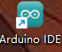图标，打开Arduino IDE。

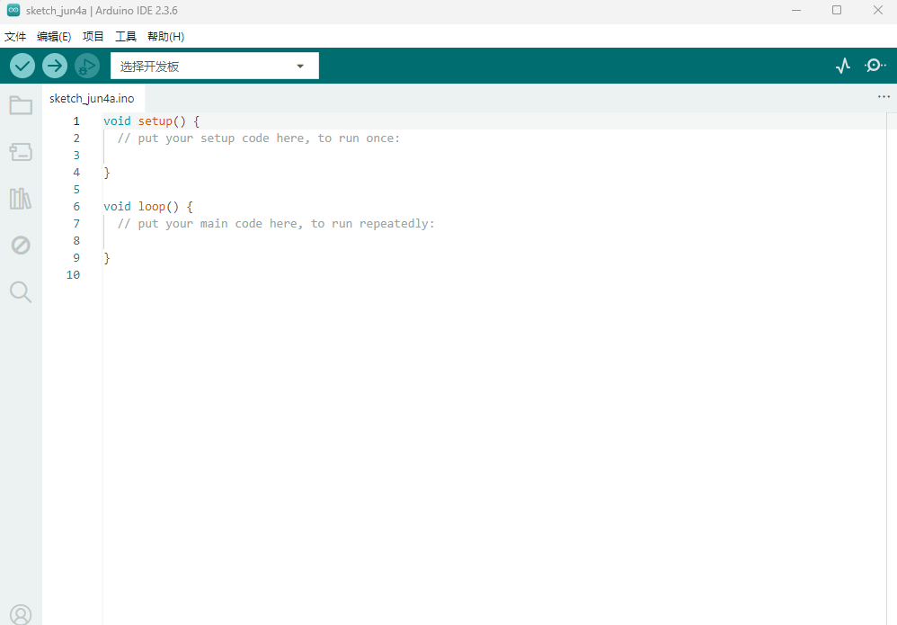

2\. 为了避免在将程序上载到板上时出现任何错误，必须选择正确的Arduino板名称，该名称与连接到计算机的电路板相匹配。转到工具→开发板，然后选择你的板。

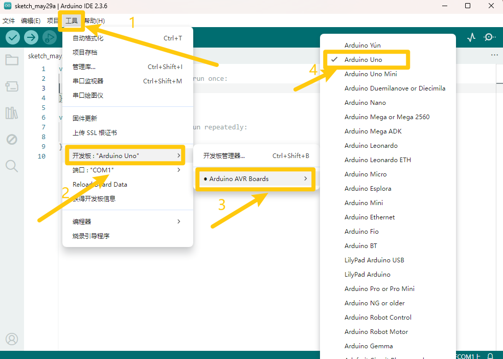

3\.  然后再选择正确的COM口（安装驱动成功后可看到对应COM口）。

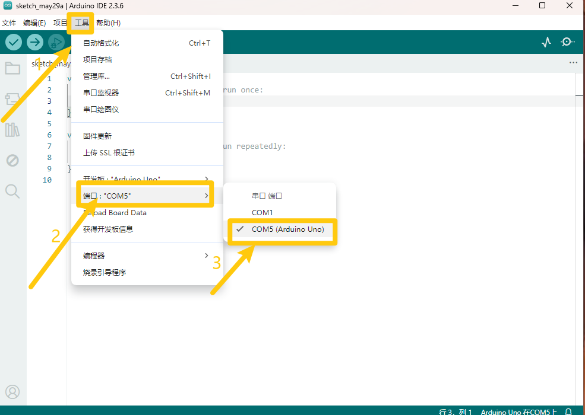

4\. 我们的程序上传到板之前，我们必须演示Arduino
IDE工具栏中出现的每个符号的功能。

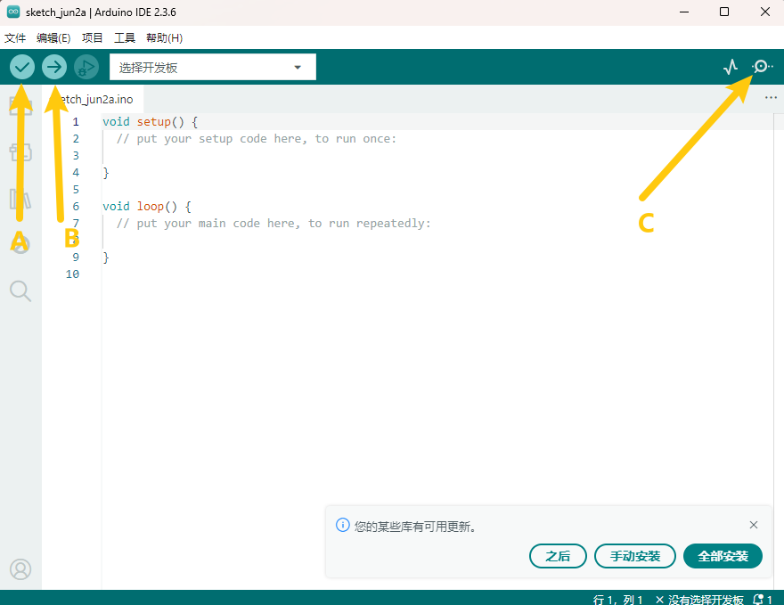

A - 用于检查是否存在任何编译错误。

B - 用于将程序上传到Arduino板。

C - 用于从板接收串行数据并将串行数据发送到板的串行监视器。

## 4.4 库文件的添加

**请在此处下载好资料，资料里面包含所需库文件：**

1\.  首先选择“**项目**”，选择“**导入库**”，再选择“添加.ZIP库”.

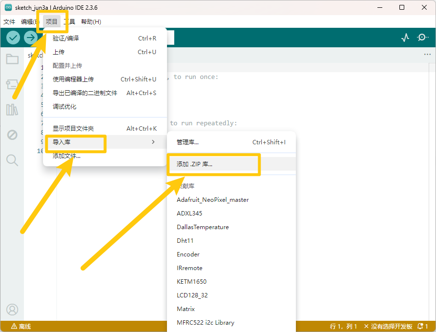

2\.  选择要导入的库，点击“**打开**”.

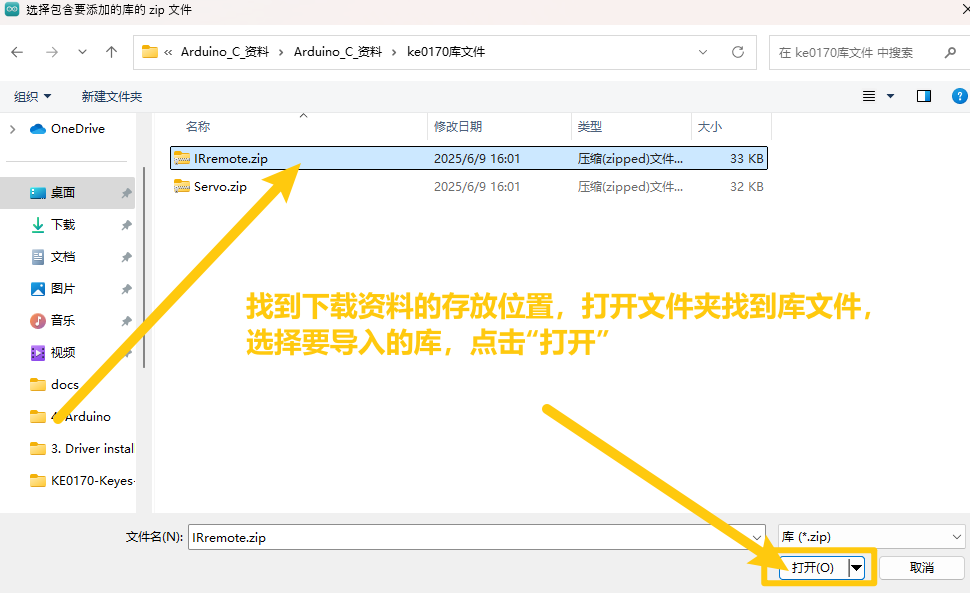

3\.  出现“Library installed”证明库导入成功.

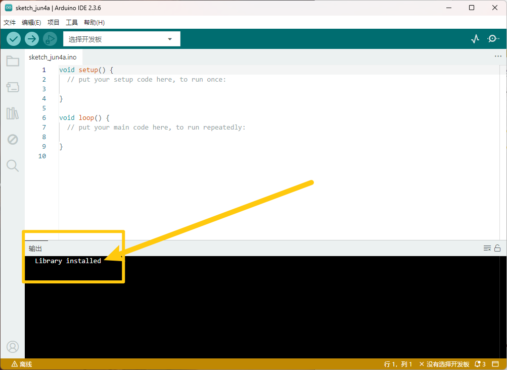

## 4.5 上传第一个代码

1\. 上面我们学习了怎么下载软件和安装开发板的驱动，那下面我们就开始正式开始第一个程序，打开文件选择例子，选择第一个文件BASIC里面的BLINK程序

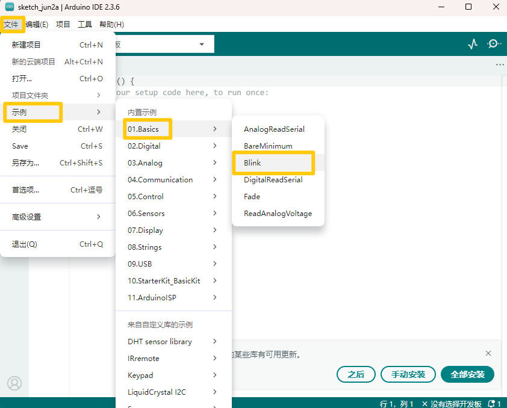

2\.  按照前面方法设置板和COM口，IDE右下角显示对应板和COM口。

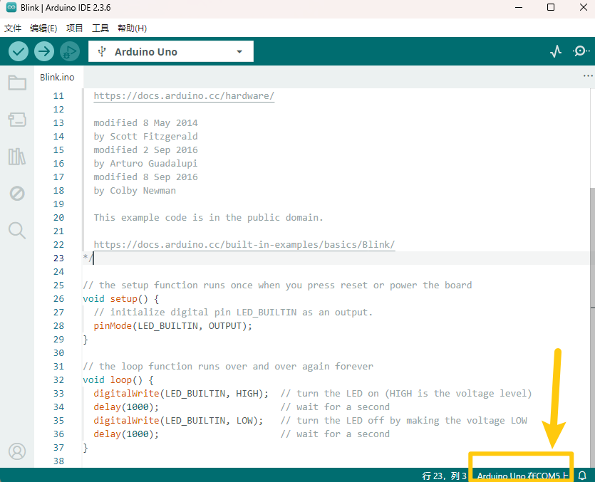

3\.  点击图标开始编译程序，检查错误，检查无误。

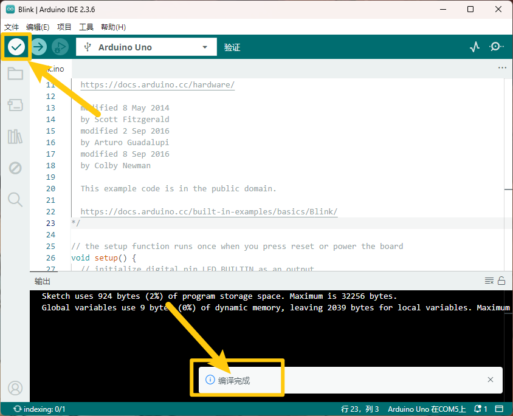

4\.  点击图标开始上传程序，上传成功。

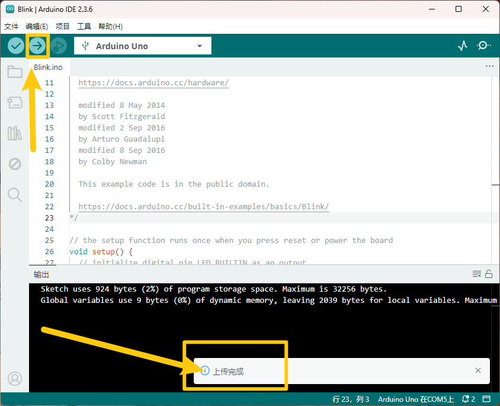

程序上传成功，板载的LED灯亮一秒钟，灭一秒钟，恭喜你的第一个程序完成了！
