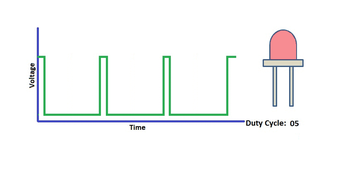
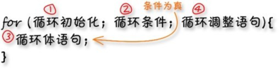
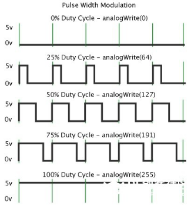

### 项目二 LED 亮度的调节

**项目介绍：**

前面课程中，我们详细的介绍了通过代码控制LED亮灭，实现闪烁的效果。这节课我们使用PWM来控制LED亮度不断地变化，模拟我们呼吸的效果。

PWM是使用数字手段来控制模拟输出的一种手段。使用数字控制产生占空比不同的方波（一个不停在高电平与低电平之间切换的信号)来控制模拟输出。一般来说端口的输入电压只有两个0V与5V。如果想要改变灯的亮度怎么办呢个？有同学说串联电阻，对，这个方法是正确的。但是，如果想要得到不同的亮度，且在不同亮度之间来回变动怎么办呢？不可能不停地切换电阻吧。这种情况下就需要使用PWM了，那它是怎么控制的呢？



对于Arduino的数字端口电压输出只有LOW与HIGH两个，对应的就是0V与5V的电压输出，可以把LOW定义为0，HIGH定义为1，1秒内让Arduino输出500个0或者1的信号。如果这500个全部为1，那就是完整的5V，如果全部为0，那就是0V。如果010101010101这样输出，刚好一半，端口输出的平均电压就为2.5V了。这个和放映电影是一个道理，咱们所看的电影并不是完全连续的，它其实是每秒输出25张图片。在这种情况下，人的肉眼是分辨不出来的，看上去就是连续的了。PWM也是同样的道理，如果想要不同的电压，就控制0与1的输出比例控制就可以了。当然这和真实的连续输出还是有差别的，单位时间内输出的0,1信号越多，控制的就越精确。

**项目组件：**

| UNO PLUS 开发板\*1                                   | L298P 电机驱动扩展板 V1\*1                             | LED白发红模块\*1                                       |
|--------------------------------------------------------|--------------------------------------------------------|--------------------------------------------------------|
|  |  |  |
| USB线\*1                                               | 3Pin 双母头杜邦线\*1                                   | 18650双节电池盒 (18650电池*2(电池自配))*1              |
|  |  |  |

**接线图：**

**⚠️特别注意：坦克智能车已经组装好了，这里不需要把传感器模块和其他的都拆下来又重新组装和接线，这里再次提供接线图，是为了方便您编写代码。但是，LED灯是需要另外连接上去的！**

Arduino的PWM引脚在3，5，6，9，10，11,上一小节的接线刚刚好在9脚，所以我们这个接线不用变


**项目代码：**

（**特别提醒：在上传程序代码前，需要把蓝牙模块取下，否则代码会上传失败。需要上传代码成功后，再连接蓝牙模块。**）

我们来看Arduino代码:

``` c
/*
  迷你履带坦克机器人
  课程 2.1
  呼吸灯
  http://www.keyes-robot.com
*/

int ledPin = 9;    // 定义LED为数字口9
int value;

void setup() {
    pinMode(ledPin, OUTPUT);    // 初始化LED为输出模式
}

void loop() {
  for (value = 0; value < 255; value = value + 1) {
    analogWrite(ledPin, value);    // led变亮
    delay(5);                      // 延迟5ms
  }

  for (value = 255; value > 0; value = value - 1) {
    analogWrite(ledPin, value);    // led变暗
    delay(5);                      // 延迟5ms
  }
}
```

**项目结果：**

代码下载完成后，我们可以看到LED会有个逐渐由亮到灭的一个缓慢过程，而不是直接的亮灭，如同呼吸一般，均匀变化。

**代码说明:**

当我们需要重复执行某句话时，我们可以使用for语句。

for语句格式如下：



for循环顺序如下：

第一轮：1 → 2 → 3 → 4

第二轮：2 → 3 → 4

…

直到2不成立，for循环结束。

知道了这么个顺序之后，回到代码中：

```c
for (int value = 0; value < 255; value=value+1){
…}

for (int value = 255; value >0; value=value-1){
…}
```

这两个for语句实现了value的值不断由0增加到255，随之在从255减到0，在增加到255……,无限循环下去。

再看下for里面，涉及一个新函数analogWrite()。

我们知道数字口只有0和1两个状态，那如何发送一个模拟值到一个数字引脚呢？就要用到该函数。观察一下Arduino板，查看数字引脚，你会发现其中6个引脚旁标有“~”，这些引脚不同于其他引脚，它们可以输出PWM信号。

函数格式如下：

```c
analogWrite(pin,value)
```

analogWrite()函数用于给PWM口写入一个0-255的模拟值。所以，value是在0-255之间的值。特别注意的是，analogWrite()函数只能写入具有PWM功能的数字引脚，也就是3，5，6，9，10，11引脚。

PWM是一项通过数字方法来获得模拟量的技术。数字控制来形成一个方波，方波信号只有开关两种状态（也就是我们数字引脚的高低）。通过控制开与关所持续时间的比值就能模拟到一个0到5V之间变化的电压。开（学术上称为高电平）所占用的时间就叫做脉冲宽度，所以PWM也叫做脉冲宽度调制。

通过下面五个方波来更形象的了解一下PWM。



**PWM示意图**

上图绿色竖线代表方波的一个周期。每个analogWrite(value)中写入的value都能对应一个百分比，这个百分比也称为占空比(Duty Cycle)，指的是高电平在周期内占的时间比值，也就是：占空比=高电平时间/周期时间。图中，从上往下，第一个方波，占空比为0%，对应的value为0。LED亮度最低，也就是灭的状态。高电平持续时间越长，也就越亮。所以，最后一个占空比为100%的对应value是255，LED最亮。50%就是最亮的一半了，25%则相对更暗。

PWM比较多的用于调节LED灯的亮度。或者是电机的转动速度，电机带动的车轮速度也就能很容易控制了，在玩一些Arduino机器人时，更能体现PWM的好处。

**项目拓展：**

（**特别提醒：在上传程序代码前，需要把蓝牙模块取下，否则代码会上传失败。需要上传代码成功后，再连接蓝牙模块。**）

我们不改变灯的脚位，只是改变程序里面delay的值，看看它如何改变渐变效果。

``` c
/*
  迷你履带坦克机器人
  课程 2.2
  呼吸灯
  http://www.keyes-robot.com
*/

int ledPin = 9;    // 定义LED为数字口9

void setup() {
  pinMode(ledPin, OUTPUT);    // 初始化LED为输出模式
}

void loop() {
  for (int value = 0; value < 255; value = value + 1) {
    analogWrite(ledPin, value);    // led变亮
    delay(30);                     // 延迟30ms
  }

  for (int value = 255; value > 0; value = value - 1) {
    analogWrite(ledPin, value);    // led变暗
    delay(30);                     // 延迟30ms
  }
}
```

上传代码到开发板，看LED渐变的效果是不是慢了一些。