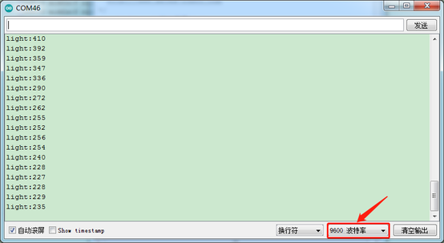
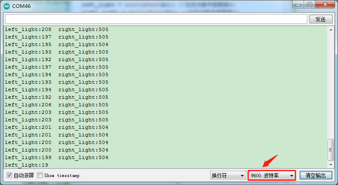

### 项目三 光敏电阻传感器

**项目介绍**：


在套件中，包含两个光敏电阻模块，我们可以利用这两个模块和小车搭配做一个追光智能车。在这一课程中，我们先学习了解下光敏电阻模块和使用方法。

光敏电阻环境光线最敏感，不同的光照强度，光敏电阻的阻值不一样。我们利用光敏电阻该特性，设计电路，生成光敏电阻模块。模块信号端连接单片机模拟口，当光照强度越强时，模拟口电压越大，即单片机的模拟值也大；反之，光照强度越弱时，模拟口电压越小，即单片机的模拟值也小。这样，我们就可以利用光敏电阻模块读取对应模拟值，感应环境中光照强度了。

**参数：**

工作电压：3.3V-5V（DC）

接口：3PIN接口

输出信号：模拟信号

**项目组件：**

| UNO PLUS 开发板\*1                                       | L298P 电机驱动扩展板 V1\*1                             | LED白发红模块\*1                                       | 光敏电阻传感器\*2                                      |
|--------------------------------------------------------|--------------------------------------------------------|--------------------------------------------------------|--------------------------------------------------------|
|  |  |  |  |
| HX-2.54 3P 双头 26AWG\*2                               | 3Pin 双母头杜邦线\*1                                   | USB线\*1                                               | 18650双节电池盒 (18650电池*2(电池自配))*1              |
|  |  |  |  |

**接线图:**

**⚠️特别注意：坦克智能车已经组装好了，这里不需要把传感器模块和其他的都拆下来又重新组装和接线，这里再次提供接线图，是为了方便您编写代码。但是，LED灯是需要另外连接上去的！**

接线注意：左边的光敏电阻模块的“GND”、“VCC”和S引脚分别接在keyes传感器扩展板G（GND）、V（VCC）、A1；同样地，右边的光敏电阻模块接在G（GND）、V（VCC）A2。我们这里先在左边接一个测试。


**项目代码：**

（**特别提醒：在上传程序代码前，需要把蓝牙模块取下，否则代码会上传失败。需要上传代码成功后，再连接蓝牙模块。**）

``` c
/*
  迷你履带坦克机器人
  课程 3.1
  光敏电阻
  http://www.keyes-robot.com
*/

int light;  //定义变量light
void setup() 
{
  Serial.begin(9600);//设置波特率为9600
}

void loop() 
{
  light = analogRead(A1); //读取到的模拟值赋给light变量
  Serial.print("light:");   //打印光线模拟值
  Serial.println(light);
  delay(100);  //延时100ms
}
```

**项目结果：**

上传代码带开发板，打开串口监视，设置波特率为9600。可以看到打印出的光敏传感器检测的值，如果我们用手给它遮挡光线，我们发现值变小了。



**代码说明：**

Serial.begin(9600)-初始化串口,串口通信波特率为9600  ，

pinMode- 定义单片机PIN脚模式是输入还是输出，input是输入，output是输出，

analogRead-读取引脚模拟状态，范围为0~1023。

**项目拓展：**

上面我们了解了光敏传感器的工作原理，接下来我们用到两个光敏传感器，分别接在A1（左）和A2（右）。在第9脚接上一个LED灯，然后通过读取左右两个光敏传感器的状态，来控制LED的亮和灭。如下图接线：


我们开始来编写代码：

（**特别提醒：在上传程序代码前，需要把蓝牙模块取下，否则代码会上传失败。需要上传代码成功后，再连接蓝牙模块。**）

``` c
/*
  迷你履带坦克机器人
  课程 3.2
  光敏电阻
  http://www.keyes-robot.com
*/

int ledPin = 9; //定义LED管脚为数字口9
int left_light = 0; //定义左边传感器的变量
int right_light = 0; //定义右边传感器的变量
void setup() 
{
  Serial.begin(9600);//设置波特率为9600
  pinMode(ledPin, OUTPUT); //设置LED管脚为输出模式
}

void loop() 
{
  left_light = analogRead(A1); //左边光敏传感器接A1
  right_light = analogRead(A2); //右边光敏传感器接A2
  Serial.print("left_light:");   //打印左边光线模拟值
  Serial.print(left_light);
  Serial.print("  right_light:");   //打印右边光线模拟值
  Serial.println(right_light);
  if (left_light < 300 || right_light < 300)
  { //其中一个模拟值低于300
    digitalWrite(ledPin, HIGH); //点亮LED
  }
  else 
  {
    digitalWrite(ledPin, LOW); //LED熄灭
  }
}
```

上传代码到开发板，用我们的手去一个个的遮掩光敏传感器，我们看看LED灯的状态发生了改变没有？当我们用手去遮挡任一光敏传感器的时候，我们可以看到LED灯亮起来了。串口显示对应光敏传感器的检测也变小了。

