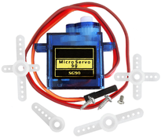
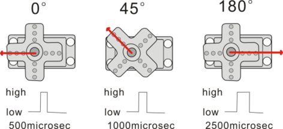
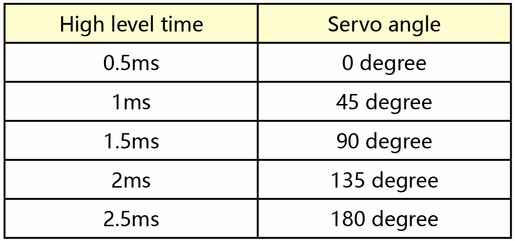
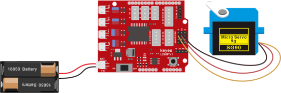

### 项目四 舵机控制



**项目介绍：**

舵机是一种位置伺服的驱动器，主要是由外壳、电路板、无核心马达、齿轮与位置检测器所构成。其工作原理是由接收机或者单片机发出信号给舵机，其内部有一个基准电路，产生周期为20ms，宽度为1.5ms
的基准信号，将获得的直流偏置电压与电位器的电压比较，获得电压差输出。


舵机有很多规格，但所有的舵机都有外接三根线，分别用棕、红、橙三种颜色进行区分，由于舵机品牌不同，颜色也会有所差异，棕色为接地线，红色为电源正极线，橙色为信号线。

舵机的转动的角度是通过调节PWM（脉冲宽度调制）信号的占空比来实现的，标准PWM（脉冲宽度调制）信号的周期固定为20ms（50Hz），理论上脉宽分布应在1ms到2ms之间，但是，事实上脉宽可由0.5ms
到2.5ms之间，脉宽和舵机的转角0°～180°相对应。



对应的舵机角度值如下:



**舵机参数：**

工作电压：DC 4.8V〜6V

可操作角度范围：大约 About 180°(在 500→2500 μsec)

脉波宽度范围：500→2500 μsec

空载转速：0.12±0.01 sec/60（DC 4.8V） 0.1±0.01 sec/60（DC 6V）

空载电流：200±20mA（DC 4.8V） 220±20mA（DC 6V）

停止扭力：1.3±0.01kg·cm（DC 4.8V） 1.5±0.1kg·cm（DC 6V）

停止电流：≦850mA（DC 4.8V） ≦1000mA（DC 6V）

待机电流：3±1mA（DC 4.8V） 4±1mA（DC 6V）

**项目组件：**

| UNO PLUS 开发板\*1                                       | L298P 电机驱动扩展板 V1\*1                             | SG90 9G舵机\*1                                         |
|--------------------------------------------------------|--------------------------------------------------------|--------------------------------------------------------|
|  |  |  |
| USB线\*1                                               | 18650双节电池盒 (18650电池*2(电池自配))*1              |                                                        |
|  |  |                                                        |

**接线图**：

**⚠️特别注意：坦克智能车已经组装好了，这里不需要把传感器模块和其他的都拆下来又重新组装和接线，这里再次提供接线图，是为了方便您编写代码！**



**接线注意**：舵机连接到G（GND）、V（VCC）、10，舵机的棕色线是与Gnd(G)相连，红色线与5v(V)相连，橙色线是与数字10相连的。接舵机的时候必须要外接供电，因为驱动舵机的电流要求比较大，一般峰值的情况下接近1A，开发板的电流远远不够。如果不接外接电源，很有可能烧坏开发板。

**项目代码1：**

（**特别提醒：在上传程序代码前，需要把蓝牙模块取下，否则代码会上传失败。需要上传代码成功后，再连接蓝牙模块。**）

``` c
/*
  迷你履带坦克机器人
  课程 4.1
  伺服舵机
  http://www.keyes-robot.com
*/

#define servoPin 10  //舵机引脚接D10
int pos; //舵机的角度变量
int pulsewidth; //舵机的脉宽变量
void setup()
{
  pinMode(servoPin, OUTPUT);  //舵机引脚设置为输出
  procedure(0); //设置舵机的角度为0度
}
void loop()
{
  for (pos = 0; pos <= 180; pos += 1)
  { // 从0到180度，以1°为一步
    procedure(pos);              // 转动到pos角度位置
    delay(15);                   //控制舵机转动的速度
  }
  for (pos = 180; pos >= 0; pos -= 1)
  { // 从180到0度，以1°为一步
    procedure(pos);              // 转动到pos角度位置
    delay(15);
  }
}
//控制舵机的函数
void procedure(int myangle) 
{
  pulsewidth = myangle * 11 + 500;  //计算出脉宽值
  digitalWrite(servoPin, HIGH);
  delayMicroseconds(pulsewidth);   //高电平持续的时间，就是脉宽
  digitalWrite(servoPin, LOW);
  delay((20 - pulsewidth / 1000));  //周期是20ms，所以低电平持续剩下的时间
}
```

在上传代码成功，我们可以看到舵机在0°到180°角度范围来回摆动。

其实我们还可以有一种更简单的方法控制舵机，就是使用Arduino的舵机库文件，可以参考Arduino官方的使用说明：<https://www.arduino.cc/en/Reference/Servo>


以下是使用了舵机库文件的程序, 接线图不变.

项目代码2:

（**特别提醒：在上传程序代码前，需要把蓝牙模块取下，否则代码会上传失败。需要上传代码成功后，再连接蓝牙模块。**）

``` c
/*
  迷你履带坦克机器人
  课程 4.2
  伺服舵机
  http://www.keyes-robot.com
*/

#include <Servo.h>
Servo myservo;  // 创建舵机类实例

int pos = 0;    //角度变量
void setup()
{
  myservo.attach(10);  //舵机接数字口10
}
void loop()
{
  for (pos = 0; pos <= 180; pos += 1)
  { // 从0到180
    // in steps of 1 degree
    myservo.write(pos);              // 转动到pos角度
    delay(15);                       // 等待15ms  以控制舵机转动速度
  }
  for (pos = 180; pos >= 0; pos -= 1)
  { // 从180到0
    myservo.write(pos);              // 转动到pos角度
    delay(15);                       // 等待15ms  以控制舵机转动速度
  }
}
```

**项目结果：**

上传代码成功，上电后，舵机也是在0°到180°角度范围来回摆动。这两个项目的效果是一样的，通常我们使用库文件来控制的比较多。

**代码说明:**

\#include\<Servo.h\>是Arduino自带的Servo函数及其语句，下面是舵机函数的几个常用语句：

1、attach（接口）——设定舵机的接口，只有9或10接口可用。

2、write（角度）——用于设定舵机旋转角度的语句，可设定的角度范围是0°到180°。

3、read（）——用于读取舵机角度的语句，可理解为读取最后一条write()命令中的值。

4、attached（）——判断舵机参数是否已发送到舵机所在接口。

**注：** 以上语句的书写格式均为 “舵机变量名.具体语句（）”例如：myservo.attach(10)。