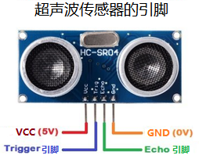
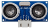
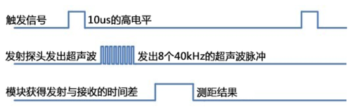
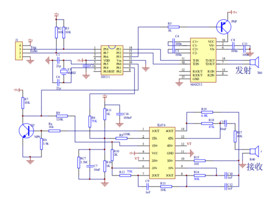
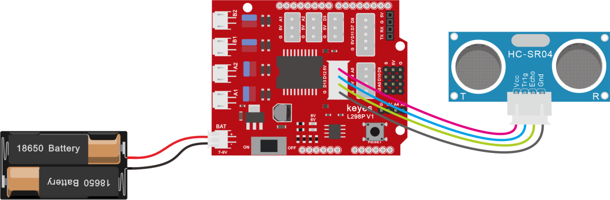
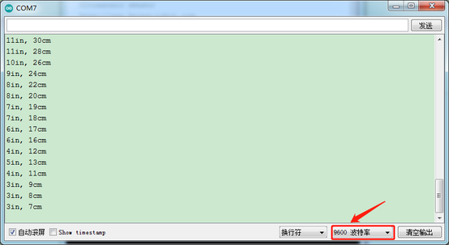
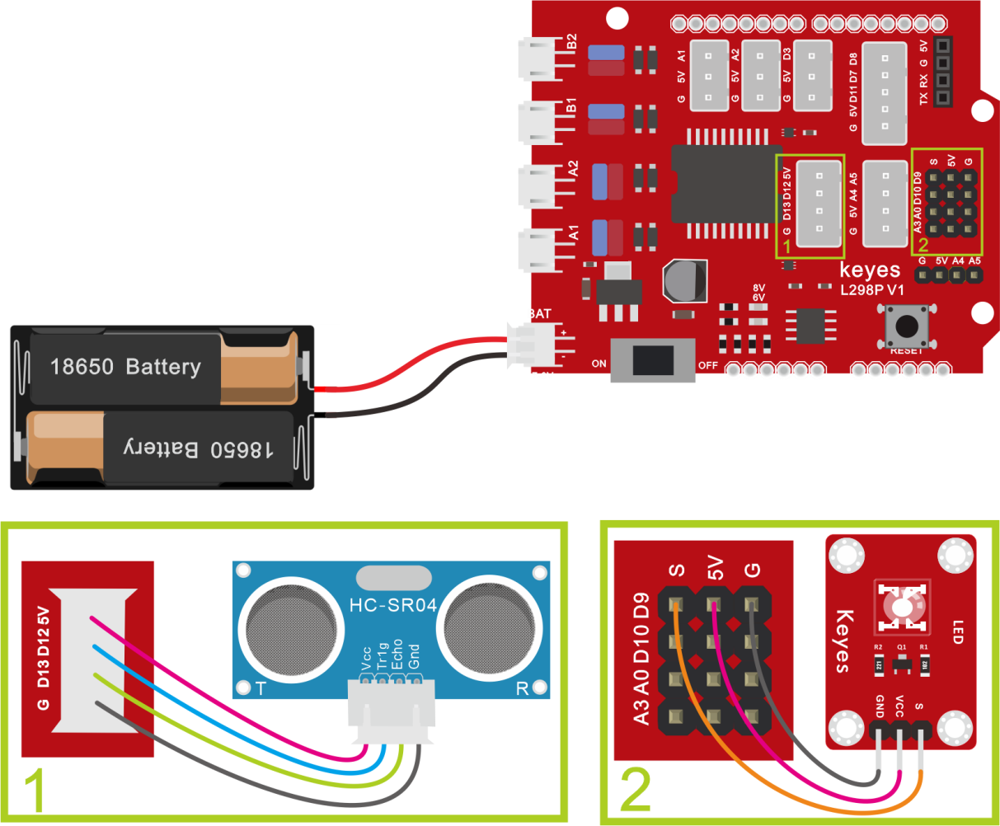

### 项目五 超声波模块项目

**项目介绍：**


HC-SR04超声波传感器利用声呐原理来测量物体的距离，就像蝙蝠那样。它具有出色的非接触式距离检测功能，精度高且读数稳定，使用方便。它配备有超声波发射器和接收器模块。

HC-SR04超声波传感器在众多电子项目中被广泛使用，用于创建障碍物检测和距离测量应用以及其他各种应用。在这里，我们带来了使用Arduino 和超声波传感器测量距离的简单方法，以及如何将超声波传感器与Arduino 配合使用。

**超声波参数：**



工作电压：+5 伏

直流静态电流：\<2 毫安

工作电流：15 毫安

有效角度：\< 15°

测距范围：2 厘米 - 400 厘米

分辨率：0.3 厘米

测量角度：30 度

触发输入脉冲宽度：10 微秒

**项目组件：**

| UNO PLUS 开发板\*1                                       | L298P 电机驱动扩展板 V1\*1                             | LED白发红模块\*1                                       | HC-SR04超声波传感器\*1                                 |
|--------------------------------------------------------|--------------------------------------------------------|--------------------------------------------------------|--------------------------------------------------------|
|  |  |  |  |
| HX-2.54 4P 双头 连接线\*1                              | 3Pin 双母头杜邦线\*1                                   | USB线\*1                                               | 18650双节电池盒 (18650电池*2 (电池自配))* 1            |
|  |  |  |  |

**超声波模块知识：**

原理：看超声波的图可知，像是有两个眼睛，其一边是发射超声的，一边是接收超声波的，然后检测从发射遇到障碍物返回被接收到所需的时间t，再根据声音在空气中的传播速度大概是343m/s,

距离 = 速度 \* 时间 ，

由于超声波发射返回是两段路程了，所以需要除以2，故超声波测到的
距离=（速度 \* 时间）/2

超声波模块的使用方法及时序图：

1、使用GPIO引脚给SR04的Trig引脚至少10μs的高电平信号，触发SR04模块测距功能；

2、触发后，模块会自动发送8个40KHz的超声波脉冲，并自动检测是否有信号返回。这步会由模块内部自动完成。

3、如有信号返回，Echo引脚会输出高电平，高电平持续的时间就是超声波从发射到返回的时间。



超声波模块的电路图



**接线图：**

**⚠️特别注意：坦克智能车已经组装好了，这里不需要把传感器模块和其他的都拆下来又重新组装和接线，这里再次提供接线图，是为了方便您编写代码。但是，LED灯是需要另外连接上去的！**

接线注意：超声波传感器模块的VCC引脚连接至传感器扩展板的5v(V)，Trig引脚至数字12(S)，Echo引脚至数字13(S)，Gnd引脚至Gnd(G)。



**项目代码：**

（**特别提醒：在上传程序代码前，需要把蓝牙模块取下，否则代码会上传失败。需要上传代码成功后，再连接蓝牙模块。**）

``` c
/*
  迷你履带坦克机器人
  课程 5.1
  超声波传感器
  http://www.keyes-robot.com
*/
int trigPin = 12;    // Trig引脚接D12
int echoPin = 13;    // Echo引脚接D13
long duration, cm, inches;
void setup()
{
  //启动串口监视器
  Serial.begin (9600);
  //定义引脚输入输出模式
  pinMode(trigPin, OUTPUT);//trigPin设置为输出
  pinMode(echoPin, INPUT);//echoPin设置为输入
}
void loop() 
{
  // 拉低2us
  digitalWrite(trigPin, LOW);
  delayMicroseconds(2);
  digitalWrite(trigPin, HIGH);  //给trigPin至少10us以触发
  delayMicroseconds(10);
  digitalWrite(trigPin, LOW);
  // 计算echopin高电平时间
  duration = pulseIn(echoPin, HIGH);
  // 转换为距离
  cm = (duration / 2) / 29.1;   
  inches = (duration / 2) / 74; 
  Serial.print(inches);
  Serial.print("in, ");
  Serial.print(cm);
  Serial.print("cm");
  Serial.println();
  delay(200);
}
```

**项目结果：**

上传好测试代码到开发板，打开串口监视器，设置波特率为9600，我们可以看到超声波模块显示的距离，单位是厘米和英寸。用手阻挡超声波模块，我们看到显示距离的数值变小了。



**代码说明:**

int trigPin - 这个是定义发射超声波的脚位，通常是输出，

int echoPin - 这个是定义接收超声波的脚位，通常是输入。

cm = (duration/2) / 29.1-

inches = (duration/2) / 74-

我们可以使用以下公式来计算距离：

距离 = (来回时间/2) x 声速

声音的传播速度是： 343m/s = 0.0343 cm/uS = 1/29.1 cm/uS

或者以英寸为单位: 13503.9in/s = 0.0135in/uS = 1/74in/uS

我们需要将时间除以2，因为我们需要考虑到波发出后，会先撞击物体，然后返回到传感器这一过程。

**项目拓展：**

我们刚刚测出了超声波显示的距离，那我们动动脑筋，能不能用测出的距离来做一些控制呢，如果控制一个LED灯的亮和灭。我们来试一下，在D9脚接上一个LED灯模块。



（**特别提醒：在上传程序代码前，需要把蓝牙模块取下，否则代码会上传失败。需要上传代码成功后，再连接蓝牙模块。**）

``` c
/*
  迷你履带坦克机器人
  课程 5.2
  超声波传感器控制LED
  http://www.keyes-robot.com
*/

int trigPin = 12;    // Trig引脚接D12
int echoPin = 13;    // Echo引脚接D13
long duration, cm, inches;
void setup()
{
  //启动串口监视器
  Serial.begin (9600);
  //定义引脚输入输出模式
  pinMode(trigPin, OUTPUT);//trigPin设置为输出
  pinMode(echoPin, INPUT);//echoPin设置为输入
  pinMode(9, OUTPUT);
}
void loop()
{
  // 拉低2us
  digitalWrite(trigPin, LOW);
  delayMicroseconds(2);
  digitalWrite(trigPin, HIGH);  //给trigPin至少10us以触发
  delayMicroseconds(10);
  digitalWrite(trigPin, LOW);
  // 计算echopin高电平时间
  duration = pulseIn(echoPin, HIGH);
  // 转换为距离
  cm = (duration / 2) / 29.1;   
  inches = (duration / 2) / 74; 
  Serial.print(inches);
  Serial.print("in, ");
  Serial.print(cm);
  Serial.print("cm");
  Serial.println();
  if (cm >= 2 && cm <= 10)
  {
    digitalWrite(9, HIGH);
  }
  else 
  {
    digitalWrite(9, LOW);
  }
  delay(50);
}
```

上传好测试代码到开发板，我们用手去靠近超声波传感器，看LED灯亮起来了没有。