### 项目七 蓝牙遥控的原理及应用

**项目介绍：**

蓝牙是一种流行的无线通信方式，能让设备之间不用电线就能传递信息。蓝牙模块充当中间人，手机通过蓝牙发送指令，蓝牙模块将指令传给Arduino开发板，开发板根据指令执行相应操作，例如控制LED灯的亮灭或小车的运动等。


**蓝牙工作原理**

⚠️ <span style="color: rgb(255, 76, 65);">**特别提醒：这是针对于 UNO-PLUS版本 的蓝牙模块。**</span>

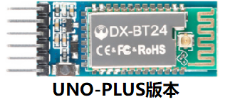

BT24是一款面向嵌入式开发的‌低功耗串口透传蓝牙模块‌，主打简化蓝牙通信开发，广泛应用于物联网原型开发和小型智能设备项目中，以下是详细介绍：

**蓝牙参数：**

- 蓝牙协议: 蓝牙V5.1 低功耗BLE

- 工作频率: 2.4GHz ISM band

- 通信接口: UART

- 工作电压: DC 5V

- 通信距离: 40m

- 蓝牙名称: BT24

- 串口参数: 9600、8数据位、1停止位、无校验、无流控

- 兼容性‌：支持Android/iOS蓝牙4.0及以上设备，AT指令可灵活修改模块名称、波特率等参数。

DX-BT24模块同时支持BT5.1 BLE协议，能够与具备BLE蓝牙功能的iOS设备直接连接，支持后台程序常驻运行。主要用于短距离的数据无线传输领域。避免繁琐的线缆连接，能直接替代串口线。BT24模块成功应用领域包括：

- 蓝牙无线数据传输

- 手机、电脑周边设备

- 手持POS设备

- 医疗设备无线数据传输

- 智能家居控制

- 蓝牙打印机

- 蓝牙遥控玩具

- 共享单车

⚠️ <span style="color: rgb(255, 76, 65);">**特别提醒：这是针对于 UNO-R3版本 的蓝牙模块。**</span>


HM-10是一款经典的蓝牙4.0 BLE低功耗串口透传模块‌，广泛应用于物联网DIY项目和智能硬件开发，以下是核心信息：

**蓝牙参数：**

- 工作电压：5V DC

- 蓝牙协议：蓝牙V4.0 BLE串口收发无字节限制

- 工作距离：空旷环境最大100米，实际场景约20-30米，可通过发射功率调整

- 工作频率：2.4GHz ISM频段

- 调制方式：GFSK（高斯频移键控）

- 传输功率：支持-23dBm至6dBm调节，通过AT指令配置。

- 灵敏度：0.1％BER时≤-84dBm

- 安全功能：身份验证和加密

- 支持服务：中央和外围UUID FFE0，FFE1

- 功耗：自动休眠模式，待机电流400uA〜800uA，传输期间为8.5mA。

- 兼容性‌：支持Android/iOS蓝牙4.0及以上设备，AT指令可灵活修改模块名称、波特率等参数。

**下载蓝牙APP：**

⚠️ **特别提醒：如果已经在手机/平板上安装好了APP，则这一步骤可以直接跳过；否则，需要参照以下步骤在手机/平板上来安装APP。**


**步骤1：** 在手机/平板浏览器的搜索框中输入官网链接：[https://www.keyesrobot.cn/zh-cn/latest](https://www.keyesrobot.cn/zh-cn/latest)


**步骤2：** 点击 “**下载中心**”，进入下载中心页面。


**步骤3：** 在 “**APP下载**” 栏向下滑找到 **Tank Car**，根据自己的手机/平板系统选择对应的APP下载安装。

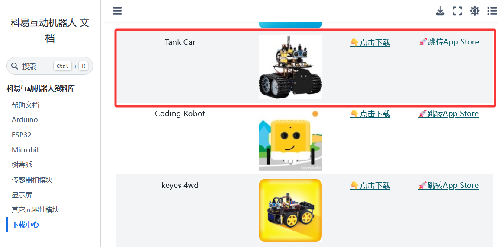

**安卓系统(Android)**

a. 点击 "**点击下载**" 按钮，下载对应的 "**Tank Car.apk**" 文件。

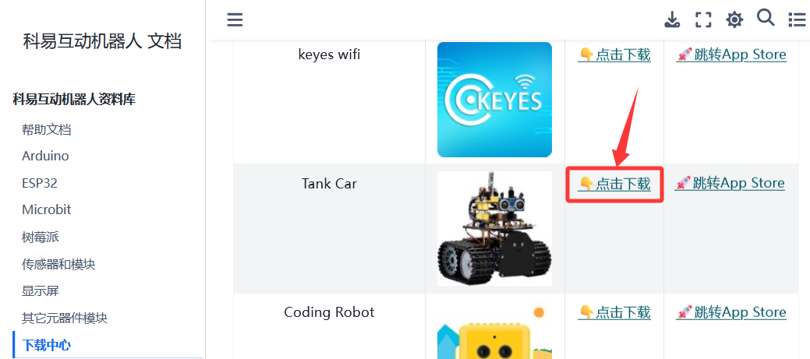

b. 按照安装提示进行下载安装。

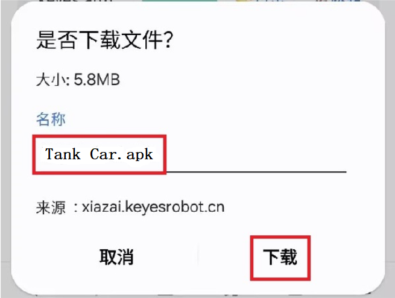

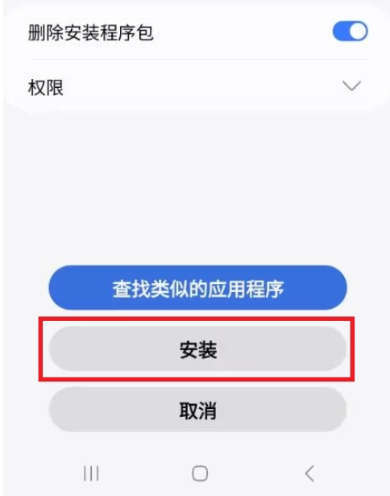

c. 安装成功后，显示图标如下。


d. 打开手机/平板上的蓝牙。


d. 点击图标 ，进入APP，显示如下图。


**项目组件：**

| 组装好的智能车(<span style="color: rgb(255, 76, 65);">未插上蓝牙模块</span>) *1 | 草帽LED白发红模块 *1 | 3Pin 双母头杜邦线 *1  |
| --- | --- | --- |
|  | | |
| USB线 *1 | 18650电池 *2（电池自备） | 蓝牙模块 |
| |  | 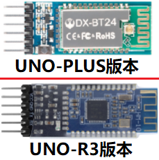 | 

**接线图：**

**蓝牙是直接插在电机驱动扩展板上的，注意一下方向，而且在上传代码之前不要插上蓝牙。**

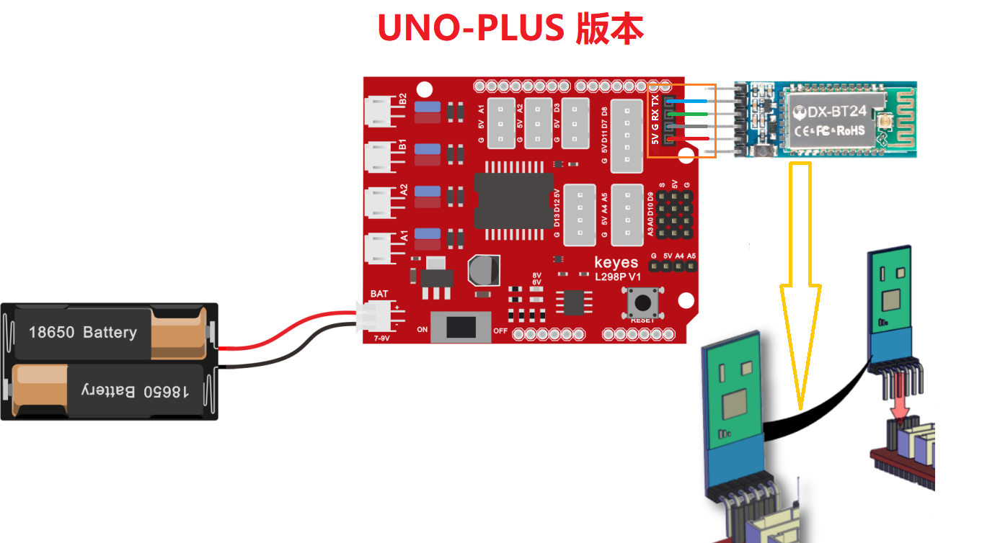

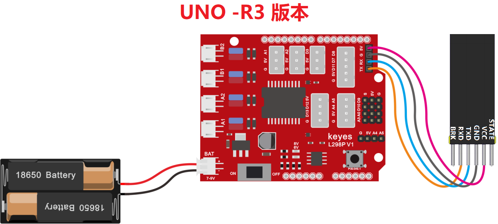

**项目代码：**

（**特别提醒：在上传程序代码前，需要把蓝牙模块取下，否则代码会上传失败。需要上传代码成功后，再连接蓝牙模块。**）

``` c
/*
  迷你履带坦克机器人
  课程 7.1
  蓝牙
  http://www.keyes-robot.com
*/
char ble_val; //字符变量，用于存放蓝牙接收到的值
void setup() 
{
  Serial.begin(9600);
}
void loop()
{
  if (Serial.available() > 0) //判断串口缓存区是否有数据
  {
    ble_val = Serial.read();  //读取串口缓存区的数据
    Serial.println(ble_val);  //打印出来
  }
}
```

外接电源，将电机驱动扩展板上的拨码开关拨至ON端。选择好正确的开发板板型和适当的串口端口（COMxx），上传代码。然后再插上蓝牙模块。

**安卓系统(Android)**

- 打开手机/平板上的蓝牙。


- 点击手机/平板上的APP图标 ，进入APP界面，显示如下图：

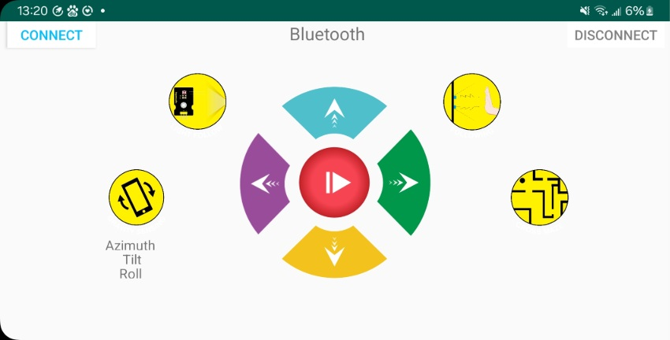

- 点击APP界面左上角的图标 “**CONNECT**”，搜索到对应的蓝牙设备（<span style="color: rgb(255, 76, 65);">**BT24**--针对UNO-PLUS版本</span> // <span style="color: rgb(0, 209, 0);">**HMSoft**--针对UNO-R3版本</span>），上下滑动找到对应的蓝牙设备（<span style="color: rgb(255, 76, 65);">**BT24**--针对UNO-PLUS版本</span> // <span style="color: rgb(0, 209, 0);">**HMSoft**--针对UNO-R3版本</span>），显示如下图：

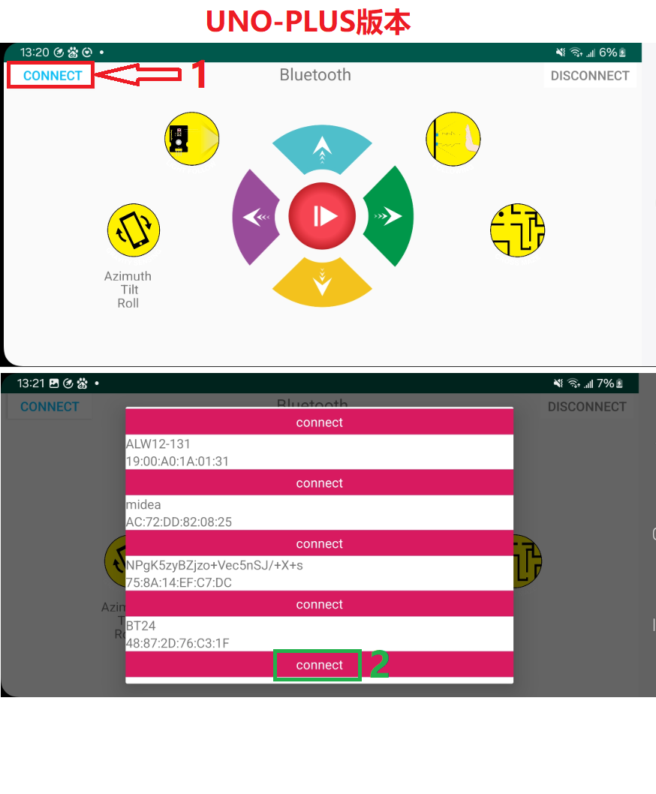

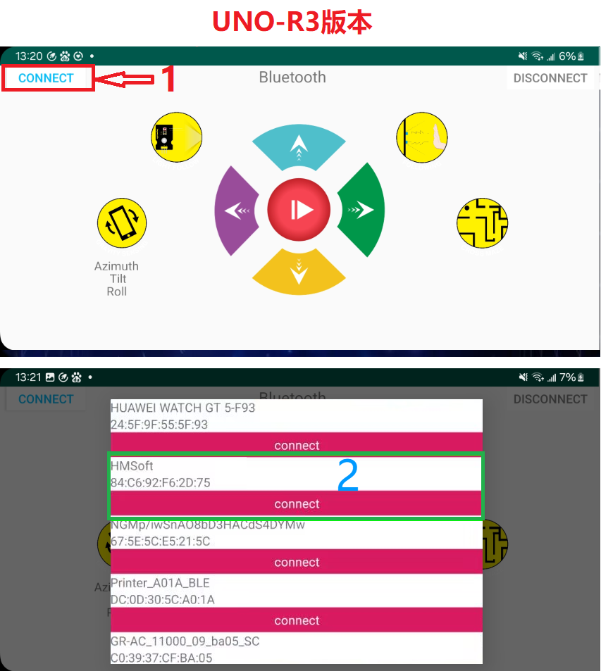

- 点击 “**connect**” 来连接蓝牙，蓝牙连接成功后，“**connect**” 字样会变成 “**is connected**” 字样，显示如下图。这时，蓝牙模块上的LED变为常亮。

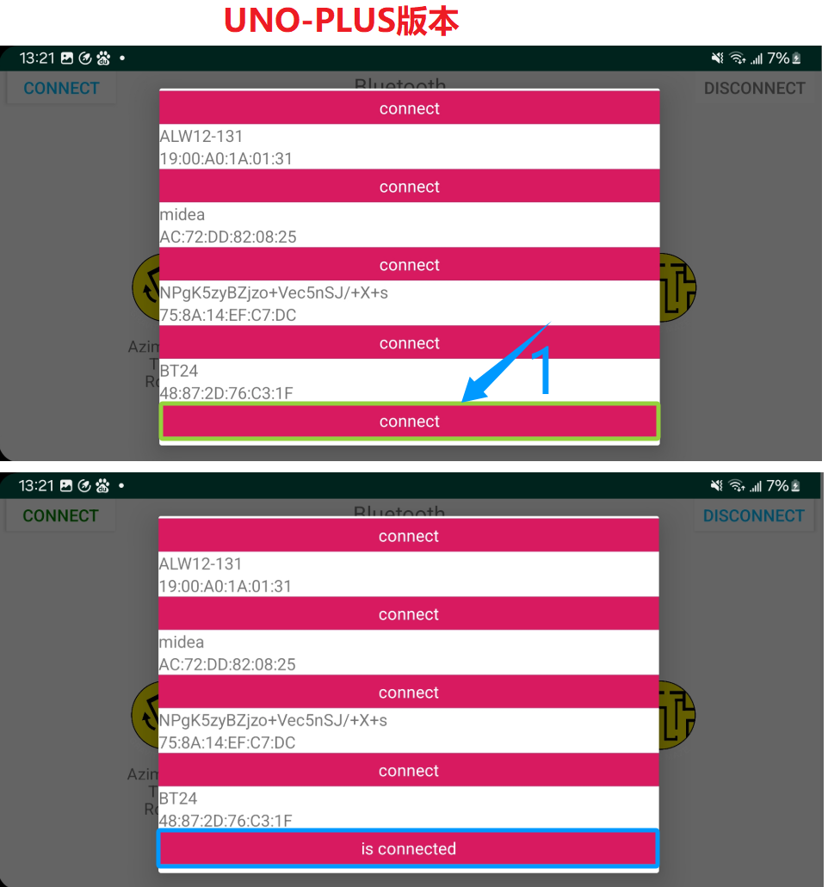

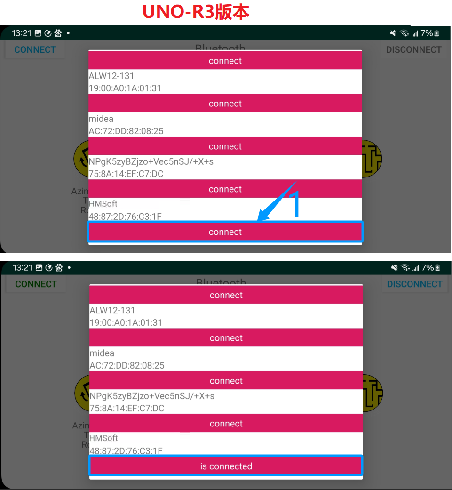

- 打开串口监视器，设置波特率为9600，按下APP界面上的各个按键，串口监视器窗口会打印对应的字符。

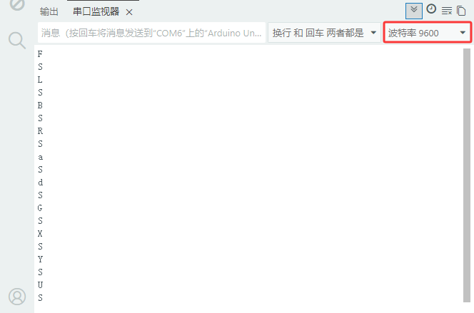

**苹果系统(IOS)**

- 打开手机/平板上的蓝牙。


- 点击手机/平板上的APP图标 ，进入APP界面，显示如下图：

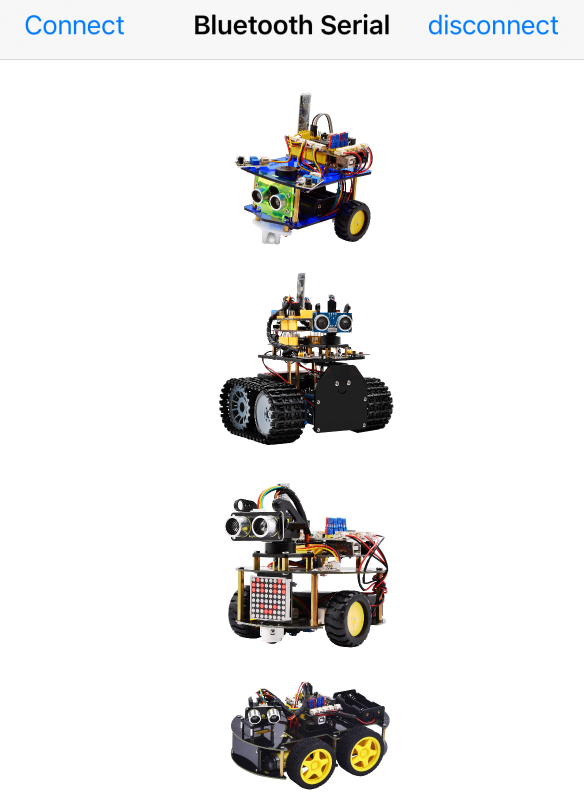

- 点击APP界面左上角的图标 “**CONNECT**”，搜索到对应的蓝牙设备（<span style="color: rgb(255, 76, 65);">**BT24**--针对UNO-PLUS版本</span> // <span style="color: rgb(0, 209, 0);">**HMSoft**--针对UNO-R3版本</span>），上下滑动找到对应的蓝牙设备（<span style="color: rgb(255, 76, 65);">**BT24**--针对UNO-PLUS版本</span> // <span style="color: rgb(0, 209, 0);">**HMSoft**--针对UNO-R3版本</span>），显示如下图：

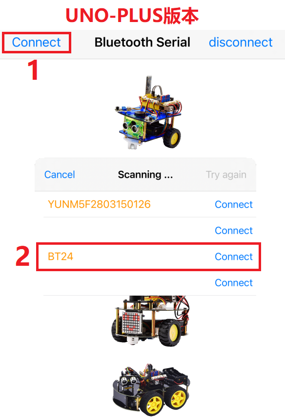

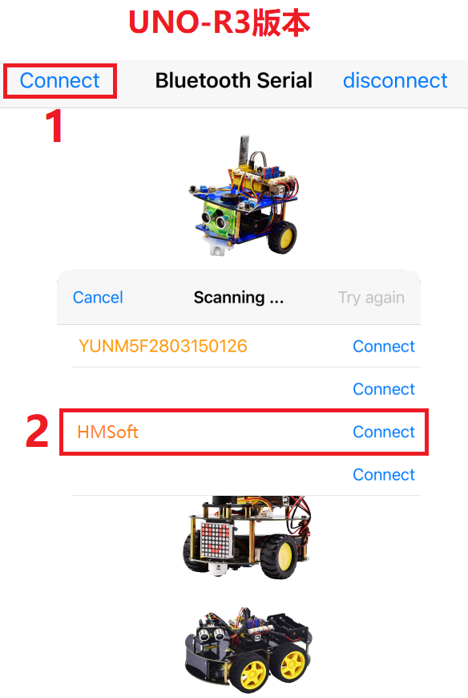

- 点击 “**Connect**” 来连接蓝牙，蓝牙连接成功后，蓝色字体“**Connect**” 字样会变成 绿色字体“**Connect**” 字样，显示如下图。这时，蓝牙模块上的LED变为常亮。

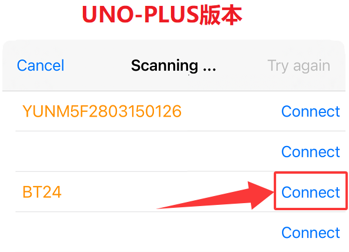

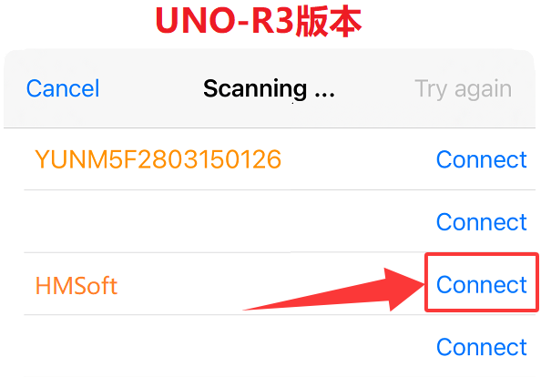

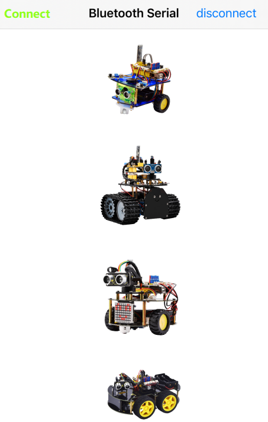

- 点击 “**Tank Car**” 图标进入APP操作页面。

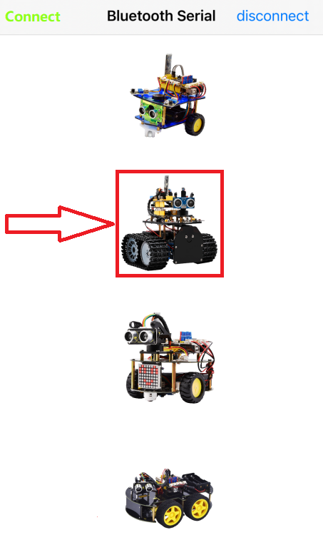


- 打开串口监视器，设置波特率为9600，按下APP界面上的各个按键，串口监视器窗口会打印对应的字符。


**代码说明：**

Serial.available()的意思是：返回串口缓冲区中当前剩余的字符个数。一般用这个函数来判断串口的缓冲区有无数据，当Serial.available()\>0时，说明串口接收到了数据，可以读取；

Serial.read()指从串口的缓冲区取出并读取一个Byte的数据，比如有设备通过串口向Arduino发送数据了，我们就可以用Serial.read()来读取发送的数据。

**项目拓展：**

上面的项目，我们讲解了蓝牙接收到手机发送的信号并且在开发板的串口显示出来，比如我们按下，然后我们就会接收到‘B’，当我们松开的时候又接收到‘S’。那接下来我们就要想一下了，我们可以利用接收到的信号去做一些事情吗，答案是肯定的，我们这里就利用手机发送的命令去打开或者关闭一个LED灯。看接线图，在D9脚接了一个LED。

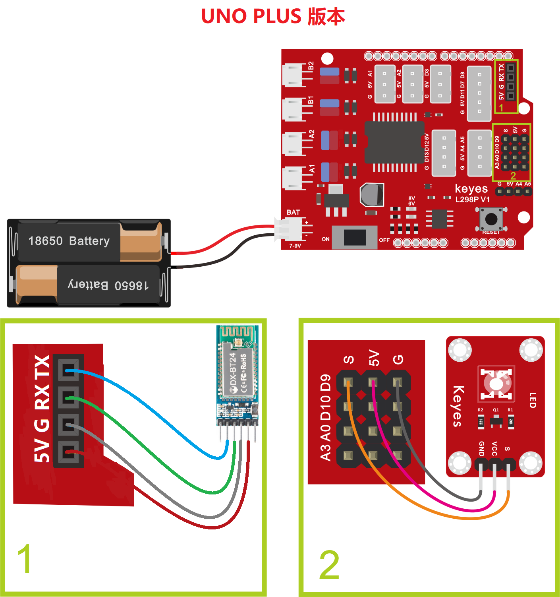

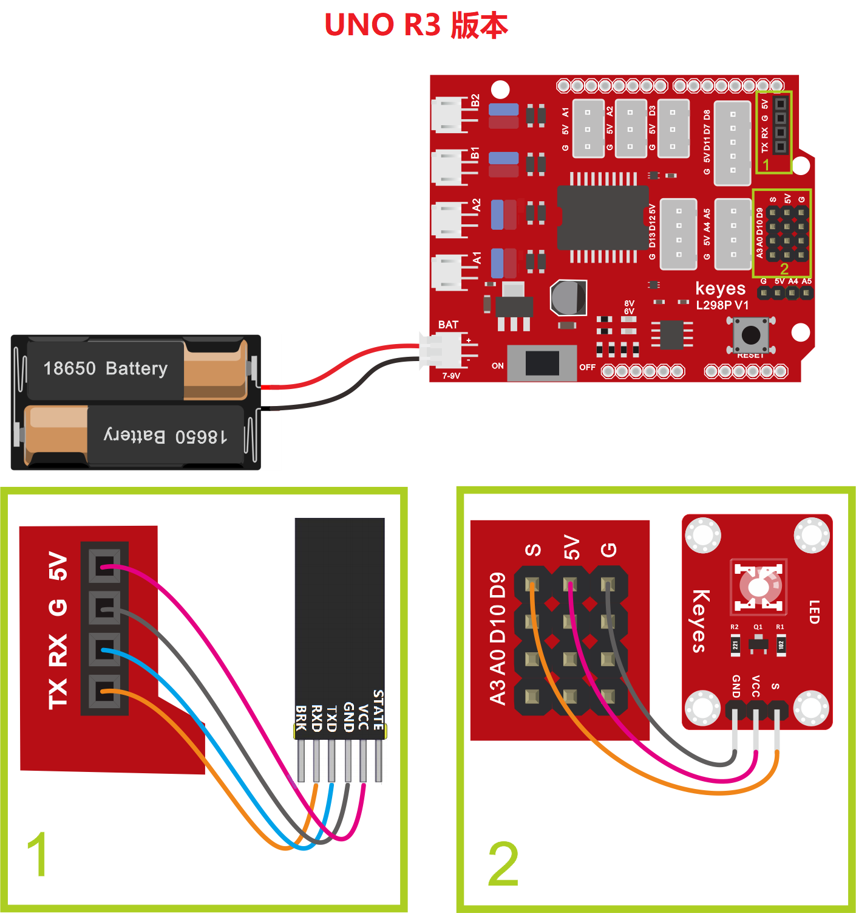

（**特别提醒：在上传程序代码前，需要把蓝牙模块取下，否则代码会上传失败。需要上传代码成功后，再连接蓝牙模块。**）

``` c
/*
  迷你履带坦克机器人
  课程 7.2
  蓝牙控制LED
  http://www.keyes-robot.com
*/
int ledpin = 9;
void setup()
{
  Serial.begin(9600);
  pinMode(ledpin, OUTPUT);
}
void loop()
{
  int i;
  if (Serial.available())
  {
    i = Serial.read();
    Serial.println("DATA RECEIVED:");
    if (i == 'B')
    {
      digitalWrite(ledpin, HIGH);
      Serial.println("led on");
    }
    if (i == 'S')
    {
      digitalWrite(ledpin, LOW);
      Serial.println("led off");
    }
  }
}
```

外接电源，将电机驱动扩展板上的拨码开关拨至ON端。选择好正确的开发板板型和适当的串口端口（COMxx），上传代码。插上蓝牙模块，打开App，单击 **CONNECT** 连接上蓝牙，点击手机APP上以控制LED。当您按住发送`B’‘时，LED将打开，而当您松开发送`S’’时，LED将关闭。

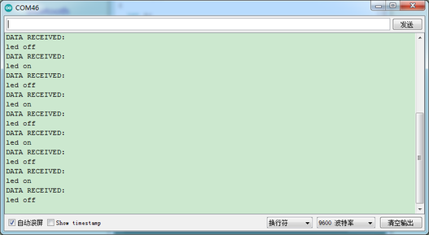