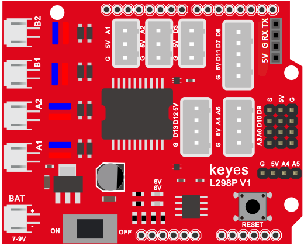
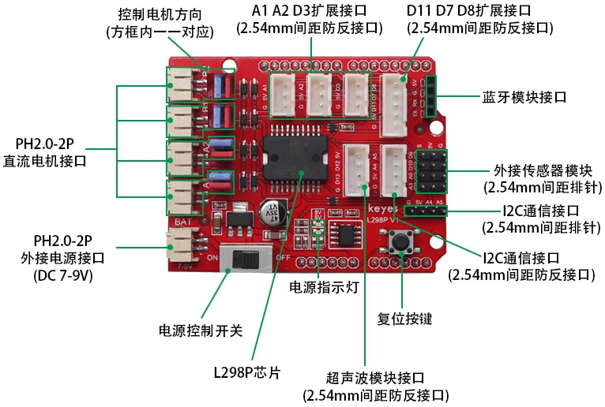

### 项目八 电机的驱动和调速

**项目介绍：**

想要让智能小车跑起来，光有电机是不够的，我们还需要一个“大力士”来帮Arduino控制电机。这个“大力士”就是电机驱动模块。

在本课中，我们将学习如何使用 L298P 电机驱动扩展板。L298P 是一款非常经典且强大的电机驱动芯片，它可以同时驱动两个直流电机，最大电流可达 2A。通过它，我们可以轻松控制小车的前进、后退、转弯以及速度。

为了简化接线，我们使用了一款基于 L298P 设计的电机驱动扩展板。这块板子可以直接插接在 Arduino 开发板上（就像戴帽子一样），这种设计叫做 “Shield（盾板）” 或 “扩展板”。





**规格参数：**

逻辑部分输入电压：DC 5V

驱动部分输入电压：DC 7-12V

逻辑部分工作电流：\<36mA

驱动部分工作电流：\<2A

最大耗散功率：25W（T=75℃）

控制信号输入电平：高电平2.3V\<Vin\<5V  ，低电平-0.3V\<Vin\<1.5V

工作温度：-25＋130℃

**驱动小车运行原理：**

根据上面电机驱动板的电路图和示意图，我们让左边电机（MA电机）的方向引脚在D2，调速引脚在D6，右边电机（MB电机）的方向引脚在D4，调速引脚在D5，按照以下表格的运动逻辑，我们就可以知道如何通过控制数字口和PWM口来控制2个电机转动，从而实现智能小车的行走。其中PWM值范围为0-255，设置数值越大，电机转动越快。（电机扩展板上的A1、A2接口是接左边电机、B1、B2接口是接右边电机）

| \\   | D2   | D6（PWM） | 电机MA   | D4   | D5（PWM） | 电机MB   |
|------|------|-----------|----------|------|-----------|----------|
| 前进 | HIGH | 200       | 逆时针转 | HIGH | 200       | 顺时针转 |
| 后退 | LOW  | 200       | 顺时针转 | LOW  | 200       | 逆时针转 |
| 左转 | LOW  | 200       | 顺时针转 | HIGH | 200       | 顺时针转 |
| 右转 | HIGH | 200       | 逆时针转 | LOW  | 200       | 逆时针转 |
| 停止 | /    | 0         | 停止     | /    | 0         | 停止     |

**项目组件：**

| 组装好的智能车(<span style="color: rgb(255, 76, 65);">未插上蓝牙模块</span>) *1 | USB线 *1 | 18650电池 *2（电池自备） |
| --- | --- | --- |
|  | |  |                                                        |

**接线图：**

**⚠️特别注意：坦克智能车已经组装好了，这里不需要把传感器模块和其他的都拆下来又重新组装和接线，这里再次提供接线图，是为了方便您编写代码！**


**项目代码：**

（**特别提醒：在上传程序代码前，需要把蓝牙模块取下，否则代码会上传失败。**）

``` c
/*
  迷你履带坦克机器人
  课程 8.1
  电机驱动
  http://www.keyes-robot.com
*/
int MA = 2; //定义电机M1,M2方向控制引脚为D2
int PWMA = 6; //定义电机M1,M2速度控制引脚为D6
int MB = 4; //定义电机M3,M4方向控制引脚为D4
int PWMB = 5; //定义电机M3,M4速度控制引脚为D5
void setup() {
  pinMode(MA, OUTPUT); //配置电机引脚为输出模式
  pinMode(PWMA, OUTPUT);
  pinMode(MB, OUTPUT);
  pinMode(PWMB, OUTPUT);

}
void loop() {
  //前进1秒
  digitalWrite(MA, HIGH); //电机A逆时针转
  analogWrite(PWMA, 200); //电机A速度为200
  digitalWrite(MB, HIGH); //电机B顺时针转
  analogWrite(PWMB, 200); //电机B速度为200
  delay(1000);

  //后退1秒
  digitalWrite(MA, LOW); //电机A顺时针转
  analogWrite(PWMA, 200); //电机A速度为200
  digitalWrite(MB, LOW); //电机B逆时针转
  analogWrite(PWMB, 200); //电机B速度为200
  delay(1000);

  //左转1秒
  digitalWrite(MA, LOW); //电机A顺时针转
  analogWrite(PWMA, 200); //电机A速度为200
  digitalWrite(MB, HIGH); //电机B顺时针转
  analogWrite(PWMB, 200); //电机B速度为200
  delay(1000);

  //右转1秒
  digitalWrite(MA, HIGH); //电机A逆时针转
  analogWrite(PWMA, 200); //电机A速度为200
  digitalWrite(MB, LOW); //电机B逆时针转
  analogWrite(PWMB, 200); //电机B速度为200
  delay(1000);

  //停止1秒
  analogWrite(PWMA, 0);
  analogWrite(PWMB, 0);
  delay(1000);
}
```

**项目结果：**

外接电源，将电机驱动扩展板上的拨码开关拨至ON端。选择好正确的开发板板型和适当的串口端口（COMxx），上传代码。智能车前进1秒，后退1秒，左转1秒，右转1秒，停止1秒，循环。

**代码说明**：

digitalWrite(MB,LOW); : 电机的正反转是靠高低电平的转换来实现的，控制电机正反转的脚位用一般的数字脚位就可以了。

analogWrite(PWMB,200); : 电机的速度调节是靠PWM来实现的，控制电机调速的脚位必须是Arduino的PWM脚位。

**项目拓展**：

（**特别提醒：在上传程序代码前，需要把蓝牙模块取下，否则代码会上传失败。**）

我们来通过调整PWM控制电机的速度，为后面我们控制车速做一个铺垫，接线不变

``` c
/*
  迷你履带坦克机器人
  课程 8.2
  电机驱动
  http://www.keyes-robot.com
*/
int MA = 2; //定义电机M1,M2方向控制引脚为D2
int PWMA = 6; //定义电机M1,M2速度控制引脚为D6
int MB = 4; //定义电机M3,M4方向控制引脚为D4
int PWMB = 5; //定义电机M3,M4速度控制引脚为D5
void setup() {
  pinMode(MA, OUTPUT); //配置电机引脚为输出模式
  pinMode(PWMA, OUTPUT);
  pinMode(MB, OUTPUT);
  pinMode(PWMB, OUTPUT);

}
void loop() {
  //前进1秒
  digitalWrite(MA, HIGH); //电机A逆时针转
  analogWrite(PWMA, 100); //电机A速度为100
  digitalWrite(MB, HIGH); //电机B顺时针转
  analogWrite(PWMB, 100); //电机B速度为100
  delay(1000);

  //后退1秒
  digitalWrite(MA, LOW); //电机A顺时针转
  analogWrite(PWMA, 100); //电机A速度为100
  digitalWrite(MB, LOW); //电机B逆时针转
  analogWrite(PWMB, 100); //电机B速度为100
  delay(1000);

  //左转1秒
  digitalWrite(MA, LOW); //电机A顺时针转
  analogWrite(PWMA, 100); //电机A速度为100
  digitalWrite(MB, HIGH); //电机B顺时针转
  analogWrite(PWMB, 100); //电机B速度为100
  delay(1000);

  //右转1秒
  digitalWrite(MA, HIGH); //电机A逆时针转
  analogWrite(PWMA, 100); //电机A速度为100
  digitalWrite(MB, LOW); //电机B逆时针转
  analogWrite(PWMB, 100); //电机B速度为100
  delay(1000);

  //停止1秒
  analogWrite(PWMA, 0);
  analogWrite(PWMB, 0);
  delay(1000);
}
```

外接电源，将电机驱动扩展板上的拨码开关拨至ON端。选择好正确的开发板板型和适当的串口端口（COMxx），上传代码。电机转动的速度是不是慢了很多？