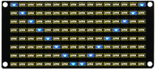
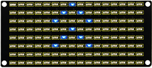
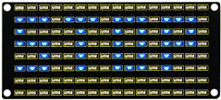
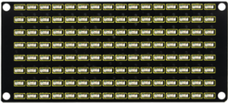
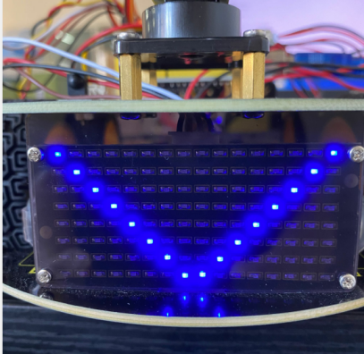
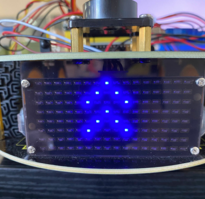
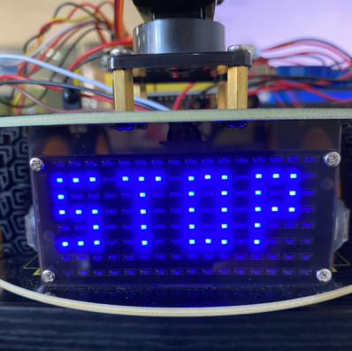

### 项目九 LED表情灯板

**项目介绍：**

如果在我们的机器人上加一块表情面板，这将是多么好玩的一件事情，keyes的8*16点阵就可以满足你的要求。你可以自己创建面部表情，动画，图案或者是其他有趣的显示。8*16
LED灯板自带128个LED。微处理器（arduino）的数据通过两线总线接口与AiP1640通讯，从而控制模块上128个LED的亮灭，从而让模块上点阵显示你需要的图案。为方便接线，我们还配送一根HX-2.54
4Pin接线。

**规格参数**


工作电压: DC 3.3-5V

功率损耗：400mW

震荡频率：450KHz

驱动电流：200mA

工作温度：-40~80℃

**项目组件：**

| UNO PLUS 开发板\*1                                        | L298P 电机驱动扩展板 V1\*1                              | 8x16 LED灯板\*1                                          |
|---------------------------------------------------------|---------------------------------------------------------|----------------------------------------------------------|
|  |  |   |
| USB线\*1                                                | 18650双节电池盒 (18650电池*2 （电池自配）)* 1           | 4P 转杜邦线母单\*1                                       |
|  |  |  |

**8×16点阵模块详细介绍：**

1\.  8\*16点阵的电路图：


2\.  控制8×16点阵的原理：

是怎么控制8×16点阵的每个led灯的呢？要知道一个字节有8位，每一位是0或1，0时关闭led，1时打开led灯，那么一个字节就可以控制点阵一列的led灯开关了，自然16个字节就可以控制16列led灯，即控制了8*16点阵。

3\.  接口说明及通讯协议：

微处理器（arduino）的数据通过两线总线接口与AiP1640通讯。

通讯协议图如下(SCLK)就是SCL，(DIN)就是SDA ：


① 数据输入的开始条件是，SCL为高电平，SDA由高变低。

② 数据命令设置，有下图所示方法可选

我们的示例程序中选择 地址自动加1的方式，其二进制是01000000对应的十六进制为0x40


③ 地址命令设置，有如下图地址可以选

我们示例程序中选了第一个00H，其二进制1100 0000对应的十六进制是0xc0


④ 数据输入的要求是，在输入数据时当SCL是高电平时，SDA上的信号必须保持不变，只有SCL上的时钟信号为低电平时，SDA上的信号才可以改变。数据的输入是低位在前，高位在后 传输。

⑤ 数据传输结束的条件是，SCL为低时，SDA为低，SCL为高时，SDA电平也变为高电平。

⑥ 显示控制，设置不同脉宽，脉宽有如下图可选

我们示例中选了脉宽为4/16，1000 1010对应的十六进制是0x8A


对应我们的示例程序来学习会理解的更好。

4\.  取模工具的使用说明


设置时，我们需要把一个图案转换成1组16个的16位数据，这里就需要用到一个取模软件,这个软件已放入资料文件夹中。使用时打开图标，显示如下图。


点击这个图标新建图案，根据显示屏规格，设置宽度为16，高度为8，如下图。


初始时发现格点不大，不方便设置，我们可以通过设置模拟动画，设置格点大小，点击如下图。


一直鼠标左键点击，就可以一直放大格点了。

放大后，我们就可以通过用鼠标点击白色区域，设置显示图案了。


设置时，鼠标点击（左右键都可以）白色格点，变为黑色；再点击黑色格点，变为白色。黑色代表该格点显示亮起，白色代表格点不显示。显示屏最多能设置16\*8个点显示。设置笑脸显示如下图。


设置参数设置，选择其他选项，设置如下图。设置完成点击。


设置取模方式，选择C51格式选择如下图。


设置成功后，在以下区域就可以看到对应的16个数据了，只需要将数据复制粘贴在数组中，就可以用直接调用了。（0x00,0x00,0x1C,0x02,0x02,0x02,0x5C,0x40,0x40,0x5C,0x02,0x02,0x02,0x1C,0x00,0x00）


**接线图：**

**⚠️特别注意：坦克智能车已经组装好了，这里不需要把传感器模块和其他的都拆下来又重新组装和接线，这里再次提供接线图，是为了方便您编写代码！**


**接线注意：** 8x16 LED灯板的GND、VCC、SDA、SCL分别对应的接到keyes传感器扩展板-（GND）、+（VCC）、A4、A5进行两线串行通信。（注意：这里是接了arduino IIC的引脚，但是这个模块并不是IIC通讯的，是可以接任意两个引脚的。）

**项目代码**

（**特别提醒：在上传程序代码前，需要把蓝牙模块取下，否则代码会上传失败。需要上传代码成功后，再连接蓝牙模块。**）

点阵显示上面画的微笑表情的代码

``` c
/*
  迷你履带坦克机器人
  课程 9.1
  8*16点阵
  http://www.keyes-robot.com
*/
unsigned char smile[] = {0x00, 0x00, 0x1c, 0x02, 0x02, 0x02, 0x5c, 0x40, 0x40, 0x5c, 0x02, 0x02, 0x02, 0x1c, 0x00, 0x00};
#define SCL_Pin  A5  //设置时钟引脚为 A5
#define SDA_Pin  A4  //设置数据引脚为 A4
void setup()
{
  //设置引脚为输出
  pinMode(SCL_Pin, OUTPUT);
  pinMode(SDA_Pin, OUTPUT);
  //清屏
  //matrix_display(clear);
}
void loop()
{
  matrix_display(smile);  //显示微笑表情图案
}
//这个函数用于点阵屏显示
void matrix_display(unsigned char matrix_value[])
{
  IIC_start();  //调用数据传输开始条件的函数
  IIC_send(0xc0);  //选择地址

  for (int i = 0; i < 16; i++) //图案数据有16个字节
  {
    IIC_send(matrix_value[i]); //传输图案的数据
  }
  IIC_end();   //结束图案数据传输
  IIC_start();
  IIC_send(0x8A);  //显示控制，选择脉宽为4/16
  IIC_end();
}
//传输数据开始的条件
void IIC_start()
{
  digitalWrite(SCL_Pin, HIGH);
  delayMicroseconds(3);
  digitalWrite(SDA_Pin, HIGH);
  delayMicroseconds(3);
  digitalWrite(SDA_Pin, LOW);
  delayMicroseconds(3);
}
//传输数据
void IIC_send(unsigned char send_data)
{
  for (char i = 0; i < 8; i++) //每个字节有8位
  {
    digitalWrite(SCL_Pin, LOW); //将时钟引脚SCL_Pin拉低，才可以改变SDA的信号
    delayMicroseconds(3);
    if (send_data & 0x01) //根据字节的每一位是1还是0来设置SDA_Pin的高低电平
    {
      digitalWrite(SDA_Pin, HIGH);
    }
    else
    {
      digitalWrite(SDA_Pin, LOW);
    }
    delayMicroseconds(3);
    digitalWrite(SCL_Pin, HIGH); //将时钟引脚SCL_Pin拉高，停止数据的传输
    delayMicroseconds(3);
    send_data = send_data >> 1;  //一位一位的检测，所以将数据右移一位
  }
}
//数据传输结束的标志
void IIC_end()
{
  digitalWrite(SCL_Pin, LOW);
  delayMicroseconds(3);
  digitalWrite(SDA_Pin, LOW);
  delayMicroseconds(3);
  digitalWrite(SCL_Pin, HIGH);
  delayMicroseconds(3);
  digitalWrite(SDA_Pin, HIGH);
  delayMicroseconds(3);
}
```

**项目结果：**

在 UNO PLUS 开发板上传代码成功，按照接线图接线，拨码开关拨打到右端上电后，看一下，我们的显示屏上是不是显示了一个笑脸。


**项目拓展：**

我们利用刚刚学到的取模工具,让点阵循环显示开始图案，前进图案，停止图案，然后清除图案，时间间隔为2000毫秒。




利用取模工具得到的我们要显示的图形代码

开始的代码：

0x01,0x02,0x04,0x08,0x10,0x20,0x40,0x80,0x80,0x40,0x20,0x10,0x08,0x04,0x02,0x01

前进的代码：

0x00,0x00,0x00,0x00,0x00,0x24,0x12,0x09,0x12,0x24,0x00,0x00,0x00,0x00,0x00,0x00

后退的代码：

0x00,0x00,0x00,0x00,0x00,0x24,0x48,0x90,0x48,0x24,0x00,0x00,0x00,0x00,0x00,0x00

左转的代码：

0x00,0x00,0x00,0x00,0x00,0x00,0x44,0x28,0x10,0x44,0x28,0x10,0x44,0x28,0x10,0x00

右转的代码：

0x00,0x10,0x28,0x44,0x10,0x28,0x44,0x10,0x28,0x44,0x00,0x00,0x00,0x00,0x00,0x00

停止的代码：

0x2E,0x2A,0x3A,0x00,0x02,0x3E,0x02,0x00,0x3E,0x22,0x3E,0x00,0x3E,0x0A,0x0E,0x00

清屏的代码：

0x00,0x00,0x00,0x00,0x00,0x00,0x00,0x00,0x00,0x00,0x00,0x00,0x00,0x00,0x00,0x00

接线图不变：


下面就是多个图案切换显示的代码：

（**特别提醒：在上传程序代码前，需要把蓝牙模块取下，否则代码会上传失败。需要上传代码成功后，再连接蓝牙模块。**）

``` c
/*
  迷你履带坦克机器人
  课程 9.2
  8*16点阵
  http://www.keyes-robot.com
*/
//数组，用于储存图案的数据，可以自己算也可以从取摸工具中得到
unsigned char start01[] = {0x01, 0x02, 0x04, 0x08, 0x10, 0x20, 0x40, 0x80, 0x80, 0x40, 0x20, 0x10, 0x08, 0x04, 0x02, 0x01};
unsigned char front[] = {0x00, 0x00, 0x00, 0x00, 0x00, 0x24, 0x12, 0x09, 0x12, 0x24, 0x00, 0x00, 0x00, 0x00, 0x00, 0x00};
unsigned char back[] = {0x00, 0x00, 0x00, 0x00, 0x00, 0x24, 0x48, 0x90, 0x48, 0x24, 0x00, 0x00, 0x00, 0x00, 0x00, 0x00};
unsigned char left[] = {0x00, 0x00, 0x00, 0x00, 0x00, 0x00, 0x44, 0x28, 0x10, 0x44, 0x28, 0x10, 0x44, 0x28, 0x10, 0x00};
unsigned char right[] = {0x00, 0x10, 0x28, 0x44, 0x10, 0x28, 0x44, 0x10, 0x28, 0x44, 0x00, 0x00, 0x00, 0x00, 0x00, 0x00};
unsigned char STOP01[] = {0x2E, 0x2A, 0x3A, 0x00, 0x02, 0x3E, 0x02, 0x00, 0x3E, 0x22, 0x3E, 0x00, 0x3E, 0x0A, 0x0E, 0x00};
unsigned char clear[] = {0x00, 0x00, 0x00, 0x00, 0x00, 0x00, 0x00, 0x00, 0x00, 0x00, 0x00, 0x00, 0x00, 0x00, 0x00, 0x00};
#define SCL_Pin  A5  //设置时钟引脚为 A5
#define SDA_Pin  A4  //设置数据引脚为 A4
void setup()
{
  //设置引脚为输出
  pinMode(SCL_Pin, OUTPUT);
  pinMode(SDA_Pin, OUTPUT);
  //清屏
  matrix_display(clear);
}
void loop()
{
  matrix_display(start01);  //显示开始图案
  delay(2000);
  matrix_display(front);    //前进图案
  delay(2000);
  matrix_display(STOP01);   //停止图案
  delay(2000);
  matrix_display(clear);    //清屏
  delay(2000);
}

//这个函数用于点阵屏显示
void matrix_display(unsigned char matrix_value[])
{
  IIC_start();  //调用数据传输开始条件的函数
  IIC_send(0xc0);  //选择地址
  for (int i = 0; i < 16; i++) //图案数据有16个字节
  {
    IIC_send(matrix_value[i]); //传输图案的数据
  }
  IIC_end();   //结束图案数据传输
  IIC_start();
  IIC_send(0x8A);  //显示控制，选择脉宽为4/16
  IIC_end();
}
//传输数据开始的条件
void IIC_start()
{
  digitalWrite(SCL_Pin, HIGH);
  delayMicroseconds(3);
  digitalWrite(SDA_Pin, HIGH);
  delayMicroseconds(3);
  digitalWrite(SDA_Pin, LOW);
  delayMicroseconds(3);
}
//传输数据
void IIC_send(unsigned char send_data)
{
  for (char i = 0; i < 8; i++) //每个字节有8位
  {
    digitalWrite(SCL_Pin, LOW); //将时钟引脚SCL_Pin拉低，才可以改变SDA的信号
    delayMicroseconds(3);
    if (send_data & 0x01) //根据字节的每一位是1还是0来设置SDA_Pin的高低电平
    {
      digitalWrite(SDA_Pin, HIGH);
    }
    else
    {
      digitalWrite(SDA_Pin, LOW);
    }
    delayMicroseconds(3);
    digitalWrite(SCL_Pin, HIGH); //将时钟引脚SCL_Pin拉高，停止数据的传输
    delayMicroseconds(3);
    send_data = send_data >> 1;  //一位一位的检测，所以将数据右移一位
  }
}
//数据传输结束的标志
void IIC_end()
{
  digitalWrite(SCL_Pin, LOW);
  delayMicroseconds(3);
  digitalWrite(SDA_Pin, LOW);
  delayMicroseconds(3);
  digitalWrite(SCL_Pin, HIGH);
  delayMicroseconds(3);
  digitalWrite(SDA_Pin, HIGH);
  delayMicroseconds(3);
} 
```

上传代码到开发板，我们看到表情面板（8×16点阵显示开始前进停止然后清屏的图案，循环反复）。





