### 项目九 LED表情灯板

**项目介绍：**

如果在我们的机器人上加一块表情面板，会非常有趣。8x16 LED点阵可以满足需求，能自己创建面部表情、动画等。微处理器（Arduino）通过两线总线接口与AiP1640通讯，控制点阵上128个LED的亮灭来显示图案。

**规格参数**


- 工作电压: DC 3.3-5V

- 功率损耗：400mW

- 震荡频率：450KHz

- 驱动电流：200mA

- 工作温度：-40~80℃

**项目组件：**

|组装好的智能车(<span style="color: rgb(255, 76, 65);">未插上蓝牙模块</span>) *1 | USB线 *1 | 18650电池 *2（电池自备） |
|-------------------------------|---------------------------------|--------------------------------|
|  | |  |

**8×16点阵模块详细介绍：**

**1\. 如何控制每一个 LED？**

8x16 点阵共有 128 个 LED。为了简化控制，我们将这 128 个灯分为 16 列，每列有 8 个灯。 在计算机中，一个字节（Byte）由 8 位（Bit）组成，每一位可以是 0 或 1。

- 1 代表 LED 亮

- 0 代表 LED 灭

因此，1 个字节的数据正好可以控制 1 列（8个）LED 的状态。要控制整个 8x16 点阵，我们需要发送 16 个字节的数据，分别对应 16 列。

**接口说明及通讯协议**

微处理器（Arduino）通过两线总线接口与AiP1640通讯。通讯协议图中，(SCLK)为SCL，(DIN)为SDA：

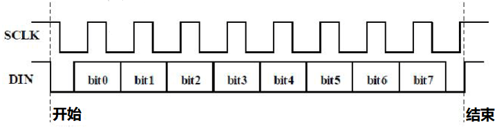

- ① 数据输入开始条件：SCL为高电平，SDA由高变低。

- ② 数据命令设置：示例程序中选择 “地址自动加1” 方式，二进制为0100 0000，对应十六进制0x40。

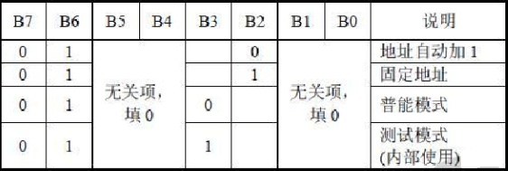

- ③ 地址命令设置：示例程序中选择第一个00H，二进制为1100 0000，对应十六进制0xc0。


- ④ 数据输入：SCL为高电平时SDA信号保持不变，低电平时可改变，数据输入低位在前、高位在后传输。

- ⑤ 数据传输结束条件：SCL为低时SDA为低，SCL变高时SDA变高。

- ⑥ 显示控制：示例中选择脉宽为4/16，十六进制为0x8A。

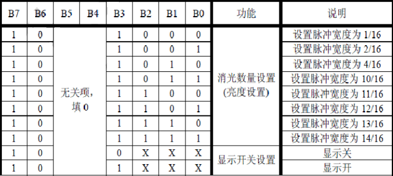

**取模工具的使用说明**

设置时，我们需要把一个图案转换成1组16个的16位数据，这里就需要用到一个取模软件，这个软件已放入资料文件夹中。使用时打开图标，显示如下图。

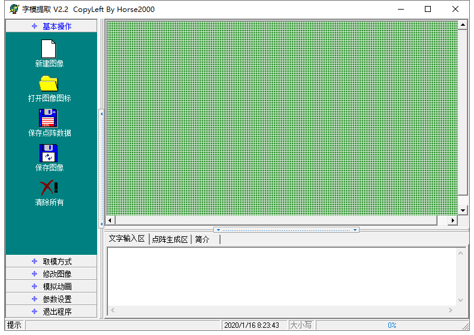

点击 “**新建图案**” ，根据显示屏规格，设置宽度为16，高度为8，如下图。

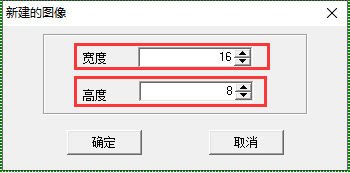

初始时发现格点不大，不方便设置，我们可以通过点击 “**模拟动画**” 设置格点大小，点击“放大格点” 来放大格点。如下图。

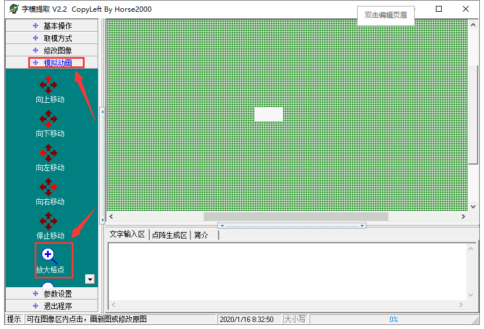

一直鼠标左键点击，就可以一直放大格点了。放大后，我们就可以通过用鼠标点击白色区域，设置显示图案了。


设置时，鼠标点击（左右键都可以）白色格点，变为黑色；再点击黑色格点，变为白色。黑色代表该格点显示亮起，白色代表格点不显示。显示屏最多能设置16*8个点显示。设置笑脸显示如下图。


点击 “**参数设置**”，选择 “**其他选项**”，设置如下图。设置完成点击 “**确定**” 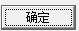。


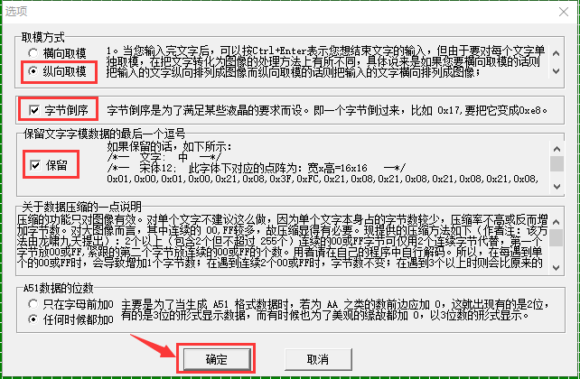

点击 “**取模方式**”，选择 “**C51格式**”。如下图：


设置成功后，在以下区域就可以看到对应的16个数据了，只需要将数据复制粘贴在数组中，就可以用直接调用了。（0x00,0x00,0x1C,0x02,0x02,0x02,0x5C,0x40,0x40,0x5C,0x02,0x02,0x02,0x1C,0x00,0x00）

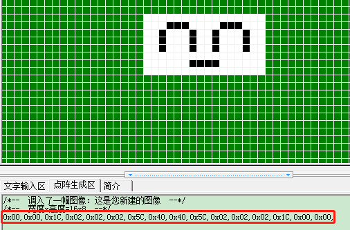

**接线图：**

**⚠️特别注意：坦克智能车已经组装好了，这里不需要把传感器模块和其他的都拆下来又重新组装和接线，这里再次提供接线图，是为了方便您编写代码！**


**项目代码**

（**特别提醒：在上传程序代码前，需要把蓝牙模块取下，否则代码会上传失败。**）

点阵显示上面画的微笑表情的代码

``` c
/*
  迷你履带坦克机器人
  课程 9.1
  8*16点阵
  http://www.keyes-robot.com
*/
unsigned char smile[] = {0x00, 0x00, 0x1c, 0x02, 0x02, 0x02, 0x5c, 0x40, 0x40, 0x5c, 0x02, 0x02, 0x02, 0x1c, 0x00, 0x00};
#define SCL_Pin  A5  //设置时钟引脚为 A5
#define SDA_Pin  A4  //设置数据引脚为 A4
void setup()
{
  //设置引脚为输出
  pinMode(SCL_Pin, OUTPUT);
  pinMode(SDA_Pin, OUTPUT);
  //清屏
  //matrix_display(clear);
}
void loop()
{
  matrix_display(smile);  //显示微笑表情图案
}
//这个函数用于点阵屏显示
void matrix_display(unsigned char matrix_value[])
{
  IIC_start();  //调用数据传输开始条件的函数
  IIC_send(0xc0);  //选择地址

  for (int i = 0; i < 16; i++) //图案数据有16个字节
  {
    IIC_send(matrix_value[i]); //传输图案的数据
  }
  IIC_end();   //结束图案数据传输
  IIC_start();
  IIC_send(0x8A);  //显示控制，选择脉宽为4/16
  IIC_end();
}
//传输数据开始的条件
void IIC_start()
{
  digitalWrite(SCL_Pin, HIGH);
  delayMicroseconds(3);
  digitalWrite(SDA_Pin, HIGH);
  delayMicroseconds(3);
  digitalWrite(SDA_Pin, LOW);
  delayMicroseconds(3);
}
//传输数据
void IIC_send(unsigned char send_data)
{
  for (char i = 0; i < 8; i++) //每个字节有8位
  {
    digitalWrite(SCL_Pin, LOW); //将时钟引脚SCL_Pin拉低，才可以改变SDA的信号
    delayMicroseconds(3);
    if (send_data & 0x01) //根据字节的每一位是1还是0来设置SDA_Pin的高低电平
    {
      digitalWrite(SDA_Pin, HIGH);
    }
    else
    {
      digitalWrite(SDA_Pin, LOW);
    }
    delayMicroseconds(3);
    digitalWrite(SCL_Pin, HIGH); //将时钟引脚SCL_Pin拉高，停止数据的传输
    delayMicroseconds(3);
    send_data = send_data >> 1;  //一位一位的检测，所以将数据右移一位
  }
}
//数据传输结束的标志
void IIC_end()
{
  digitalWrite(SCL_Pin, LOW);
  delayMicroseconds(3);
  digitalWrite(SDA_Pin, LOW);
  delayMicroseconds(3);
  digitalWrite(SCL_Pin, HIGH);
  delayMicroseconds(3);
  digitalWrite(SDA_Pin, HIGH);
  delayMicroseconds(3);
}
```

**项目结果：**

外接电源，将电机驱动扩展板上的拨码开关拨至ON端。选择好正确的开发板板型和适当的串口端口（COMxx），上传代码。显示屏上显示一个笑脸。

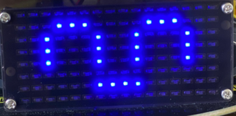

**项目拓展：**

我们利用刚刚学到的取模工具,让点阵循环显示开始图案，前进图案，停止图案，然后清除图案，时间间隔为2000毫秒。

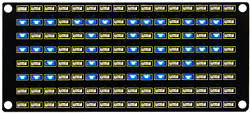
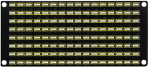

利用取模工具得到的我们要显示的图形代码

开始的代码：

0x01,0x02,0x04,0x08,0x10,0x20,0x40,0x80,0x80,0x40,0x20,0x10,0x08,0x04,0x02,0x01

前进的代码：

0x00,0x00,0x00,0x00,0x00,0x24,0x12,0x09,0x12,0x24,0x00,0x00,0x00,0x00,0x00,0x00

后退的代码：

0x00,0x00,0x00,0x00,0x00,0x24,0x48,0x90,0x48,0x24,0x00,0x00,0x00,0x00,0x00,0x00

左转的代码：

0x00,0x00,0x00,0x00,0x00,0x00,0x44,0x28,0x10,0x44,0x28,0x10,0x44,0x28,0x10,0x00

右转的代码：

0x00,0x10,0x28,0x44,0x10,0x28,0x44,0x10,0x28,0x44,0x00,0x00,0x00,0x00,0x00,0x00

停止的代码：

0x2E,0x2A,0x3A,0x00,0x02,0x3E,0x02,0x00,0x3E,0x22,0x3E,0x00,0x3E,0x0A,0x0E,0x00

清屏的代码：

0x00,0x00,0x00,0x00,0x00,0x00,0x00,0x00,0x00,0x00,0x00,0x00,0x00,0x00,0x00,0x00

接线图不变：

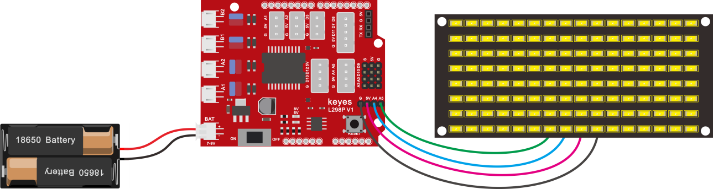

下面就是多个图案切换显示的代码：

（**特别提醒：在上传程序代码前，需要把蓝牙模块取下，否则代码会上传失败。**）

``` c
/*
  迷你履带坦克机器人
  课程 9.2
  8*16点阵
  http://www.keyes-robot.com
*/
//数组，用于储存图案的数据，可以自己算也可以从取摸工具中得到
unsigned char start01[] = {0x01, 0x02, 0x04, 0x08, 0x10, 0x20, 0x40, 0x80, 0x80, 0x40, 0x20, 0x10, 0x08, 0x04, 0x02, 0x01};
unsigned char front[] = {0x00, 0x00, 0x00, 0x00, 0x00, 0x24, 0x12, 0x09, 0x12, 0x24, 0x00, 0x00, 0x00, 0x00, 0x00, 0x00};
unsigned char back[] = {0x00, 0x00, 0x00, 0x00, 0x00, 0x24, 0x48, 0x90, 0x48, 0x24, 0x00, 0x00, 0x00, 0x00, 0x00, 0x00};
unsigned char left[] = {0x00, 0x00, 0x00, 0x00, 0x00, 0x00, 0x44, 0x28, 0x10, 0x44, 0x28, 0x10, 0x44, 0x28, 0x10, 0x00};
unsigned char right[] = {0x00, 0x10, 0x28, 0x44, 0x10, 0x28, 0x44, 0x10, 0x28, 0x44, 0x00, 0x00, 0x00, 0x00, 0x00, 0x00};
unsigned char STOP01[] = {0x2E, 0x2A, 0x3A, 0x00, 0x02, 0x3E, 0x02, 0x00, 0x3E, 0x22, 0x3E, 0x00, 0x3E, 0x0A, 0x0E, 0x00};
unsigned char clear[] = {0x00, 0x00, 0x00, 0x00, 0x00, 0x00, 0x00, 0x00, 0x00, 0x00, 0x00, 0x00, 0x00, 0x00, 0x00, 0x00};
#define SCL_Pin  A5  //设置时钟引脚为 A5
#define SDA_Pin  A4  //设置数据引脚为 A4
void setup()
{
  //设置引脚为输出
  pinMode(SCL_Pin, OUTPUT);
  pinMode(SDA_Pin, OUTPUT);
  //清屏
  matrix_display(clear);
}
void loop()
{
  matrix_display(start01);  //显示开始图案
  delay(2000);
  matrix_display(front);    //前进图案
  delay(2000);
  matrix_display(STOP01);   //停止图案
  delay(2000);
  matrix_display(clear);    //清屏
  delay(2000);
}

//这个函数用于点阵屏显示
void matrix_display(unsigned char matrix_value[])
{
  IIC_start();  //调用数据传输开始条件的函数
  IIC_send(0xc0);  //选择地址
  for (int i = 0; i < 16; i++) //图案数据有16个字节
  {
    IIC_send(matrix_value[i]); //传输图案的数据
  }
  IIC_end();   //结束图案数据传输
  IIC_start();
  IIC_send(0x8A);  //显示控制，选择脉宽为4/16
  IIC_end();
}
//传输数据开始的条件
void IIC_start()
{
  digitalWrite(SCL_Pin, HIGH);
  delayMicroseconds(3);
  digitalWrite(SDA_Pin, HIGH);
  delayMicroseconds(3);
  digitalWrite(SDA_Pin, LOW);
  delayMicroseconds(3);
}
//传输数据
void IIC_send(unsigned char send_data)
{
  for (char i = 0; i < 8; i++) //每个字节有8位
  {
    digitalWrite(SCL_Pin, LOW); //将时钟引脚SCL_Pin拉低，才可以改变SDA的信号
    delayMicroseconds(3);
    if (send_data & 0x01) //根据字节的每一位是1还是0来设置SDA_Pin的高低电平
    {
      digitalWrite(SDA_Pin, HIGH);
    }
    else
    {
      digitalWrite(SDA_Pin, LOW);
    }
    delayMicroseconds(3);
    digitalWrite(SCL_Pin, HIGH); //将时钟引脚SCL_Pin拉高，停止数据的传输
    delayMicroseconds(3);
    send_data = send_data >> 1;  //一位一位的检测，所以将数据右移一位
  }
}
//数据传输结束的标志
void IIC_end()
{
  digitalWrite(SCL_Pin, LOW);
  delayMicroseconds(3);
  digitalWrite(SDA_Pin, LOW);
  delayMicroseconds(3);
  digitalWrite(SCL_Pin, HIGH);
  delayMicroseconds(3);
  digitalWrite(SDA_Pin, HIGH);
  delayMicroseconds(3);
} 
```

外接电源，将电机驱动扩展板上的拨码开关拨至ON端。选择好正确的开发板板型和适当的串口端口（COMxx），上传代码。看到表情面板（8×16点阵显示开始、前进、停止，然后清屏的图案，循环反复）。

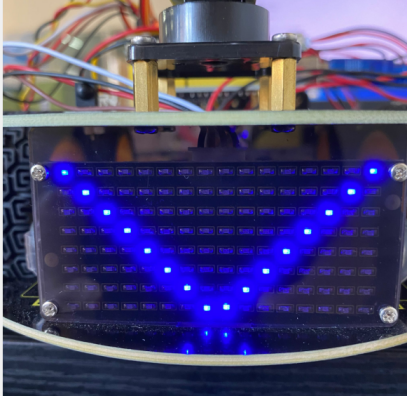


