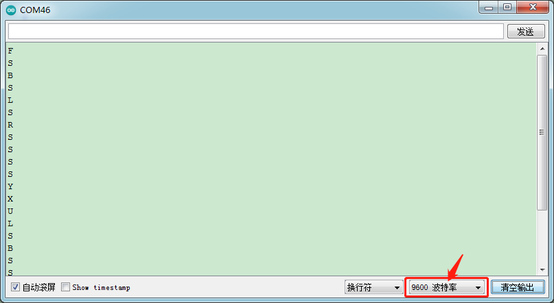

### 项目十四 蓝牙遥控智能车

**项目介绍：**

前面课程中，我们利用红外控制智能车运动，在这课程中我们可以做一个蓝牙控制智能车。既然是控制智能车，那就有一个控制端和被控制端。课程中我们把手机当做控制端（主机），蓝牙模块（从机）连接的智能车当做被控制端。使用时，我们需要在手机上安装一个APP，然后连接蓝牙模块，然后我们利用蓝牙APP上各个按钮，控制智能车实现各种运动状态。

**蓝牙遥控智能车具体逻辑如下表格：**

经过前面 第7课 蓝牙遥控的原理及应用的学习和了解，经过测试，我们得出了手机APP上各个按钮对应的控制字符，如下图：



以下是APP上各个按钮对应的控制字符和对应的功能，这里我们整理了一个表格如下：

| 按钮: |                            | 功能：配对连接HM-10蓝牙模块                                                               |
|--------------------------------------------------------------|----------------------------|-------------------------------------------------------------------------------------------|
| 按钮: |                            | 功能：进入蓝牙控制界面                                                                    |
| 按钮: |                            | 功能：断开蓝牙连接                                                                        |
| 按钮: | 控制字符：按下：F；松开：S | 功能：按下，小车前进；松开就停止                                                          |
| 按钮: | 控制字符：按下：B；松开：S | 功能：按下，小车后退；松开就停止                                                          |
| 按钮: | 控制字符：按下：L；松开：S | 功能：按下，小车左旋转；松开就停止                                                        |
| 按钮: | 控制字符：按下：R；松开：S | 功能：按下，小车右旋转；松开就停止                                                        |
| 按钮: | 控制字符： 点击发送：S     | 功能：小车停止，停止所有功能                                                              |
| 按钮: | 控制字符：                 | 功能：点击一下开启手机方向感应控制，再点击一下退出方向感应控制                            |
| 按钮: | 控制字符： 点击发送：U     | 功能：开启避障功能，点击退出       |
| 按钮: | 控制字符： 点击发送：X     | 功能：开启寻光功能，点击退出       |
| 按钮: | 控制字符： 点击发送：Y     | 功能：开启超声波跟随功能，点击退出 |

**接线图：**

**⚠️特别注意：坦克智能车已经组装好了，这里不需要把传感器模块和其他的都拆下来又重新组装和接线，这里再次提供接线图，是为了方便您编写代码！**

蓝牙+电机


接线注意：蓝牙模块的RXD、TXD、GND、VCC分别对应的接到电机驱动扩展板上的TX、RX、-（GND）、+（VCC），而蓝牙模块的STATE和BRK两引脚不需要接，电源接到BAT接口。

左、右两电机分别对应的连接到电机驱动扩展板上的接口A和接口B；蓝牙模块的RXD、TXD、GND、VCC分别对应的接到电机驱动扩展板上的TX、RX、-（GND）、+（VCC），而蓝牙模块的STATE和BRK两引脚不需要接，电源接到BAT接口。

**测试代码：**

（**特别提醒：在上传程序代码前，需要把蓝牙模块取下，否则代码会上传失败。需要上传代码成功后，再连接蓝牙模块。**）

``` c
/*
  迷你履带坦克机器人
  课程 14
  蓝牙控制智能车
  http://www.keyes-robot.com
*/
//数组，用于储存图案的数据，可以自己算也可以从取摸工具中得到
unsigned char start01[] = {0x01, 0x02, 0x04, 0x08, 0x10, 0x20, 0x40, 0x80, 0x80, 0x40, 0x20, 0x10, 0x08, 0x04, 0x02, 0x01};
unsigned char front[] = {0x00, 0x00, 0x00, 0x00, 0x00, 0x24, 0x12, 0x09, 0x12, 0x24, 0x00, 0x00, 0x00, 0x00, 0x00, 0x00};
unsigned char back01[] = {0x00, 0x00, 0x00, 0x00, 0x00, 0x24, 0x48, 0x90, 0x48, 0x24, 0x00, 0x00, 0x00, 0x00, 0x00, 0x00};
unsigned char left[] = {0x00, 0x00, 0x00, 0x00, 0x00, 0x00, 0x44, 0x28, 0x10, 0x44, 0x28, 0x10, 0x44, 0x28, 0x10, 0x00};
unsigned char right[] = {0x00, 0x10, 0x28, 0x44, 0x10, 0x28, 0x44, 0x10, 0x28, 0x44, 0x00, 0x00, 0x00, 0x00, 0x00, 0x00};
unsigned char STOP01[] = {0x2E, 0x2A, 0x3A, 0x00, 0x02, 0x3E, 0x02, 0x00, 0x3E, 0x22, 0x3E, 0x00, 0x3E, 0x0A, 0x0E, 0x00};
unsigned char clear[] = {0x00, 0x00, 0x00, 0x00, 0x00, 0x00, 0x00, 0x00, 0x00, 0x00, 0x00, 0x00, 0x00, 0x00, 0x00, 0x00};
#define SCL_Pin  A5  //设置时钟引脚为 A5
#define SDA_Pin  A4  //设置数据引脚为 A4
int MA = 2; //定义电机A方向控制引脚为D2
int PWMA = 6; //定义电机A速度控制引脚为D6
int MB = 4; //定义电机A方向控制引脚为D4
int PWMB = 5; //定义电机A速度控制引脚为D5
char blue_val;

void setup() {
  Serial.begin(9600);  //设置波特率为9600
  pinMode(MA, OUTPUT); //配置电机引脚为输出模式
  pinMode(PWMA, OUTPUT);
  pinMode(MB, OUTPUT);
  pinMode(PWMB, OUTPUT);
  //设置引脚为输出
  pinMode(SCL_Pin, OUTPUT);
  pinMode(SDA_Pin, OUTPUT);
  //清屏
  matrix_display(clear);
  matrix_display(start01);
}
void loop() {
  if (Serial.available() > 0) { //接收到蓝牙信号
    blue_val = Serial.read(); //接收到的信号赋给blue_val
    Serial.println(blue_val);  //串口监视器显示蓝牙信号
    switch (blue_val) {
      case  'F':  advance();  break;  //接收到‘F’前进
      case  'B':  back();     break;  //接收到‘B’后退
      case  'L':  turnL();    break;  //接收到‘L’左旋转
      case  'R':  turnR();    break;  //接收到‘R’右旋转
      case  'S':  stopp();    break;  //接收到‘S’停止
    }
  }
}

void advance() { //小车前进
  matrix_display(front);  //显示向前的图案
  digitalWrite(MA, HIGH); //电机A逆时针转
  analogWrite(PWMA, 200); //电机A速度为200
  digitalWrite(MB, HIGH); //电机B顺时针转
  analogWrite(PWMB, 200); //电机B速度为200
}

void back() { //小车后退
  matrix_display(back01);  //显示后退的图案
  digitalWrite(MA, LOW); //电机A顺时针转
  analogWrite(PWMA, 200); //电机A速度为200
  digitalWrite(MB, LOW); //电机B逆时针转
  analogWrite(PWMB, 200); //电机B速度为200
}

void turnL() { //小车左转
  matrix_display(left);  //显示左转的图案
  digitalWrite(MA, HIGH); //电机A逆时针转
  analogWrite(PWMA, 200); //电机A速度为200
  digitalWrite(MB, LOW); //电机B逆时针转
  analogWrite(PWMB, 200); //电机B速度为200
}

void turnR() { //小车右转
  matrix_display(right);  //显示右转的图案
  digitalWrite(MA, LOW); //电机A正转
  analogWrite(PWMA, 200); //电机A速度为200
  digitalWrite(MB, LOW); //电机B反转
  analogWrite(PWMB, 200); //电机B速度为200
}

void stopp() { //小车停止
  matrix_display(STOP01);  //显示停止的图案
  analogWrite(PWMA, 0); //电机A速度为0
  analogWrite(PWMB, 0); //电机B速度为0
}

//这个函数用于点阵屏显示
void matrix_display(unsigned char matrix_value[])
{
  IIC_start();  //调用数据传输开始条件的函数
  IIC_send(0xc0);  //选择地址
  for (int i = 0; i < 16; i++) //图案数据有16个字节
  {
    IIC_send(matrix_value[i]); //传输图案的数据
  }
  IIC_end();   //结束图案数据传输
  IIC_start();
  IIC_send(0x8A);  //显示控制，选择脉宽为4/16
  IIC_end();
}
//传输数据开始的条件
void IIC_start()
{
  digitalWrite(SCL_Pin, HIGH);
  delayMicroseconds(3);
  digitalWrite(SDA_Pin, HIGH);
  delayMicroseconds(3);
  digitalWrite(SDA_Pin, LOW);
  delayMicroseconds(3);
}
//传输数据
void IIC_send(unsigned char send_data)
{
  for (char i = 0; i < 8; i++) //每个字节有8位
  {
    digitalWrite(SCL_Pin, LOW); //将时钟引脚SCL_Pin拉低，才可以改变SDA的信号
    delayMicroseconds(3);
    if (send_data & 0x01) //根据字节的每一位是1还是0来设置SDA_Pin的高低电平
    {
      digitalWrite(SDA_Pin, HIGH);
    }
    else
    {
      digitalWrite(SDA_Pin, LOW);
    }
    delayMicroseconds(3);
    digitalWrite(SCL_Pin, HIGH); //将时钟引脚SCL_Pin拉高，停止数据的传输
    delayMicroseconds(3);
    send_data = send_data >> 1;  //一位一位的检测，所以将数据右移一位
  }
}
//数据传输结束的标志
void IIC_end()
{
  digitalWrite(SCL_Pin, LOW);
  delayMicroseconds(3);
  digitalWrite(SDA_Pin, LOW);
  delayMicroseconds(3);
  digitalWrite(SCL_Pin, HIGH);
  delayMicroseconds(3);
  digitalWrite(SDA_Pin, HIGH);
  delayMicroseconds(3);
}
```

好了，按住蓝牙APP的前进、后退、左转弯、右转弯、停止、左旋转、右旋转的按钮控制桌面迷你蓝牙智能车分别前进、后退、左转弯、右转弯、停止、左旋转、右旋转的程序代码全编写完了。上传程序，看看效果。

**测试结果：**

将驱动扩展板堆叠在UNO plus板上，上传好代码，按照接线图接线，将拨码开关拨至ON端后，手机APP连接蓝牙成功后，我们就能用手机APP控制智能车运动并在LED灯板上显示对应的图案了。

按下按钮，小车前进；按下按钮，小车后退；按下按钮，小车左旋转；按下按钮，小车右旋转；点击按钮，小车停止；点击一下按，开启手机重力感应控制，拿起手机从不同的方向移动手机，智能车会自动的移动，再点击一下按钮，退出重力感应控制。