## 5.1. KidsBlock(Scratch)\_资料下载

⚠️特别提示:
请先下载本教程需要用到的KidsBlock(Scratch)\_资料(包含：KidsBlock(Scratch)\_代码）和Android_APP等，保存至您方便使用的路径下。

**下载：** [KidsBlock(Scratch)_资料](./KidsBlock(Scratch)_资料.7z) 和 [Android_APP](./Android_APP.7z)

## 5.2 KidsBlock IDE 软件下载安装

**注意：这里是以Windows系统为例，macOS 系统可以以此作为参考。**

1\.  点击链接 <https://xiazai.keyesrobot.cn/KidsBlock.exe> 下载软件。

2\. 双击软件安装包，选择 “**仅为我安装**”，选择 “**下一步(N)**”。

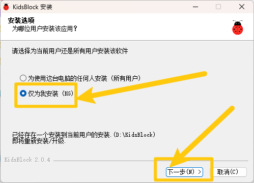

3\. 点击 “**浏览（B）**”，可以自定义软件安装的位置，最后选择
“**安装（I）**”。

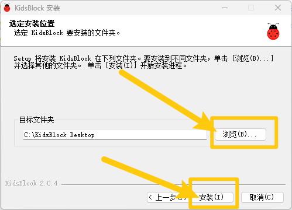

4\.  安装完成后，选择 “**完成（F）**”。

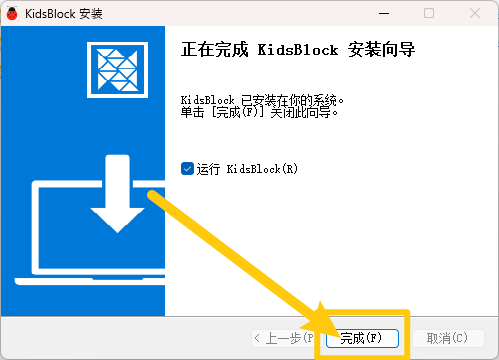

## 5.3 KidsBlock软件的使用

（以下是以Windows系统为例，MacOS系统可以参考）

### 5.3.1. 软件中各按钮的功能：

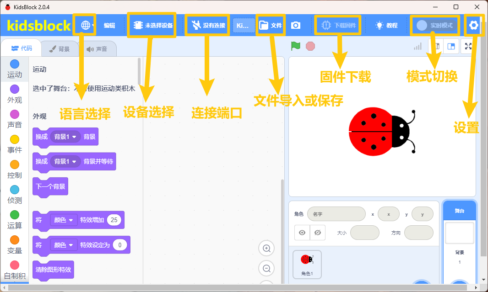

### 5.3.2. 选择设备

(提醒：本教程是在 Windows 系统下操作， Mac 系统类似，可以参照。)

**特别注意：** 该套件中使用的设备是 Tank Robot v2.0，关于导入Tank Robot
v2.0设备的方法，请参考以下内容.

1\. 确保UNO R3开发板与计算机连接成功，然后双击 “**KidsBlock**” 图标打开KidsBlock软件。

2\.  单击，如下图所示：

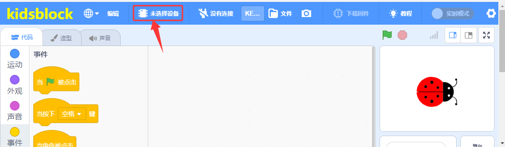

3\. 由于本教程使用的是 Tank Robot v2.0 设备，所以选择 “**Tank Robot v2.0**” 设备，如下图所示：

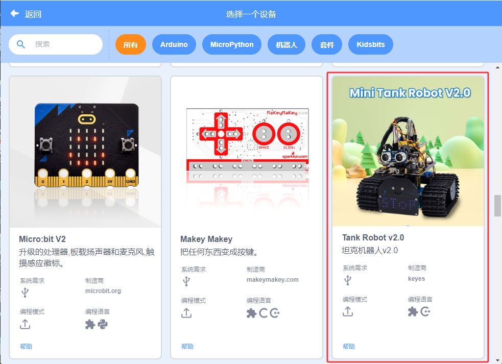

4\.  连接串口端口(COM26)，点击 “**连接**”，如下图所示：

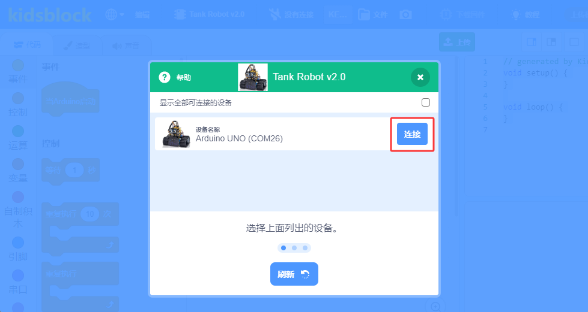

5\.  然后单击 “**返回编辑器**” 返回代码编辑区，如下图所示：

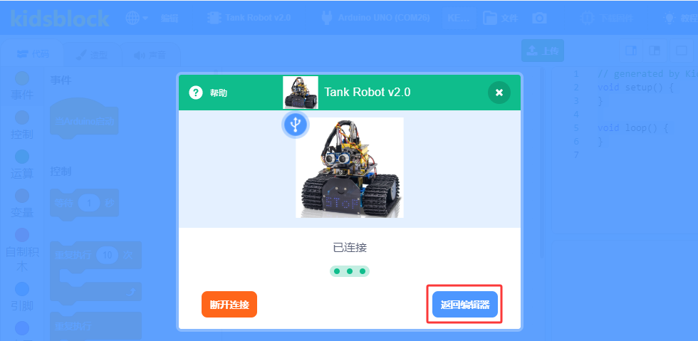

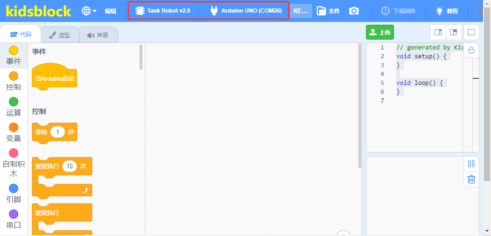

### 5.3.3. 界面介绍

了解KidsBlock软件界面，有利于代码编程的学习，如下图所示：

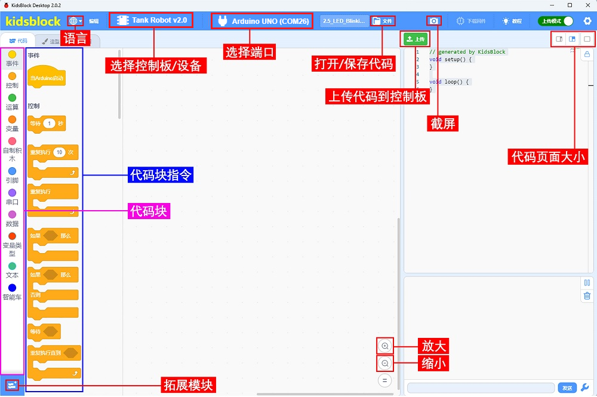

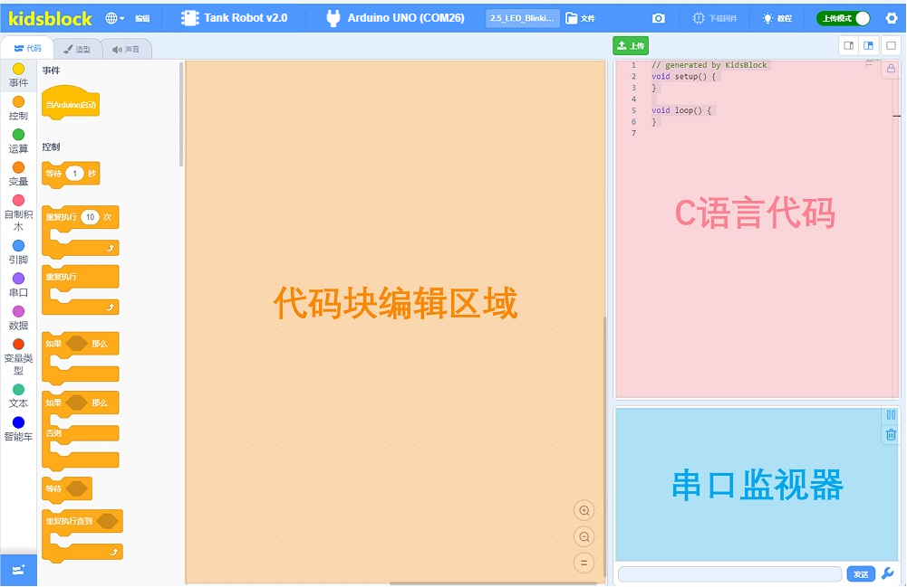

### 5.3.4. 编写代码并上传

（**后面的示例代码上传步骤也一样，可以参考。**）

**确保UNO PLUS主控板与计算机连接成功，然后双击 “**KidsBlock**” 图标打开KidsBlock软件。**

**方法①：** 从直接拖动代码块到代码编辑区进行代码编写，如下图所示：

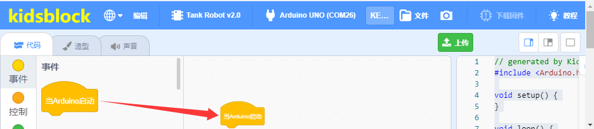

代码编写完成后保存到电脑，单击 “**文件**” –\> “**保存到电脑**”，如下图所示：

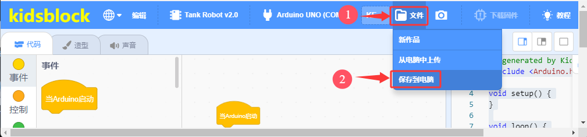

单击将代码上传到UNO R3开发板，如下图所示：

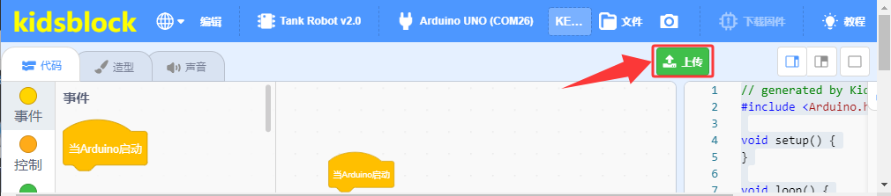

**方法②：** 从电脑打开已经编写好的代码。

将我们提供的代码文件压缩包解压，把解压后的代码文件夹保存到方便使用的位置。我们提供本课程需要用到的所有代码文件，并保存到方便使用的位置。本课程以代码存放于D盘为例，路径为
D:KidsBlock(Scratch)\_资料`\KidsBlock`(Scratch)\_代码。（你也可以放入其他磁盘，只要方便示例代码导入就行）

单击 “**文件**” –\>“**从电脑中上传**”，然后选择保存代码的路径，选中代码文件打开即可，如下图所示：

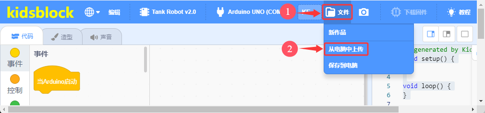

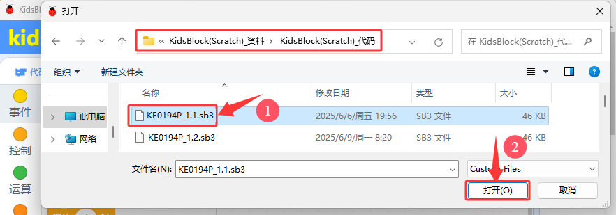

代码文件打开后，需要手动连接串口端口，如下图所示：

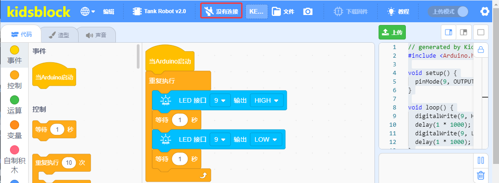

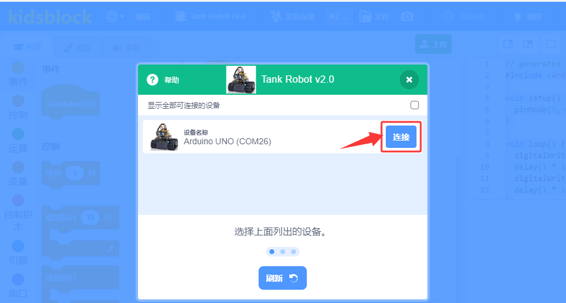

串口端口连接上后，然后单击 “**返回编辑器**” 返回代码编辑区，如下图所示：

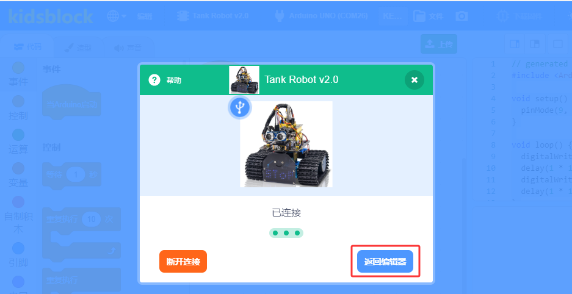

单击将代码上传到UNO PLUS开发板，如下图所示：

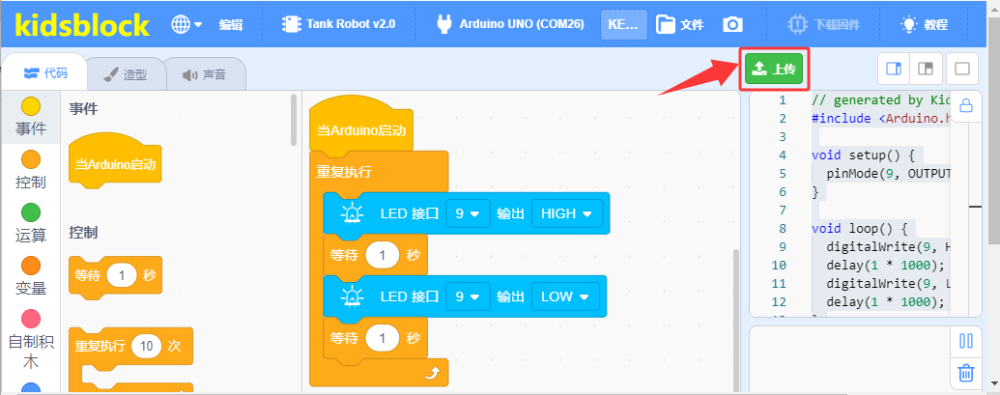
