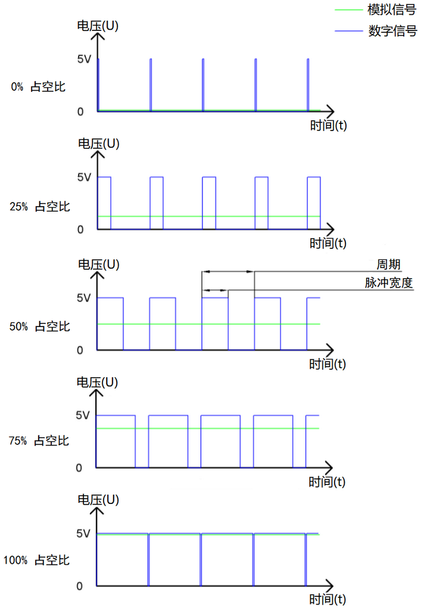
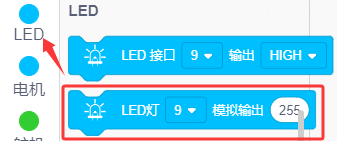
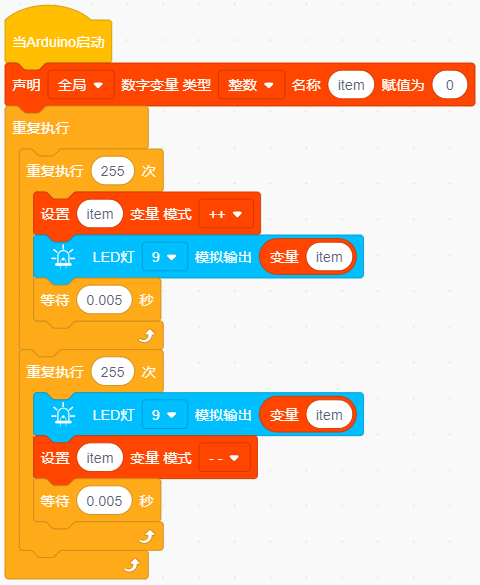
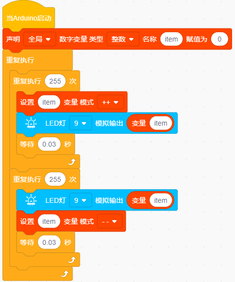

### 项目二 LED 亮度的调节

**项目介绍：**

在之前的课程中，我们学习了如何通过代码控制 LED 的“亮”与“灭”，实现了简单的闪烁效果。但在现实生活中，灯光的变化往往是柔和渐变的，比如呼吸灯或者台灯调光。这节课，我们将学习一种叫做 PWM（脉冲宽度调制） 的技术，用它来控制 LED 的亮度，模拟出像呼吸一样忽明忽暗的效果。

**什么是 PWM？** 

Arduino 的数字引脚通常只能输出两种电压：0V（低电平/LOW）和 5V（高电平/HIGH）。如果我们想让 LED 半亮（相当于 2.5V），直接连接是做不到的。这时候就需要用到 PWM。

PWM 的原理就像放电影。电影其实是由一张张静止的图片快速播放组成的，因为速度太快，我们的眼睛看不出停顿，感觉画面是连续的。PWM 也是同样的道理：它让引脚在极短的时间内快速地切换“开”和“关”。

- 如果“开”的时间长，“关”的时间短，平均电压就高，灯就亮。

- 如果“开”的时间短，“关”的时间长，平均电压就低，灯就暗。

通过控制这个“开关比例”（占空比），我们就可以用数字信号模拟出不同的电压值，从而调节 LED 的亮度。

通过下面五个方波来更形象的了解一下PWM。

**项目组件：**

| 组装好的智能车(未插上蓝牙模块) *1 | 草帽LED白发红模块 *1 | 3Pin 双母头杜邦线 *1  |
| --- | --- | --- |
|  | | |
| USB线 *1 | 18650电池 *2（电池自备） |   |
| |  |  | 

**接线图：**

**⚠️特别注意：坦克智能车已经组装好了，这里不需要把传感器模块和其他的都拆下来又重新组装和接线，这里再次提供接线图，是为了方便您编写代码。但是，LED灯是需要另外连接上去的！**

Arduino的PWM引脚在3、5、6、9、10、11，上一小节的接线刚刚好在9脚，所以我们这个接线不用变

**项目代码：**

**认识代码块**

① 这个代码块，表示当启动ESP32这块开发板时，将运行代码。

② 创建变量。

这是创建“变量”的指令方块，可以声明“全局”或“局部”，还可以设置变量的类型、名称和赋值，item是变量名称。

获取变量item。

设置变量的值

设置变量item模式为每执行一次循环让item加1或每执行一次循环让item减1。

③ 循环语句，顾名思义就是重复做一件事。

④ 有条件的循环控制语句，当满足循环次数时就退出循环，比如：10表示循环执行10次，数字10是可以改成其他数字的。

⑤ 向LED指定引脚设置输出PWM值，只需要设置对应的引脚和模拟输出数值(0~255)，就可以输出PWM值）

⑥ 将程序的执行暂停一段时间，也就是延时。单位是秒。

**组合代码块**

（**特别提醒：在上传程序代码前，需要把蓝牙模块取下，否则代码会上传失败。**）

**项目结果：**

外接电源，将电机驱动扩展板上的拨码开关拨至ON端。选择好正确的开发板板型和适当的串口端口（COMxx），上传代码。我们可以看到LED会有个逐渐由亮到灭的一个缓慢过程，而不是直接的亮灭，如同呼吸一般，均匀变化。

**项目拓展：**

我们不改变灯的脚位，只是改变程序里面 延时(delay)的值，看看它如何改变渐变效果。

实验代码：

（**特别提醒：在上传程序代码前，需要把蓝牙模块取下，否则代码会上传失败。**）

外接电源，将电机驱动扩展板上的拨码开关拨至ON端。选择好正确的开发板板型和适当的串口端口（COMxx），上传代码。可以看到LED渐变的效果慢了一些。