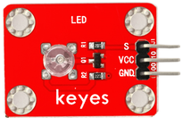
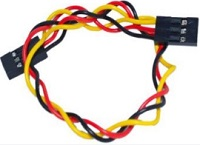
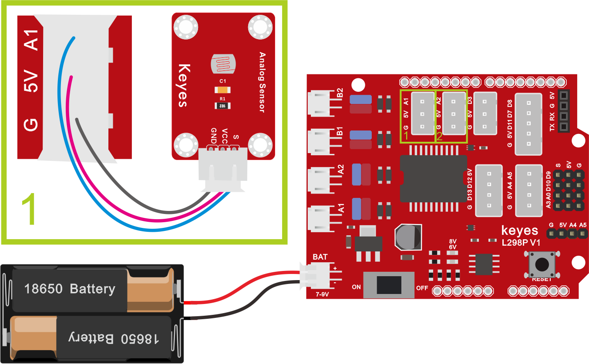
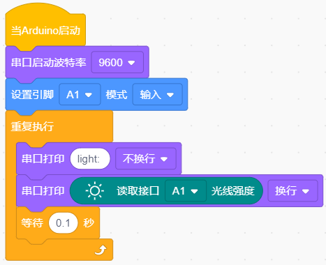
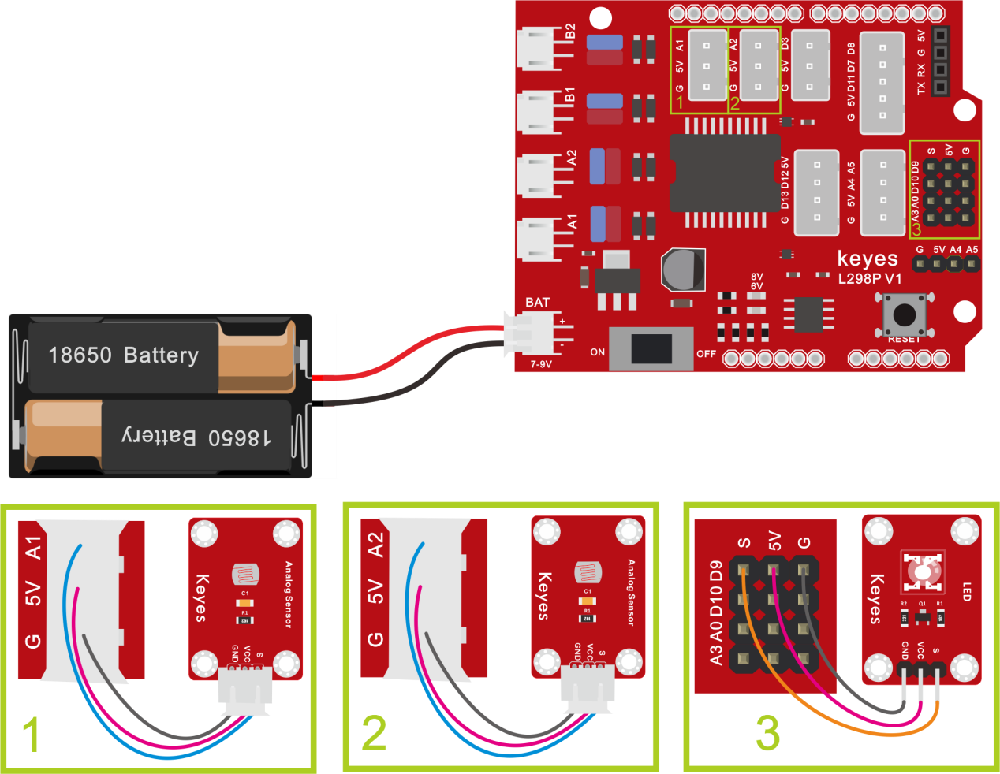
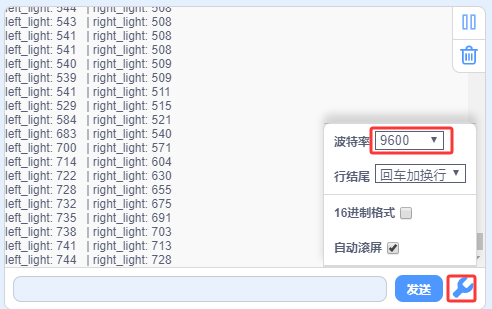
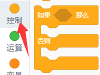
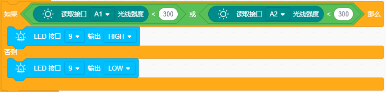

### 项目三 光敏电阻传感器

**项目介绍**：

在套件中，包含两个光敏电阻模块，我们可以利用这两个模块和小车搭配做一个追光智能车。在这一课程中，我们先学习了解下光敏电阻模块和使用方法。

光敏电阻环境光线最敏感，不同的光照强度，光敏电阻的阻值不一样。我们利用光敏电阻该特性，设计电路，生成光敏电阻模块。模块信号端连接单片机模拟口，当光照强度越强时，模拟口电压越大，即单片机的模拟值也大；反之，光照强度越弱时，模拟口电压越小，即单片机的模拟值也小。这样，我们就可以利用光敏电阻模块读取对应模拟值，感应环境中光照强度了。

**参数：**

工作电压：3.3V-5V（DC）

接口：3PIN接口

输出信号：模拟信号

**项目组件：**

| 组装好的智能车(未插上蓝牙模块) *1 | 草帽LED白发红模块 *1 | 3Pin 双母头杜邦线 *1  |
| --- | --- | --- |
|  | | |
| USB线 *1 | 18650电池 *2（电池自备） |   |
| |  |  | 

**接线图:**

**⚠️特别注意：坦克智能车已经组装好了，这里不需要把传感器模块和其他的都拆下来又重新组装和接线，这里再次提供接线图，是为了方便您编写代码。**

**项目代码：**

**认识代码块**

① 这个代码块，表示当启动ESP32这块开发板时，将运行代码。

② 设置串口。

设置串口波特率，一般波特率设置为`9600`或`115200`。

串口输出数据，从串行端口输出数据，分换行与不换行和HEX三种方式。

③ 向指定引脚设置 “输入” 或 “输出”，选择 “输入” 代表给该引脚设置输入模式；选择 “输出” 代表给引脚设置输出模式；选择 “输入上拉” 代表给该引脚设置输入模式并且使该引脚变成高电平。

④ 循环语句，顾名思义就是重复做一件事。

⑤ 读取光敏传感器的光照强度值（模拟值）。

⑥ 将程序的执行暂停一段时间，也就是延时。单位是秒。

**组合代码块**

（**特别提醒：在上传程序代码前，需要把蓝牙模块取下，否则代码会上传失败。**）

**项目结果：**

上传代码带开发板，在串口监视器窗口单击 ，设置波特率为9600。可以看到打印出的光敏传感器检测的值，如果我们用手给它遮挡光线，我们发现值变小了。

**项目拓展：**

上面我们了解了光敏传感器的工作原理，接下来我们用到两个光敏传感器，分别接在A1（左）和A2（右）。在第9脚接上一个LED灯，然后通过读取左右两个光敏传感器的状态，来控制LED的亮和灭。如下图接线：

我们开始来编写代码：

（**特别提醒：在上传程序代码前，需要把蓝牙模块取下，否则代码会上传失败。**）

外接电源，将电机驱动扩展板上的拨码开关拨至ON端。选择好正确的开发板板型和适当的串口端口（COMxx），上传代码。当我们用手去遮挡任一光敏传感器的时候，我们可以看到LED灯亮起来了，同时串口显示对应光敏传感器的检测也变小了；反之，则相反。

**代码解释：**

串口打印光敏传感器检测到的光照强度模拟值。

这些是逻辑运算符号。

这是简单的条件判断语句，如果里的表达式为真，则执行 “那么” 块内的代码。如果里表达式为假，则执行 “否则” 块内的代码。

如果左侧的光敏传感器检测到的光照强度模拟值小于300或者右侧的光敏传感器检测到的光照强度模拟值小于300时，LED点亮；否则，LED不亮。