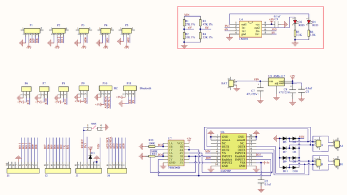
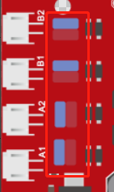
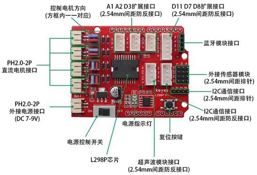
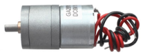
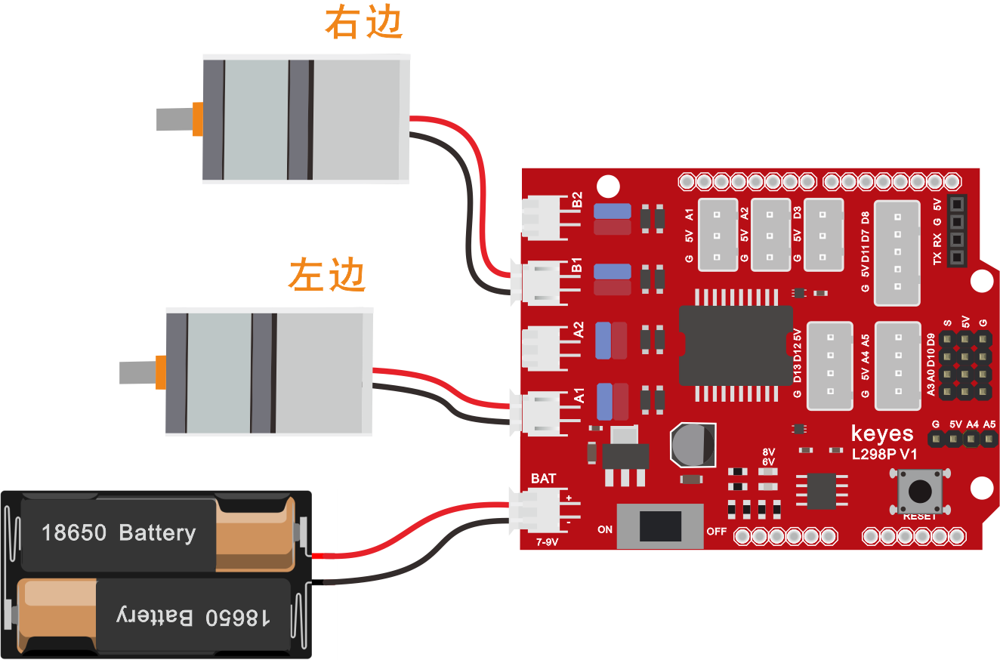
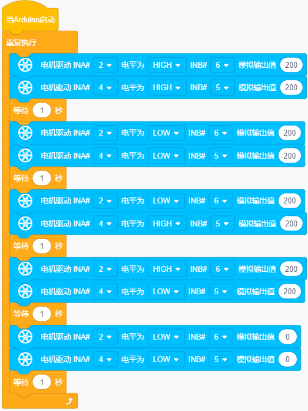
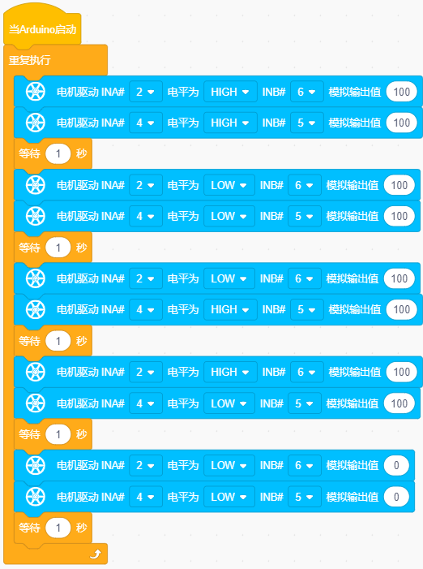

### 项目八 电机的驱动和调速

**项目介绍：**

驱动电机的方法有很多，我们这个智能车用到的是最常用的L298P这个方案，L298P是ST意法半导体公司出品的优秀大功率电机专用驱动芯片，可直接驱动直流电机、二相、四相步进电机，驱动电流达2A，电机输出端采用8只高速肖特基二极管作为保护。

我们根据L298P的电路设计了一款扩展板，叠层的设计可直接插接到开发板上使用，降低了用户使用和驱动电机的技术难度。我们来看一下这个板子的电路图和示意图：

为了调节小车上的4个电机，使得电机电机的驱动方向与后续的课程代码描述一致。驱动板上自带8个跳线帽，也可用于控制电机转向，例如当MA电机接口前方2个跳线帽由横向连接改为纵向连接时，MA电机的转动方向就和原来的转动方向相反。

**规格参数：**

逻辑部分输入电压：DC 5V

驱动部分输入电压：DC 7-12V

逻辑部分工作电流：\<36mA

驱动部分工作电流：\<2A

最大耗散功率：25W（T=75℃）

控制信号输入电平：高电平2.3V\<Vin\<5V  ，低电平-0.3V\<Vin\<1.5V

工作温度：-25＋130℃

**驱动小车运行原理：**

根据上面电机驱动板的电路图和示意图，我们让左边电机（MA电机）的方向引脚在D2，调速引脚在D6，右边电机（MB电机）的方向引脚在D4，调速引脚在D5，按照以下表格的运动逻辑，我们就可以知道如何通过控制数字口和PWM口来控制2个电机转动，从而实现智能小车的行走。其中PWM值范围为0-255，设置数值越大，电机转动越快。（电机扩展板上的A1、A2接口是接左边电机、B1、B2接口是接右边电机）

| \\   | D2   | D6（PWM） | 电机MA   | D4   | D5（PWM） | 电机MB   |
|------|------|-----------|----------|------|-----------|----------|
| 前进 | HIGH | 200       | 逆时针转 | HIGH | 200       | 顺时针转 |
| 后退 | LOW  | 200       | 顺时针转 | LOW  | 200       | 逆时针转 |
| 左转 | LOW  | 200       | 顺时针转 | HIGH | 200       | 顺时针转 |
| 右转 | HIGH | 200       | 逆时针转 | LOW  | 200       | 逆时针转 |
| 停止 | /    | 0         | 停止     | /    | 0         | 停止     |

**项目组件：**

| UNO R3 开发板\*1                                        | L298P 电机驱动扩展板 V1\*1                              | 金属电机 \*2                                            |
|---------------------------------------------------------|---------------------------------------------------------|---------------------------------------------------------|
|  |  |  |
| USB线                                                   | 18650双节电池盒（18650电池*2 （电池自配））*1           |                                                         |
|  |  |                                                         |

**接线图：**

**⚠️特别注意：坦克智能车已经组装好了，这里不需要把传感器模块和其他的都拆下来又重新组装和接线，这里再次提供接线图，是为了方便您编写代码！**

**项目代码：**

**认识新代码块**

① 这个代码块，表示当启动ESP32这块开发板时，将运行代码。

② 循环语句，顾名思义就是重复做一件事。

③
向电机模块设置引脚INA的高低电平状态，高低电平决定了电机是顺时针转还是逆时针转；设置引脚INB的模拟输出（0~255），决定电机的转速，模拟输出值越大，电机转动越快。

④ 将程序的执行暂停一段时间，也就是延时，单位是秒。

**组合代码块**

（**特别提醒：在上传程序代码前，需要把蓝牙模块取下，否则代码会上传失败。需要上传代码成功后，再连接蓝牙模块。**）

**项目结果：**

上传代码成功，外接电源，将拨码开关拨到ON端。上电后，智能车前进1秒，后退1秒，左转1秒，右转1秒，停止1秒，循环。

**项目拓展**：

我们来通过调整PWM控制电机的速度，为后面我们控制车速做一个铺垫，接线不变

实验代码：

（**特别提醒：在上传程序代码前，需要把蓝牙模块取下，否则代码会上传失败。需要上传代码成功后，再连接蓝牙模块。**）

**注意：**
如果上电后，小车的运动缓慢，可能是代码中PWM值设置太小了，可以设置为150.

上传代码成功，外接电源，将拨码开关拨到ON端。上电后，智能车前进1秒，后退1秒，左转1秒，右转1秒，停止1秒，循环。怎么样，电机转动的速度是不是慢了很多？