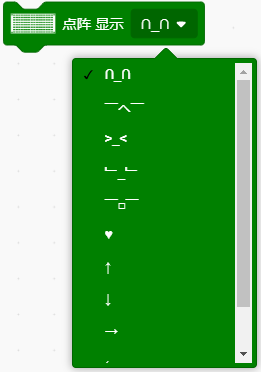
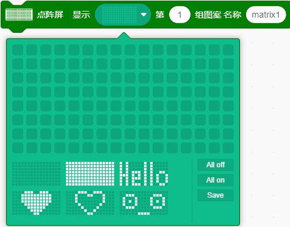
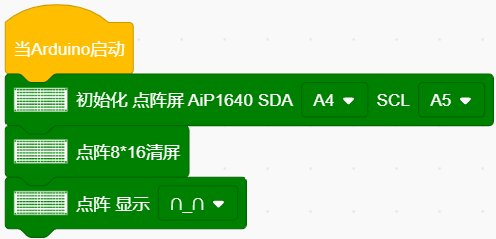
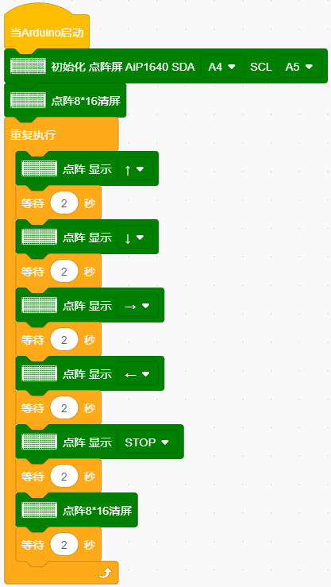

### 项目九 LED表情灯板

**项目介绍：**

如果在我们的机器人上加一块表情面板，会非常有趣。8x16 LED点阵可以满足需求，能自己创建面部表情、动画等。微处理器（Arduino）通过两线总线接口与AiP1640通讯，控制点阵上128个LED的亮灭来显示图案。

**规格参数**

- 工作电压: DC 3.3-5V

- 功率损耗：400mW

- 震荡频率：450KHz

- 驱动电流：200mA

- 工作温度：-40~80℃

**项目组件：**

|组装好的智能车(未插上蓝牙模块) *1 | USB线 *1 | 18650电池 *2（电池自备） |
|---------------------------------------------------------|---------------------------------------------------------|----------------------------------------------------------|
|  | |  |

**8×16点阵模块详细介绍：**

**1\. 如何控制每一个 LED？**

8x16 点阵共有 128 个 LED。为了简化控制，我们将这 128 个灯分为 16 列，每列有 8 个灯。 在计算机中，一个字节（Byte）由 8 位（Bit）组成，每一位可以是 0 或 1。

- 1 代表 LED 亮

- 0 代表 LED 灭

因此，1 个字节的数据正好可以控制 1 列（8个）LED 的状态。要控制整个 8x16 点阵，我们需要发送 16 个字节的数据，分别对应 16 列。

**接口说明及通讯协议**

微处理器（Arduino）通过两线总线接口与AiP1640通讯。通讯协议图中，(SCLK)为SCL，(DIN)为SDA：

- ① 数据输入开始条件：SCL为高电平，SDA由高变低。

- ② 数据命令设置：示例程序中选择 “地址自动加1” 方式，二进制为0100 0000，对应十六进制0x40。

- ③ 地址命令设置：示例程序中选择第一个00H，二进制为1100 0000，对应十六进制0xc0。

- ④ 数据输入：SCL为高电平时SDA信号保持不变，低电平时可改变，数据输入低位在前、高位在后传输。

- ⑤ 数据传输结束条件：SCL为低时SDA为低，SCL变高时SDA变高。

- ⑥ 显示控制：示例中选择脉宽为4/16，十六进制为0x8A。

**取模工具的使用说明**

设置时，我们需要把一个图案转换成1组16个的16位数据，这里就需要用到一个取模软件，这个软件已放入资料文件夹中。使用时打开图标，显示如下图。

点击 “**新建图案**” ，根据显示屏规格，设置宽度为16，高度为8，如下图。

初始时发现格点不大，不方便设置，我们可以通过点击 “**模拟动画**” 设置格点大小，点击“放大格点” 来放大格点。如下图。

一直鼠标左键点击，就可以一直放大格点了。放大后，我们就可以通过用鼠标点击白色区域，设置显示图案了。

设置时，鼠标点击（左右键都可以）白色格点，变为黑色；再点击黑色格点，变为白色。黑色代表该格点显示亮起，白色代表格点不显示。显示屏最多能设置16*8个点显示。设置笑脸显示如下图。

点击 “**参数设置**”，选择 “**其他选项**”，设置如下图。设置完成点击 “**确定**” 。

点击 “**取模方式**”，选择 “**C51格式**”。如下图：

设置成功后，在以下区域就可以看到对应的16个数据了，只需要将数据复制粘贴在数组中，就可以用直接调用了。（0x00,0x00,0x1C,0x02,0x02,0x02,0x5C,0x40,0x40,0x5C,0x02,0x02,0x02,0x1C,0x00,0x00）

**特别提醒：由于图形化编程的代码块中已经有定义好的图案，可以不用取模工具设置图案而获取代码。**

**接线图：**

**⚠️特别注意：坦克智能车已经组装好了，这里不需要把传感器模块和其他的都拆下来又重新组装和接线，这里再次提供接线图，是为了方便您编写代码！**

**项目代码**

点阵显示上面画的微笑表情的代码

**认识新代码块**

① 这个代码块，表示当启动ESP32这块开发板时，将运行代码。

② 这是一些 8\*16点阵屏的相关代码块

初始化8\*16点阵屏的引脚。

8\*16点阵屏显示一些已经定义好的图案

8\*16点阵屏清屏

可以设置一些图案，也可以选择已经定义好的一些图案。

③ 将程序的执行暂停一段时间，也就是延时，单位是秒。

**组合代码块**

（**特别提醒：在上传程序代码前，需要把蓝牙模块取下，否则代码会上传失败。**）

**项目结果：**

外接电源，将电机驱动扩展板上的拨码开关拨至ON端。选择好正确的开发板板型和适当的串口端口（COMxx），上传代码。显示屏上显示一个笑脸。

**项目拓展：**

我们利用刚刚学到的取模工具,让点阵循环显示：前进图案、后退图案、左转图案、右转图案、停止图案，然后清除图案，时间间隔为2000毫秒。

前进的代码块：

后退的代码块：

左转的代码块：

右转的代码块：

停止的代码块：

清屏的代码块：

接线图不变：

实验代码：

（**特别提醒：在上传程序代码前，需要把蓝牙模块取下，否则代码会上传失败。需要上传代码成功后，再连接蓝牙模块。**）

下面就是多个图案切换显示的代码

外接电源，将电机驱动扩展板上的拨码开关拨至ON端。选择好正确的开发板板型和适当的串口端口（COMxx），上传代码。看到表情面板（8\*16点阵）显示：前进图案、后退图案、左转图案、右转图案、停止图案、然后清除图案，时间间隔为2000毫秒。循环反复。