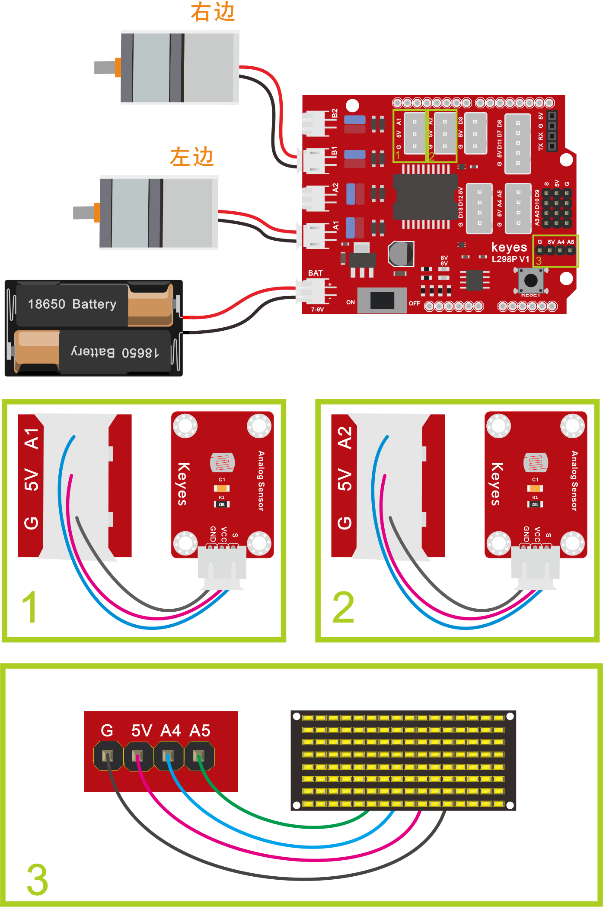
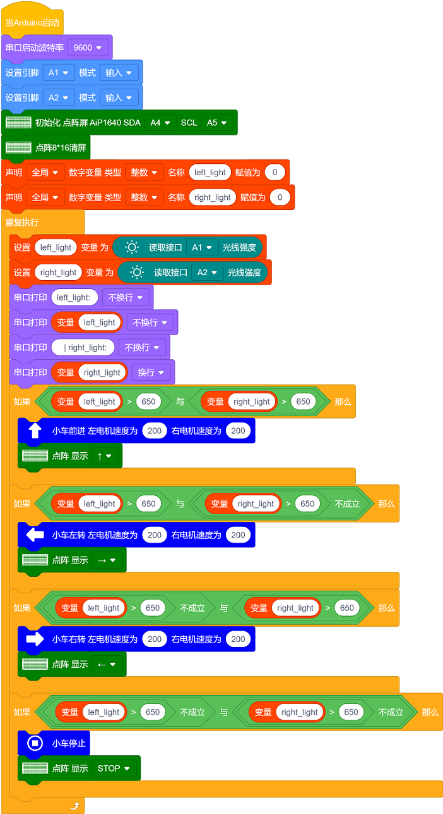

### 项目十 寻光智能车

**项目介绍：**

前面我们详细的介绍了智能车上各个传感器、模块、扩展板的使用方法。在这里我们可以结合第3课和第8课中知识制作一个寻光智能车。实验中，我们通过2个光敏电阻模块检测智能车左右两边的光照强度，读取中对应的模拟值，然后根据这2个数据控制两个电机的转动，从而控制智能车的运动状态。

**寻光智能车具体逻辑如下表格：**

| 检测 （亮度越大，数值越大） | 左边光敏电阻模块(left_light)        |
|-----------------------------|-------------------------------------|
| 检测 （亮度越大，数值越大） | 右边光敏电阻模块(right_light)       |
| 条件                        | left_light＞650并且right_light＞650 |
| 状态                        | 前进（PWM设为200）                  |
| 条件                        | left_light＞650并且right_light≤650  |
| 状态                        | 左旋转（PWM设为200）                |
| 条件                        | left_light≤650并且right_light＞650  |
| 状态                        | 右旋转（PWM设为200）                |
| 条件                        | left_light≤650并且right_light≤650   |
| 状态                        | 停止                                |

**接线图：**

**⚠️特别注意：坦克智能车已经组装好了，这里不需要把传感器模块和其他的都拆下来又重新组装和接线，这里再次提供接线图，是为了方便您编写代码！**

**测试代码：**

（**特别提醒：在上传程序代码前，需要把蓝牙模块取下，否则代码会上传失败。需要上传代码成功后，再连接蓝牙模块。**）

好了，迷你智能车寻光功能效果的代码全部编写好了，上传程序，看看精彩的效果！

**测试结果：**

上传代码成功后，按照接线图接线，拨码开关拨打到右端上电后，智能车能够跟随着光移动。