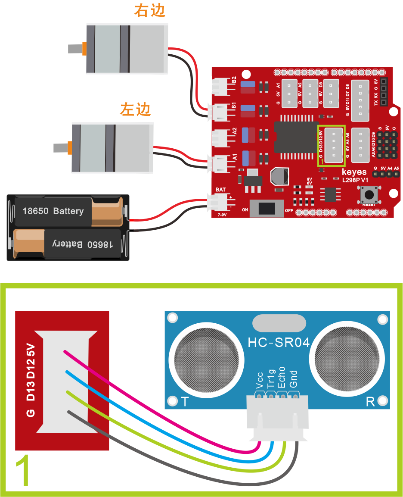

### 项目十一 超声波跟随智能车

**项目介绍：**

我们结合硬件知识-各种传感器，模块，电机驱动器，来制造超声波跟随机器人车！

实验中，我们通过检测智能车和前方障碍物的距离，然后根据这个数据控制两个电机的转动，从而控制智能车的运动状态。

**跟随智能车具体逻辑如下表格：**

| 检测 | 超声波测试前方物体距离（distance（单位：cm）） |
|------|------------------------------------------------|
| 条件 | distance\<8                                    |
| 状态 | 后退（PWM设为200）                             |
| 条件 | 8≤distance\<13                                 |
| 状态 | 停止                                           |
| 条件 | 13≤distance≤35                                 |
| 状态 | 前进（PWM设为200）                             |
| 条件 | distance＞35                                   |
| 状态 | 停止                                           |

**项目组件：**

| 组装好的智能车(未插上蓝牙模块) *1 | USB线 *1 | 18650电池 *2（电池自备） |
| --- | --- | --- |
|  | |  |

**接线图：**

**⚠️特别注意：坦克智能车已经组装好了，这里不需要把传感器模块和其他的都拆下来又重新组装和接线，这里再次提供接线图，是为了方便您编写代码！**

**测试代码：**

（**特别提醒：在上传程序代码前，需要把蓝牙模块取下，否则代码会上传失败。**）

**测试结果：**

将驱动扩展板堆叠在UNO plus 板上，上传好代码，按照接线图接线，将拨码开关拨至ON端后，智能车能够随着前方障碍物的移动而移动。