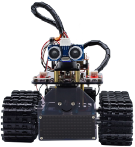
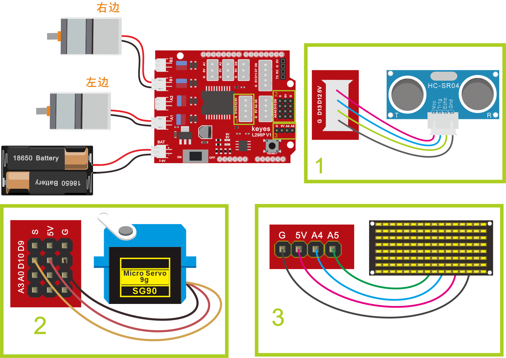

### 项目十二 自动避障智能车

**项目介绍：**

在上课程中，我们制作了一个跟随智能车。实际上，利用同样的电子元件，同样的接线方法，我们只需要更改一个测试代码就可以将跟随智能车变为避障智能车。

**避障智能车具体逻辑如下表格：**

| 检测 （单位：cm）           |     检测 （单位：cm）         |        |
|-----------------|-------------------------------------------------------------------------------|--------|
|  中间障碍物距离（distance）   | 左边障碍物距离（distance_l）/ 右边障碍物距（distance_r）                          |        |
| 条件1           | 条件2                                                                         | 状态   |
| 0\<distance\<20 | distance_l \> distance_r 如果左边大于右边                                     | 向左转 |
| 0\<distance\<20 | distance_l\<=distance_r 如果左边不大于右边                                    | 向右转 |
| distance\>=20   | ——                                                                            | 前进   |

**项目组件：**

| 组装好的智能车(未插上蓝牙模块) *1 | USB线 *1 | 18650电池 *2（电池自备） |
| --- | --- | --- |
|  | |  |

**接线图：**

**⚠️特别注意：坦克智能车已经组装好了，这里不需要把传感器模块和其他的都拆下来又重新组装和接线，这里再次提供接线图，是为了方便您编写代码！**

**测试代码**

（**特别提醒：在上传程序代码前，需要把蓝牙模块取下，否则代码会上传失败。需要上传代码成功后，再连接蓝牙模块。**）

**测试结果**

外接电源，将电机驱动扩展板上的拨码开关拨至ON端。选择好正确的开发板板型和适当的串口端口（COMxx），上传代码。上电后，智能车能够自动避开障碍物行走。