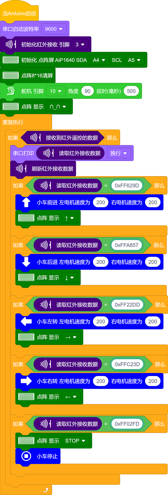

### 项目十三 红外遥控智能车

**项目介绍：**

前面的学习中我们详细的介绍了智能车上各个传感器、模块、扩展板的使用方法。在这里我们可以再结合前面课程中知识制作一个红外控制智能车。在传感器项目第四课中，我们已经测试出红外遥控器各个按键对应的键值。实验中，我们可以通过代码设置（键值），让对应的按键控制智能车对应的运动状态，且相应的状态模式显示在8X16
LED矩阵上。

**红外遥控智能车具体逻辑如下表格：**

| 按键： | 键值：FF629D | 状态：前进 |
|---------------------------------------------------------------|--------------|------------|
| 按键： | 键值：FFA857 | 状态：后退 |
| 按键： | 键值：FF22DD | 状态：左转 |
| 按键： | 键值：FFC23D | 状态：右转 |
| 按键： | 键值：FF02FD | 状态：停止 |

按照前面思路设计好智能车后，我们就需要按照设计思路开始制作智能车。我们需要设计对应的接线，测试代码，然后接线上传代码，运行，确保智能车能够实现理想中的功能。

**接线图：**

**⚠️特别注意：坦克智能车已经组装好了，这里不需要把传感器模块和其他的都拆下来又重新组装和接线，这里再次提供接线图，是为了方便您编写代码！**

电机+红外接收模块

接线注意：
由于红外接收传感器输入的数字信号，将红外接收传感器模块用导线连接到电机驱动扩展板上的G、V、D3，左、右电机分别对应的连接到堆叠在UNO plus 板上的电机驱动扩展板上的接口A和接口B，电源接到BAT接口。

**测试代码：**

（**特别提醒：在上传程序代码前，需要把蓝牙模块取下，否则代码会上传失败。需要上传代码成功后，再连接蓝牙模块。**）

好了，上传程序，红外遥控器对准红外接收器，按下红外遥控器对应按键，看看效果吧！

**测试结果**：

将驱动扩展板堆叠在UNO plus 板上，上传好代码，按照接线图接线，将拨码开关拨至ON端后，我们就能用红外遥控控制智能车运动了。