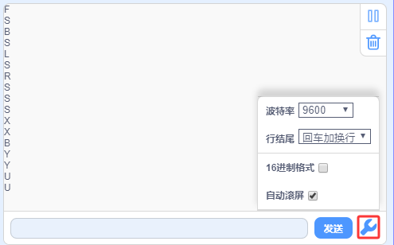
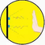
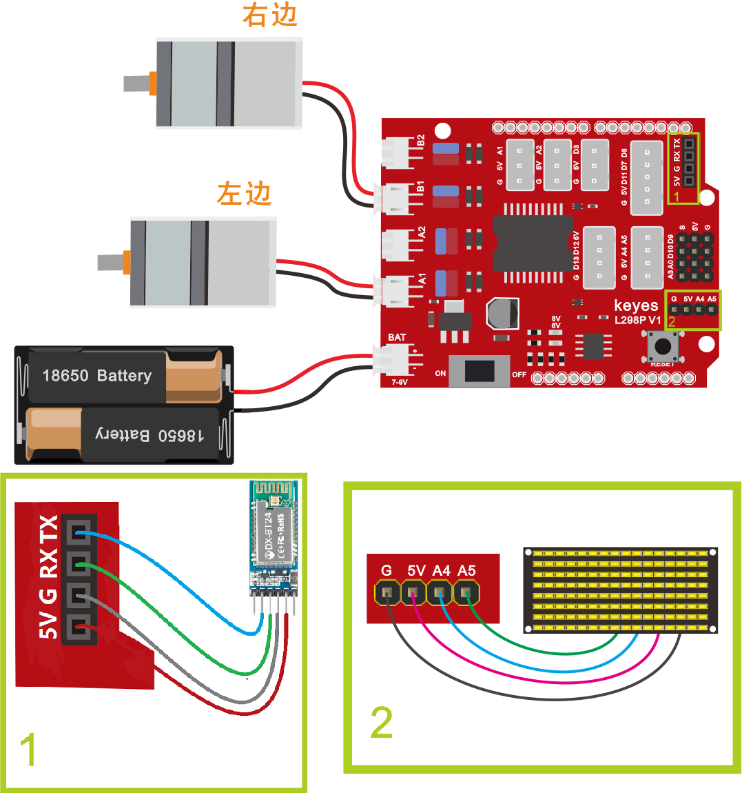
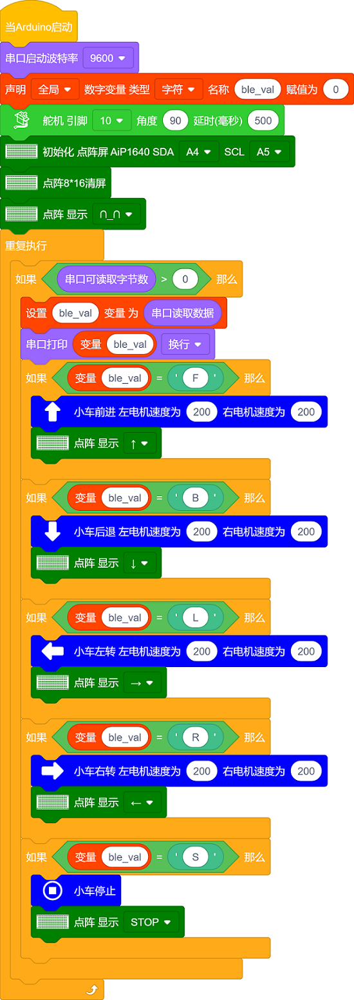

### 项目十四 蓝牙遥控智能车

**项目介绍：**

前面课程中，我们利用红外控制智能车运动，在这课程中我们可以做一个蓝牙控制智能车。既然是控制智能车，那就有一个控制端和被控制端。课程中我们把手机当做控制端（主机），蓝牙模块（从机）连接的智能车当做被控制端。使用时，我们需要在手机上安装一个APP，然后连接蓝牙模块，然后我们利用蓝牙APP上各个按钮，控制智能车实现各种运动状态。

**蓝牙遥控智能车具体逻辑如下表格：**

经过前面 第7课 蓝牙遥控的原理及应用
的学习和了解，经过测试，我们得出了手机APP上各个按钮对应的控制字符，如下图：

以下是APP上各个按钮对应的控制字符和对应的功能，这里我们整理了一个表格如下：

| 按钮: |                            | 功能：配对连接HM-10蓝牙模块                                                               |
|--------------------------------------------------------------|----------------------------|-------------------------------------------------------------------------------------------|
| 按钮: |                            | 功能：进入蓝牙控制界面                                                                    |
| 按钮: |                            | 功能：断开蓝牙连接                                                                        |
| 按钮: | 控制字符：按下：F；松开：S | 功能：按下，小车前进；松开就停止                                                          |
| 按钮: | 控制字符：按下：B；松开：S | 功能：按下，小车后退；松开就停止                                                          |
| 按钮: | 控制字符：按下：L；松开：S | 功能：按下，小车左旋转；松开就停止                                                        |
| 按钮: | 控制字符：按下：R；松开：S | 功能：按下，小车右旋转；松开就停止                                                        |
| 按钮: | 控制字符： 点击发送：S     | 功能：小车停止，停止所有功能                                                              |
| 按钮: | 控制字符：                 | 功能：点击一下开启手机方向感应控制，再点击一下退出方向感应控制                            |
| 按钮: | 控制字符： 点击发送：U     | 功能：开启避障功能，点击退出       |
| 按钮: | 控制字符： 点击发送：X     | 功能：开启寻光功能，点击退出       |
| 按钮: | 控制字符： 点击发送：Y     | 功能：开启超声波跟随功能，点击退出 |

**接线图：**

**⚠️特别注意：坦克智能车已经组装好了，这里不需要把传感器模块和其他的都拆下来又重新组装和接线，这里再次提供接线图，是为了方便您编写代码！**

蓝牙+电机

接线注意：蓝牙模块的RXD、TXD、GND、VCC分别对应的接到电机驱动扩展板上的TX、RX、-（GND）、+（VCC），而蓝牙模块的STATE和BRK两引脚不需要接，电源接到BAT接口。

左、右两电机分别对应的连接到电机驱动扩展板上的接口A和接口B；蓝牙模块的RXD、TXD、GND、VCC分别对应的接到电机驱动扩展板上的TX、RX、-（GND）、+（VCC），而蓝牙模块的STATE和BRK两引脚不需要接，电源接到BAT接口。

**测试代码：**

（**特别提醒：在上传程序代码前，需要把蓝牙模块取下，否则代码会上传失败。需要上传代码成功后，再连接蓝牙模块。**）

好了，按住蓝牙APP的前进、后退、左转、右转、停止的按钮控制桌面迷你蓝牙智能车分别前进、后退、左转、右转、停止的程序代码全编写完了。上传程序，看看效果。

**测试结果：**

将驱动扩展板堆叠在UNO
plus 板上，上传好代码，按照接线图接线，将拨码开关拨至ON端后，插上蓝牙模块，连接好蓝牙，手机APP连接蓝牙成功后，我们就能用手机APP控制智能车运动并在LED灯板上显示对应的图案了。

按下按钮，小车前进；按下按钮，小车后退；按下按钮，小车左旋转；按下按钮，小车右旋转；点击按钮，小车停止；点击一下按，开启手机重力感应控制，拿起手机从不同的方向移动手机，智能车会自动的移动，再点击一下按钮，退出重力感应控制。