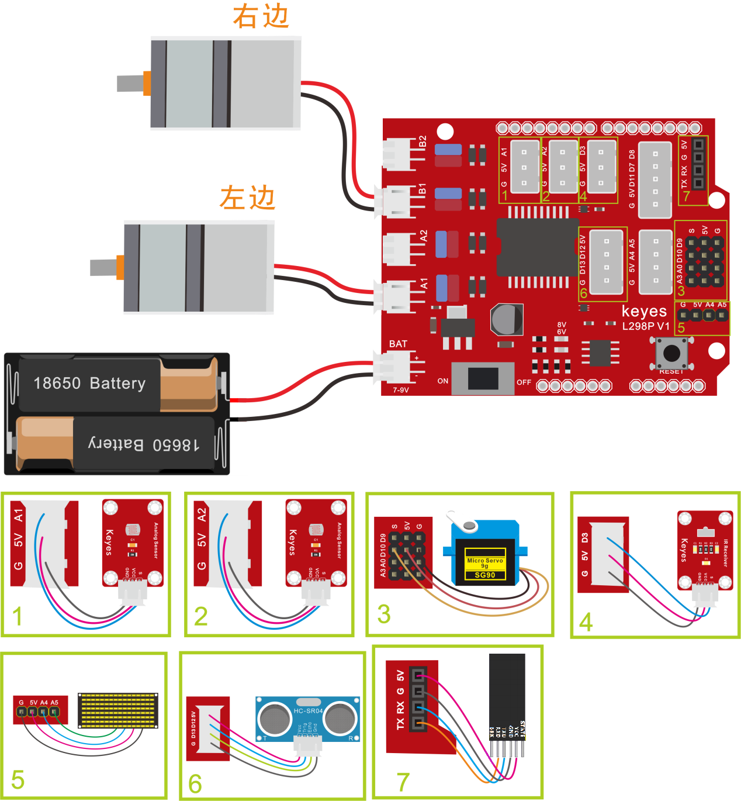
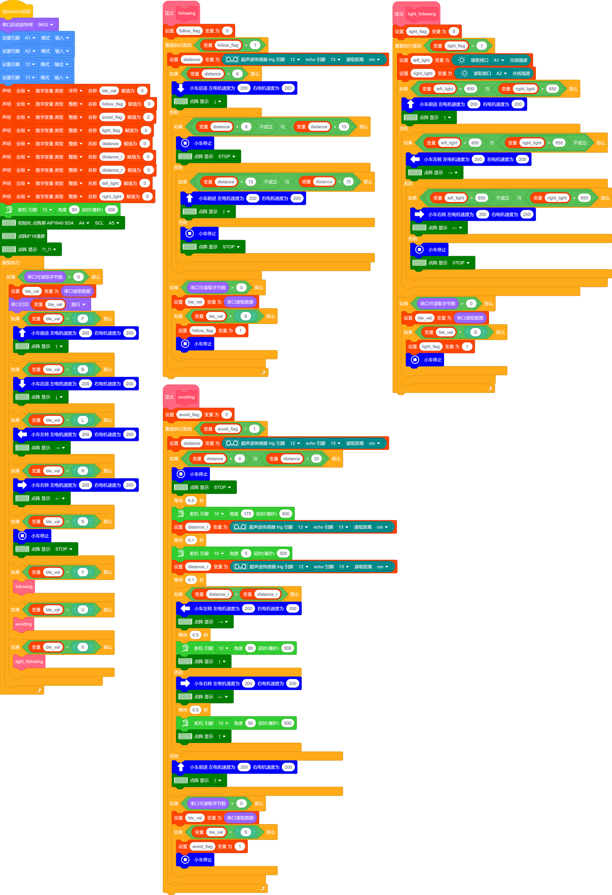

### 项目十五 多功能桌面小车

**项目介绍：**

在前面课程中，我们只是让智能车实现单个功能，那我们能不能把所有功能合在一起呢？能，在这一课程中，我们利用一个代码测试智能车，智能车包含前面课程中讲到的所有功能，我们利用手机蓝牙APP上按钮自动切换各种功能,简单方便。

**编程思路：**

按照前面思路设计好智能车后，我们就需要按照设计思路开始制作智能车。我们需要设计对应的接线，测试代码，然后接线上传代码，运行，确保智能车能够实现理想中的功能。

**接线图：**

**⚠️特别注意：坦克智能车已经组装好了，这里不需要把传感器模块和其他的都拆下来又重新组装和接线，这里再次提供接线图，是为了方便您编写代码！**

接线注意：

左、右光敏传感器分别连接到电机驱动扩展板上的G、V、A1；G、V、A2；

超声波传感器模块的VCC引脚连接至连接到电机驱动扩展板上的5V，T（Trig）引脚至数字12(S)，E（Echo）引脚至数字13(S)，Gnd引脚至G；

红外接收传感器模块用导线连接到电机驱动扩展板上的G、V、D3(S)；

左、右电机分别对应的连接到电机驱动扩展板上的接口A和接口B；

舵机的黄线接数字口D10（S），红线接5V，棕线接G；

LED点阵屏接IIC管脚（G、5V、A4、A5）；

蓝牙模块的RXD、TXD、GND、VCC分别对应的接到电机驱动扩展板上的TX、RX、-（GND）、+（VCC），而蓝牙模块的STATE和BRK两引脚不需要接，电源接到BAT接口。

**测试代码：**

（**特别提醒：在上传程序代码前，需要把蓝牙模块取下，否则代码会上传失败。需要上传代码成功后，再连接蓝牙模块。**）

好了，蓝牙多功能控制智能车的程序都已经编写好了，上传程序，实际操作下看看效果。

**测试结果：**

将驱动扩展板堆叠在UNO
plus 板上，上传好代码，按照接线图接线，将拨码开关拨至ON端后，手机APP连接蓝牙成功后，我们就能用手机APP控制智能车运动了。我们可以通过按下对应按钮实现对应功能，通过停止钮来停止功能。点击一下按，开启手机重力感应控制，拿起手机从不同的方向移动手机，智能车会自动的移动，再点击一下按钮，退出重力感应控制。