## 6.1. Mixly_资料下载

⚠️特别提示:
请先下载本教程需要用到的Mixly_资料(包含：Mixly_代码、Mixly库文件等）和Android_APP等，保存至您方便使用的路径下。

**下载：** [Mixly_资料](./Mixly_资料.7z) 和 [Android_APP](./Android_APP.7z)

## 6.2. Mixly IDE 开发环境设置

### 6.2.1. Mixly IDE下载、安装

**下载软件：**

我们通过百度网盘分享：mixly2.0 文件

下载链接： <https://pan.baidu.com/s/1sV0DUDKg7OiQcKyIkBI1Ew?pwd=keye>

提取码： keye

根据计算机系统选择下载对应的mixly2.0版本，如下图所示：

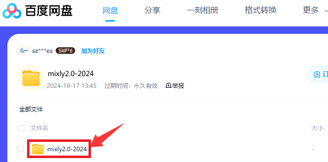

Mixly For Windows：

Windows系统一般是下载“**mixly2.0-win32-x64-rc4完整版.zip**”版本，

Mixly For Mac(根据系统选择)：

Mixly For Linux(根据系统选择)：

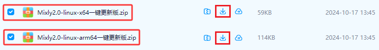

### 6.2.2. Mixly IDE安装及页面介绍

**Windows版本安装**

下载mixly2.0-win32-x64-rc4完整版压缩包之后，重新命名为 mixly2.0
，右键解压到本地磁盘。

⚠️ **特别提醒：**
(1)建议解压到硬盘根目录，路径不能包含中文及特殊字符(如:.\_( )等)。
(2)建议安装路径如 D`\mixly2.0`

因为Mixly是一个绿色免安装软件，所以“mixly2.0-win32-x64-rc4完整版”版本在解压之后就可以直接使用了。如果是下载“一键更新版.7z”版本的压缩包，压缩包解压后，需要左键双击打开“一键更新.bat”按照提示更新Mixly。

**MAC版本安装：**

提供有MAC安装Mixly2.0.txt的文本，安装时可以参考里面的安装方法。

**Linux版本安装：**

提供有Linux安装Mixly2.0.txt的文本，安装时可以参考里面的安装方法。

**启动软件(这里以Windows版本为例，其他系统版本可以参考)：**

这里双击“**Mixly.exe**”就能打开Mixly软件。如下图所示：

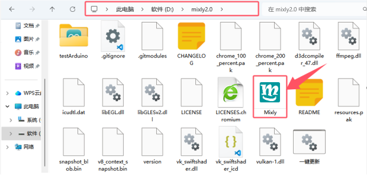

打开Mixly软件后，找到并且单击“ **Arduino AVR**
”就可以进入Mixly编程界面。软件界面如下图所示：

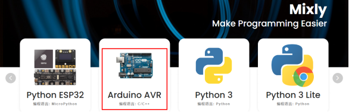

**页面介绍(这里以Windows版本为例):**

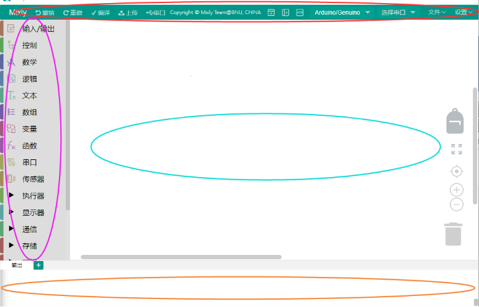

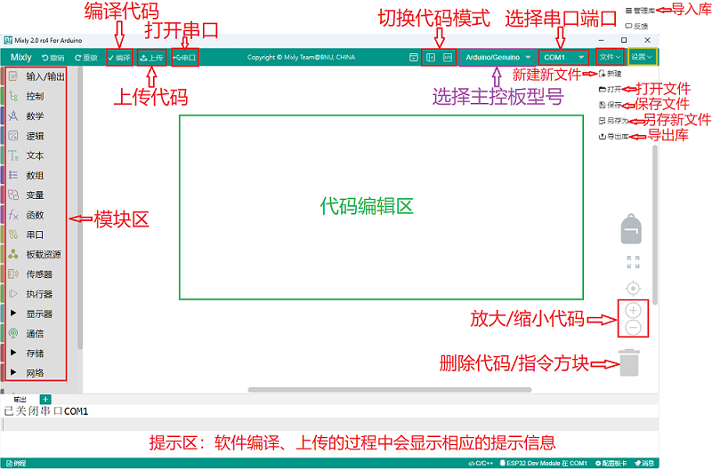

总体来说，Mixly软件界面分为4部分：

1.界面左侧为模块区，这里包含了Mixly中所有能用到的程序模块，根据功能的不同，大概分为以下几类:“输入/输出”、“控制”、“数学”、“逻辑”、“文本”、“数组”、“变量”、“函数”、“串口”、“传感器”、“执行器”、“显示器”、“通信”、“存储”、“网络”。每种类型的模块都用不同的颜色块表示，其中每一个分类中的模块会在附录A中有专门的介绍。

2.模块区的右侧是程序构建区，模块区的模块可通过鼠标拖拽放到程序构建区，拖诟过来的模块会在这里组合成一段有一定逻辑关系的程序块。这个区域有点类似代码程序编辑软件中写代码的地方，在这个区域的右下角有一个垃圾桶，当我们删除模块时，就要将模块拖到垃圾桶中，在垃圾桶的上方有三个圆形的按钮，能够实现程序构建区的放大、缩小以及居中。

3.模块区和程序构建区的上方是基本功能区，类似一般软件的菜单区。这里不仅包含了“新建”、“打开”、“保存”、“另存为”、“导出库”和“管理库”软件都具有的按钮，还包含了硬件编程软件中需要用到的“编译”、“上传”、“控制板选择”、“串口端口”、“串口”这样的按钮。

4.界面的最下方是提示区，这里在软件编译、上传的过程中会显示相应的提示信息。我们可以通过提示信息来解决编译上传过程中出现的一些问题。

最后还要补充两点：

第一点是 Mixly支持多国语言，我们可以通过如下界面找到并且点击

进入个性化设置页面，找到语言下面的简体中文下拉菜单，选择不同的语言版本，此时这个下拉菜单显示的是简体中文，如下图所示：

第二点是在界面最上方右侧有一个

按钮，单击这个按钮就能进入纯代码形式，如下图所示：

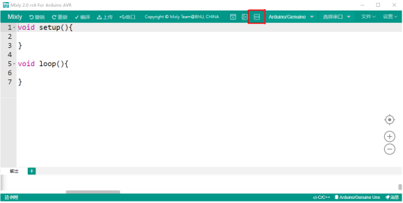

Mixly作为一款将图形化编程方式和代码编程方式融合在一起的开发环境，如果只能单独地显示代码或显示图形程序块，那么肯定是不够好的。在Mixly中是能够将代码和图形程序块一起呈现在屏幕上的，这个功能可以通过界面最上方右侧有一个按钮实现，单击这个
 按钮之后，如下图所示：

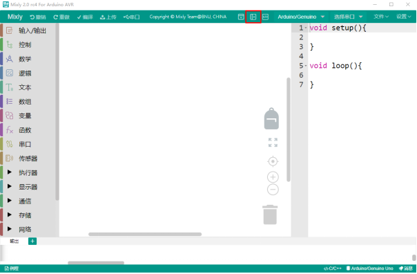

这时，在程序构建区的右侧会显示出对应的代码，这段代码是与程序构建区中的模块所组成的程序块对应的，会随着模块的变化而变化，不过区域中的代码是不可编辑的。同时，界面最右侧那个向左的箭头按钮变成了向右的箭头。

**注意：想了解更多关于Mixly相关知识的请点击链接：**<https://mixly.readthedocs.io/zh-cn/latest/>
。

**Mixly 软件相关使用教程**

<https://www.bilibili.com/video/bv1BE411A7hX>

<https://www.bilibili.com/video/BV1jE411A78S>

<https://www.bilibili.com/video/BV1YE411A7FT>

<https://wiki.mixly.org/>

## 6.3. 添加Mixly库文件

（以下是以Windows系统为例，MacOS系统可以参考）

（注意：如果库文件已经导入了，则不需要再次导入；如果没有，则需要进行以下操作）

我们提供的Mixly库文件在如下路径：

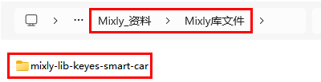

Mixly软件下载安装后，点击 Arduino AVR
进入代码编辑器，先点击右上角“设置”，再点击“管理库”进入添加库文件界面。如下图所示：

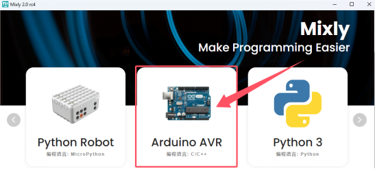

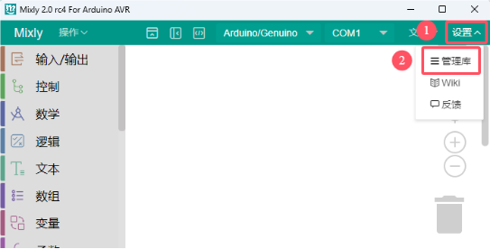

在Mixly窗口中，先点击“导入库”，再点击进入库文件所放的位置，找到
**index.xml**
库文件并选中它，然后单击“确定”。之后，就可以看到库文件在导入中，一会儿会出现“导入成功”字样，说明库文件导入成功。如下图所示：

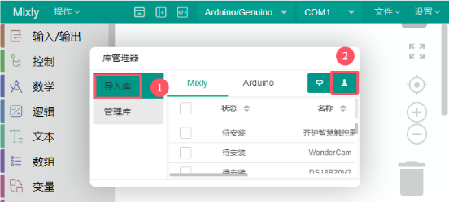

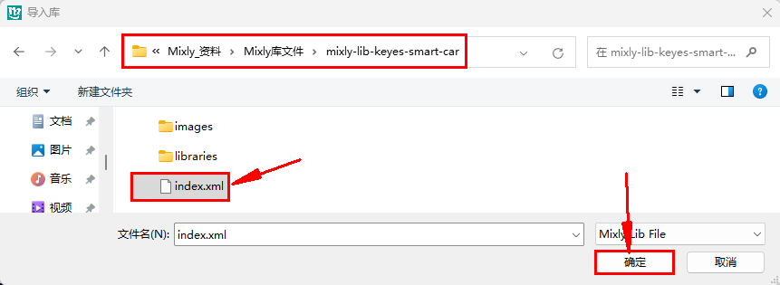

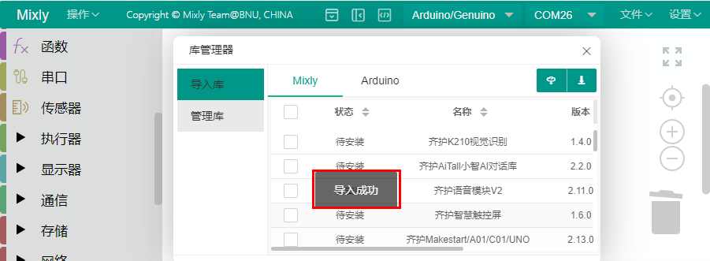

点击“管理库”可以查看到刚加入的库文件。

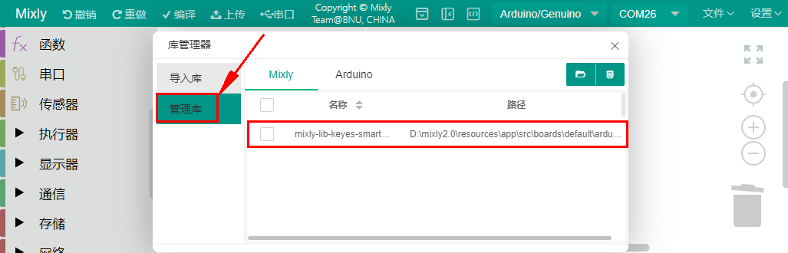

关闭添加库文件的窗口界面，在代码编辑器左侧看到所添加的库文件。如下图所示：

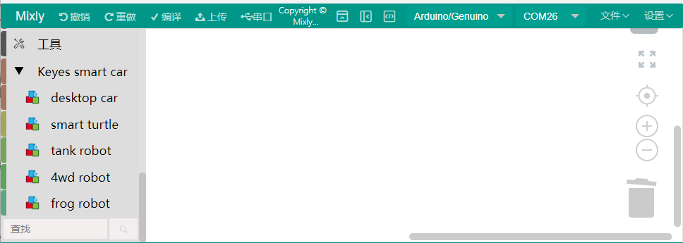

⚠️ **特别提醒：本套件是选用 “tank robot” 库**。

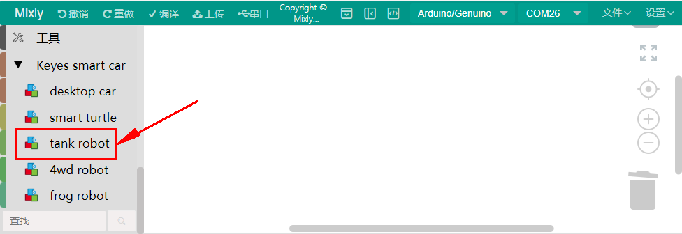

## 6.4. Mixly IDE的使用方法：

接下来，我们将以UNO PLUS 控制板控制LED亮灭为例：

1、连接指南:

通过USB数据线将控制板连接到电脑上。LED灯的控制引脚：

- LED灯（S引脚）D9

2、打开一下程序代码：

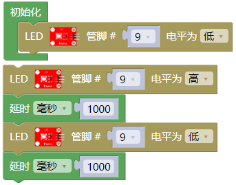

(1).
确保Arduino主控板与计算机连接成功，然后双击“Mixly.exe”图标打开Mixly软件。

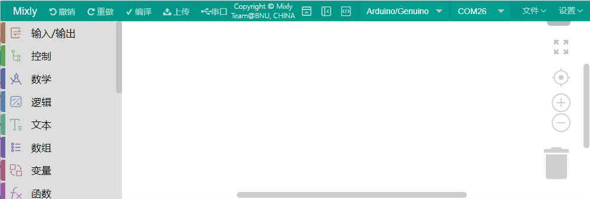

(2).
“文件”–\>“打开”，然后选择保存代码的路径，选中代码文件打开即可。如下图所示：

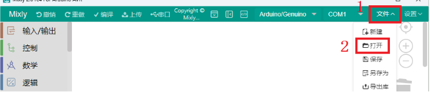

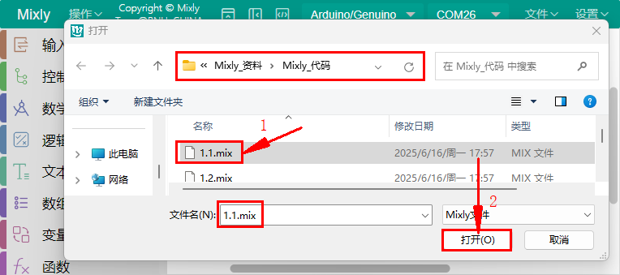

(3). 代码文件打开后，需要手动选择Arduino主控板的板型“Arduino/Genuino
Uno”和串口端口（COM26），如下图所示：

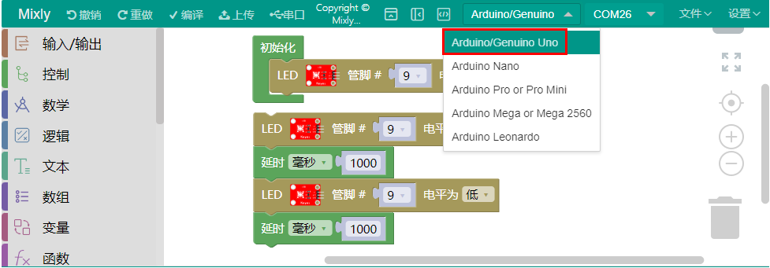

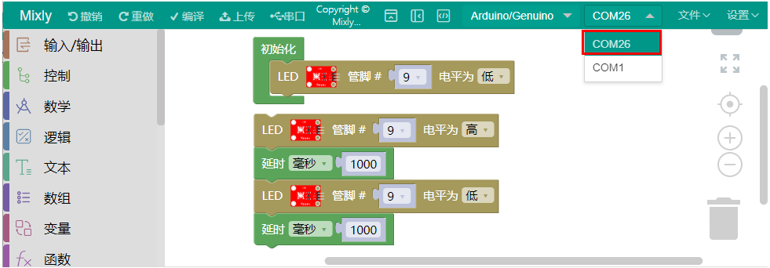

(4).
接着点击“编译”对代码进行编译，如果代码编译成功，说明代码没问题，可以进行下一步操作。

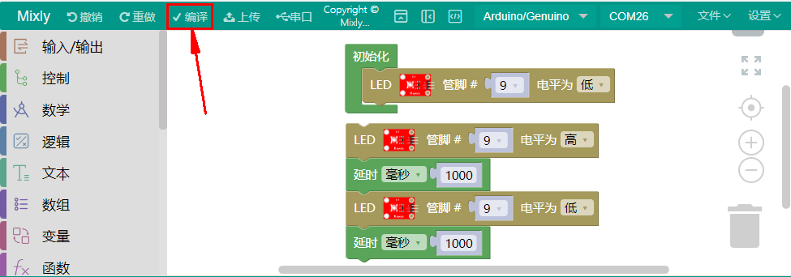

(5).
点击，把代码上传到你的控制板上。

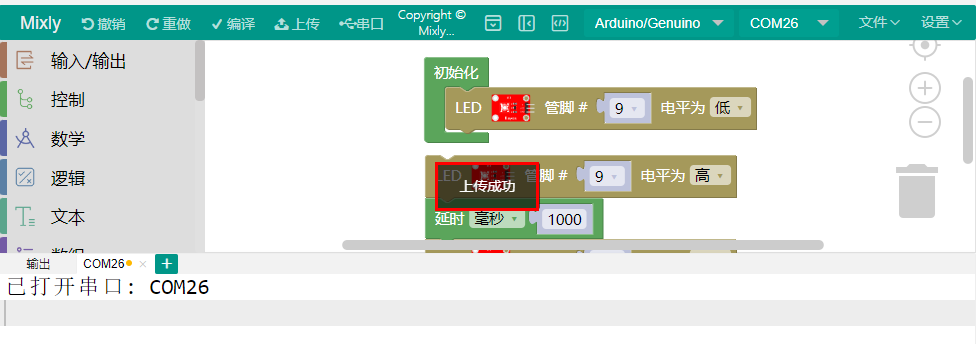

(6). 可以看到LED不断地闪烁。

⚠️ **特别提醒：本套件的Mixly_教程是选用 “tank robot” 库**。

