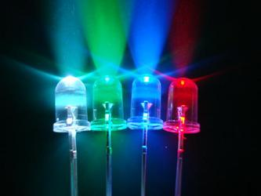
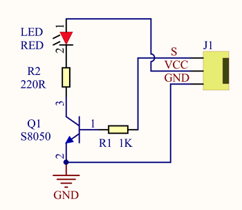
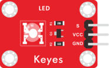
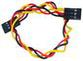
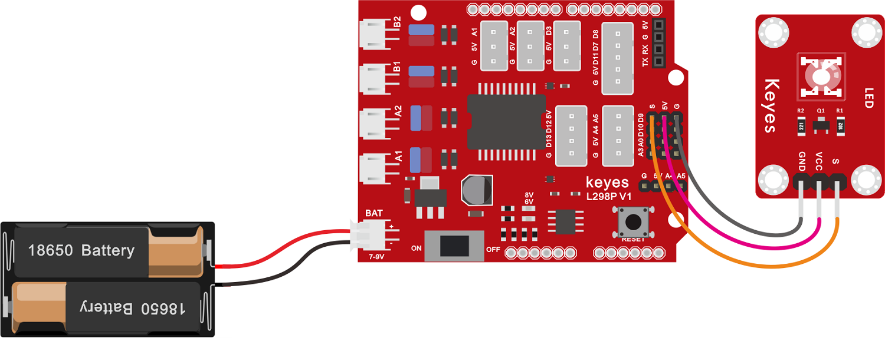
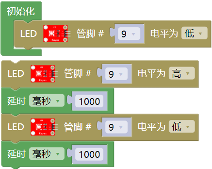
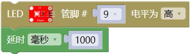
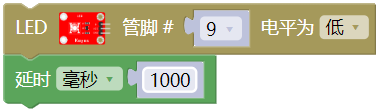
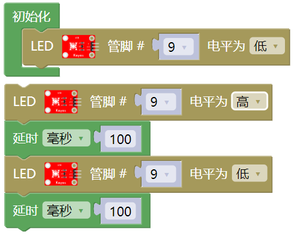

### 项目一 LED灯闪烁

**项目介绍：**

前面我们安装了keyes UNO
PLUS 开发板的驱动。接下来的项目我们就要由简单到复杂，一步一步探索Arduino的世界了。首先我们要来完成经典的“Arduino点亮LED”，也就是Blink项目。Blink对于学习Arduino的爱好者而言，是最基础的项目是新手必须经历的一个练习。

LED，发光二极管的简称。由含镓（Ga）、砷（As）、磷（P）、氮（N）等的化合物制成。当电子与空穴复合时能辐射出可见光，因而可以用来制成发光二极管。在电路及仪器中作为指示灯，或者组成文字或数字显示。

为了实验的方便，我们将LED发光二极管做成了一个模块，在第一个项目中，我们用一个最基本的测试代码来控制LED，亮一秒钟，灭一秒钟，来实现闪烁的效果。你可以改变代码中LED灯亮灭的时间，实现不同的闪烁效果。LED模块信号端S为高电平时LED亮起，S为低电平时LED熄灭。

**LED模块参数：**

控制接口: 数字口

工作电压: DC 3.3-5V

排针间距: 2.54mm

LED显示颜色：红色

**项目组件：**

| UNO PLUS  开发板\*1                                       | L298P 电机驱动扩展板 V1\*1                                | LED白发红模块\*1                                          |
| --------------------------------------------------------- | --------------------------------------------------------- | --------------------------------------------------------- |
|  |  |  |
| USB线\*1                                                  | 3Pin 双母头杜邦线\*1                                      | 18650双节电池盒 (18650电池*2(电池自配))*1                 |
|  |  |  |

**接线图：**

**⚠️特别注意：坦克智能车已经组装好了，这里不需要把传感器模块和其他的都拆下来又重新组装和接线，这里再次提供接线图，是为了方便您编写代码。但是，LED灯是需要另外连接上去的！**

由上图我们可以看到，扩展板是堆叠在开发板上的，LED模块的-接到了扩展板的G,LED模块的+接到了扩展板的5V，LED模块的S已经接到了扩展板上的D9接口，接好线之后我们开始编写代码：

**项目代码：**

（**特别提醒：在上传程序代码前，需要把蓝牙模块取下，否则代码会上传失败。需要上传代码成功后，再连接蓝牙模块。**）

**项目结果：**

点击上传程序，你应该看到D9脚接着的LED打开和关闭，而且间隔的时间是一秒钟。

**代码说明:**

LED点亮一秒

LED熄灭一秒

**项目拓展：**

前面我们控制了LED模块亮1秒钟,灭一秒钟，现在我们来拓展一下思路，通过改变delay的时间来改变LED
灯闪烁的频率。

代码如下:

（**特别提醒：在上传程序代码前，需要把蓝牙模块取下，否则代码会上传失败。需要上传代码成功后，再连接蓝牙模块。**）

怎么样是不是很好理解，就是通过改变延时(delay)这个代码的时间，来改变LED亮和灭的频率，不多说，我们上传代码。看看这个LED灯闪烁的频率是不是比之前快了？