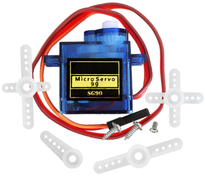
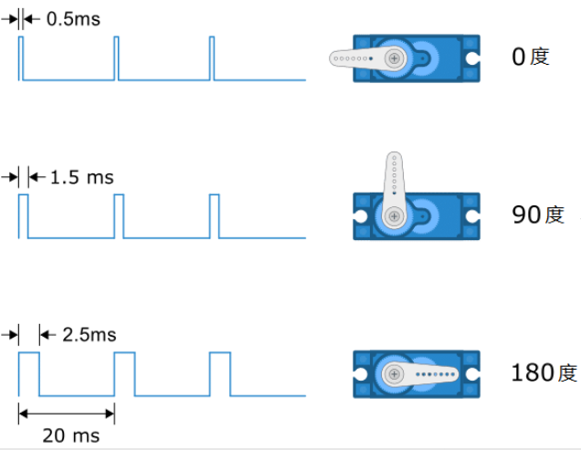
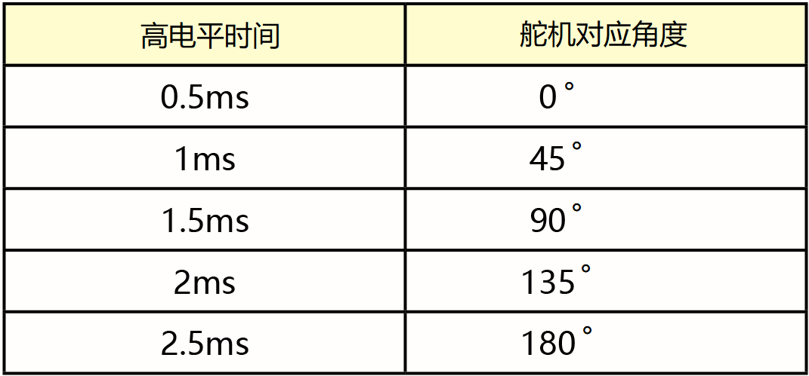

### 项目四 舵机控制

**项目介绍：**

舵机是一种位置伺服的驱动器，主要是由外壳、电路板、无核心马达、齿轮与位置检测器所构成。其工作原理是由接收机或者单片机发出信号给舵机，其内部有一个基准电路，产生周期为20ms，宽度为1.5ms的基准信号，将获得的直流偏置电压与电位器的电压比较，获得电压差输出。

舵机有很多规格，但所有的舵机都有外接三根线，分别用棕、红、橙三种颜色进行区分，由于舵机品牌不同，颜色也会有所差异，棕色为接地线，红色为电源正极线，橙色为信号线。

舵机的转动的角度是通过调节PWM（脉冲宽度调制）信号的占空比来实现的，标准PWM（脉冲宽度调制）信号的周期固定为20ms（50Hz），理论上脉宽分布应在1ms到2ms之间，但是，事实上脉宽可由0.5ms到2.5ms之间，脉宽和舵机的转角0°～180°相对应。

对应的舵机角度值如下:

**舵机参数：**

- 工作电压：DC 4.8V〜6V

- 可操作角度范围：大约 About 180°(在 500→2500 μsec)

- 脉波宽度范围：500→2500 μsec

- 空载转速：0.12±0.01 sec/60（DC 4.8V） 0.1±0.01 sec/60（DC 6V）

- 空载电流：200±20mA（DC 4.8V） 220±20mA（DC 6V）

- 停止扭力：1.3±0.01kg·cm（DC 4.8V） 1.5±0.1kg·cm（DC 6V）

- 停止电流：≦850mA（DC 4.8V） ≦1000mA（DC 6V）

- 待机电流：3±1mA（DC 4.8V） 4±1mA（DC 6V）

**项目组件：**

| 组装好的智能车(未插上蓝牙模块) *1 | USB线 *1 | 18650电池 *2（电池自备） |
| --- | --- | --- |
|  | |  |                                                          |

**接线图**：

**⚠️特别注意：坦克智能车已经组装好了，这里不需要把传感器模块和其他的都拆下来又重新组装和接线，这里再次提供接线图，是为了方便您编写代码！**

**接线注意**：接舵机的时候必须要外接供电，因为驱动舵机的电流要求比较大，一般峰值的情况下接近1A，开发板的电流远远不够。如果不接外接电源，很有可能烧坏开发板。

**项目代码：**

（**特别提醒：在上传程序代码前，需要把蓝牙模块取下，否则代码会上传失败。**）

**项目结果：**

外接电源，将电机驱动扩展板上的拨码开关拨至ON端。选择好正确的开发板板型和适当的串口端口（COMxx），上传代码。上传代码成功，上电后，舵机从0°转到90°再转到180°，循环进行。