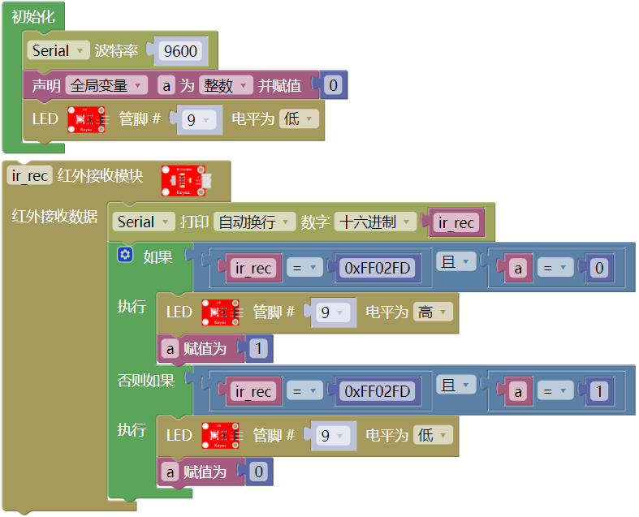

### 项目六 红外接收原理及应用

**项目介绍：**

本教程将为您详细介绍红外接收模块与红外遥控器的使用方法和应用技巧。红外遥控在我们的日常生活中非常常见，比如家里的电视、空调、音响等设备，大多都使用红外遥控器来控制。那么，它是如何工作的呢？

#### 7.2 元件知识： 

红外遥控系统主要由两部分组成：红外发射端（也就是我们手中的遥控器）和红外接收端（安装在4WD智能车上的红外接收模块）。 

当你按下遥控器上的按键时，遥控器内部的芯片会将这个按键信息编码成一串特殊的信号。这串信号通过红外线发射管发射出去。这种红外信号是一种频率为 38KHz 的载波信号，它由“引导码”、“用户码”、“数据码”和“数据反码”组成。简单来说，就是利用脉冲时间的长短来表示数字“0”和“1”。

在本课中，我们将使用一个红外接收模块。这个模块内部集成了接收、放大和解调功能。它能把接收到的微弱红外光信号转换成单片机（如：Arduino）能识别的数字电信号（TTL电平）。这个模块只有三个引脚：信号输出（S）、电源正极（VCC）和电源负极（GND），连接非常方便。

当 Arduino 接收到这些数字信号后，通过程序进行解码，就能知道我们按下了遥控器上的哪个键，从而执行相应的操作。

**红外接收模块的参数：**

- 工作电压：3.3V - 5V（直流电）

- 接口类型：3PIN 接口（S, V, G）

- 输出信号：数字信号

- 接收角度：约 90 度

- 载波频率：38kHz

- 有效距离：约 10 米（视环境光线而定）

**项目组件：**

| 组装好的智能车(未插上蓝牙模块) *1 | 草帽LED白发红模块 *1 | 3Pin 双母头杜邦线 *1  |
| --- | --- | --- |
|  | | |
| USB线 *1 | 18650电池 *2（电池自备） |   |
| |  |  |                                                       |

**接线图：**

**⚠️特别注意：坦克智能车已经组装好了，这里不需要把传感器模块和其他的都拆下来又重新组装和接线，这里再次提供接线图，是为了方便您编写代码。**

**项目代码：**

（**特别提醒：在上传程序代码前，需要把蓝牙模块取下，否则代码会上传失败。**）

**项目结果：**

外接电源，将电机驱动扩展板上的拨码开关拨至ON端。选择好正确的开发板板型和适当的串口端口（COMxx），上传代码。单击，在串口监视器窗口设置波特率为9600，拿出遥控器，对准红外接收传感器发送信号，即可看相应按键的键值，如果按键时间过长，容易出现乱码，出现
FFFFFFFF，请忽略。

我们通过测试得出的数值，做了一个遥控器按键值表，方便以后使用。

**项目拓展：**

我们刚刚解码了红外遥控器的按键值，那我们能不能用测出的按键值来做一些控制呢，如果控制一个LED灯的亮和灭。我们来试一下，在9脚接上一个LED灯模块。接线图如下：

实验代码：

（**特别提醒：在上传程序代码前，需要把蓝牙模块取下，否则代码会上传失败。**）

外接电源，将电机驱动扩展板上的拨码开关拨至ON端。选择好正确的开发板板型和适当的串口端口（COMxx），上传代码。当遥控器按下”OK”按键时，LED就会亮；再按一下”OK”按键，LED就会灭，同时电脑的串口会出现按键的命令编码.

**代码说明：**

如果红外接收器接收到红外遥控器的按键值，串口打印对应的16进制按键值。

如果按下”OK”按键，红外接收器接收到”OK”按键值，LED点亮；否则如果，再次按下”OK”按键，红外接收器再次接收到”OK”按键值，LED熄灭。