### 项目七 蓝牙遥控的原理及应用

**项目介绍：**

蓝牙是一种简单且便捷的无线通信模块，自过去几十年以来便广受欢迎，并且易于使用。如今，它已被广泛应用于大多数电池供电的设备中。

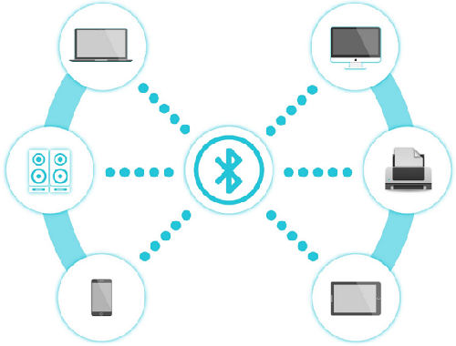

多年来，蓝牙标准经历了多次升级，以满足客户的需求以及适应技术的发展变化，这些升级都是根据时代和环境的需要而进行的。

在过去几年里，许多方面都有了变化，包括数据传输速率、可穿戴设备和物联网设备的能耗以及安全系统。

接下来我们将学习如何使用 Arduino 板来连接 蓝牙模块。HM-10
是一款易于获取的蓝牙 4.0
模块。该模块用于实现无线数据通信。该模块是通过采用德州仪器的 CC2540 或
CC2541 蓝牙低功耗（BLE）系统级芯片（SoC）而设计的。

**蓝牙参数**：

蓝牙协议：蓝牙规范 V4.0 BLE

串行端口传输接收中无字节限制

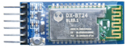

在开放环境中，能够实现与 iPhone 4s 进行 100 米的超远距离通信。

工作频率：2.4GHz ISM 频段

调制方式：高斯频率调制（GFSK）

传输功率：-23 分贝毫瓦、-6 分贝毫瓦、0 分贝毫瓦、6 分贝毫瓦，可通过 AT
命令进行调整。

灵敏度：在误码率为 0.1% 的情况下，≤ -84 分贝毫瓦。

传输速率：异步模式：6K 字节；同步模式：6k 字节

安全特性：身份验证与加密

支持服务：中央及外围 UUID 分别为 FFE0、FFE1

功耗情况：自动休眠模式下，待机电流为 400 微安至 800 微安，传输时电流为
8.5 毫安。

工作电压：DC 5 V

工作温度：-5 至 +65 摄氏度

**项目组件：**

| UNO PLUS  开发板\*1                                        | L298P 电机驱动扩展板 V1\*1                                 | LED白发红模块\*1                                           | Bluetooth-4.0 蓝牙4.0 V2\*1                                |
| ---------------------------------------------------------- | ---------------------------------------------------------- | ---------------------------------------------------------- | ---------------------------------------------------------- |
|  |  |  |  |
| 3Pin 双母头杜邦线\*1                                       | USB线\*1                                                   | 18650双节电池盒 (18650电池*2 （电池自配）)* 1              |                                                            |
|  |  |  |                                                            |

**接线图：**

1.  状态：状态测试引脚，与内部 LED 相连，通常保持其不连接状态。
2.  RXD：串行接口，接收端口。
3.  TXD：串行接口，发送端。
4.  GND：接地。
5.  VCC：电源的正极。
6.  EN/BRK：断开连接，意思是中断蓝牙连接，通常情况下，保持连接状态即可。

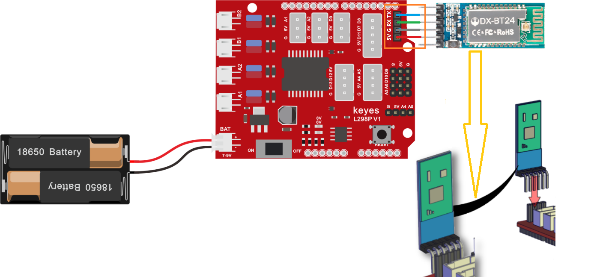

蓝牙是直接插在电机驱动扩展板上的，注意一下方向，而且在上传代码之前不要插上蓝牙。

**项目代码：**

（**特别提醒：在上传程序代码前，需要把蓝牙模块取下，否则代码会上传失败。需要上传代码成功后，再连接蓝牙模块。**）

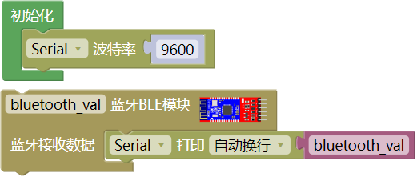

上传代码到开发板，然后再插上蓝牙模块。

**下载蓝牙测试APP：**

**安卓系统手机APP**

1\. 扫码下载 或者进入APP下载链接：<http://8.210.52.206/Tank_Car.apk>

**注意：当我们扫码下载的时候需要使用手机浏览器的扫码功能扫码打开，使用微信扫码可能无效。**

2\.  下载后安装，安装成功，显示图标如下。

3\. **一定要先打开手机上的蓝牙开关，再点击上图图标**，进入APP，显示如下图。

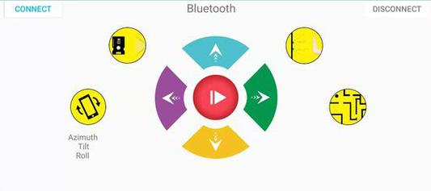

4\. 上传代码成功后，正确插好蓝牙模块，上电后，蓝牙模块上LED闪烁。点击APP图标，搜索到蓝牙，显示如下图。

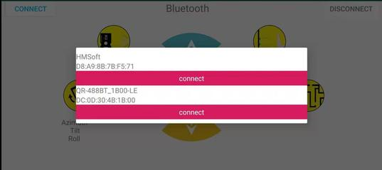

5\. 点击 **connect** ，之后 **connect** 变成 **is connected**
，说明蓝牙连接成功，显示如下图，蓝牙模块上LED变为常亮。

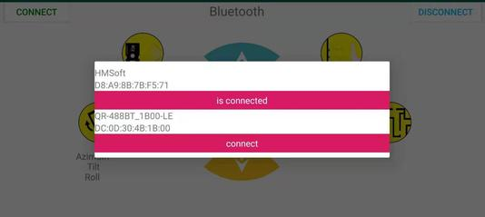

**苹果系统手机APP**

1\.  打开App Store。

2\.  点击搜索，搜索keyes，下载搜索到的keyes BT car。

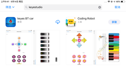

3\.  打开keyes BT car。

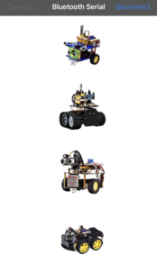

4\. 一定要先开启手机蓝牙，再点击左上角的 **CONNECT**
按钮，进行蓝牙搜索和连接。

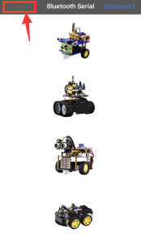

5\.  点击坦克车的图片按钮，进入控制坦克车的界面

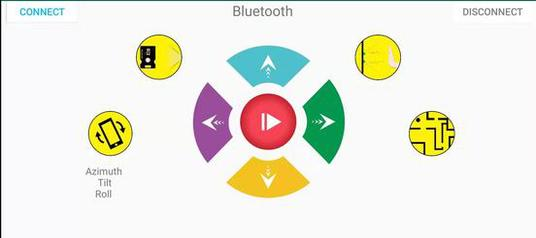

单击，在串口监视器窗口设置波特率为9600，在APP上点击各个按钮，等待手机发出的指令。指令如下：

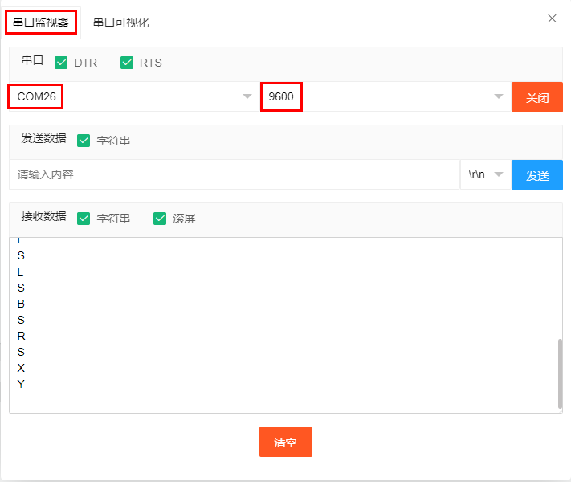

**项目拓展：**

上面的项目，我们讲解了蓝牙接收到手机发送的信号并且在开发板的串口显示出来，比如我们按下，然后我们就会接收到‘B’，当我们松开的时候又接收到‘S’。那接下来我们就要想一下了，我们可以利用接收到的信号去做一些事情吗，答案是肯定的，我们这里就利用手机发送的命令去打开或者关闭一个LED灯。看接线图，在D9脚接了一个LED。

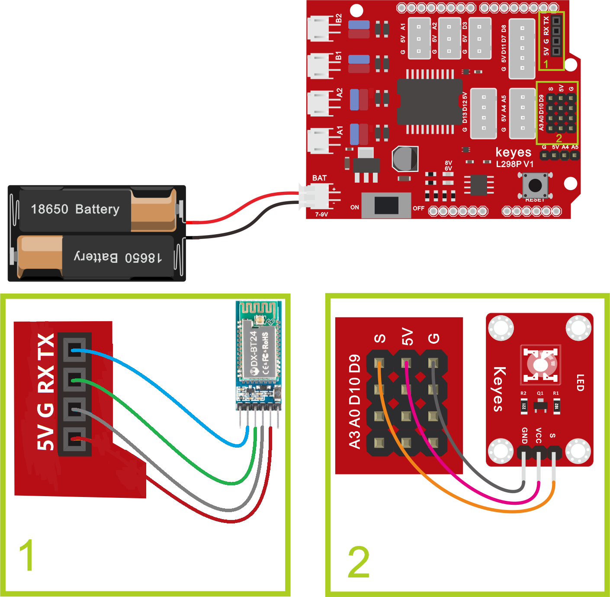

实验代码：

（**特别提醒：在上传程序代码前，需要把蓝牙模块取下，否则代码会上传失败。需要上传代码成功后，再连接蓝牙模块。**）

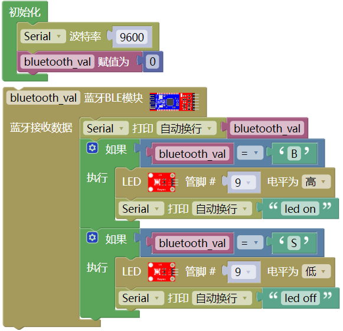

上传代码完成后，单击，在串口监视器窗口设置波特率为9600，插上蓝牙模块，打开App，单击**CONNECT**
连接上蓝牙，点击手机APP上以控制LED。当您按住发送`B`时，LED将打开，而当您松开发送`S`时，LED将关闭。

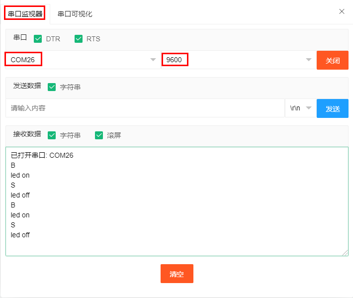