### 项目九 LED表情灯板

**项目介绍：**

如果在我们的机器人上加一块表情面板，这将是多么好玩的一件事情，keyes的8*16点阵就可以满足你的要求。你可以自己创建面部表情，动画，图案或者是其他有趣的显示。8*16
LED灯板自带128个LED。微处理器（arduino）的数据通过两线总线接口与AiP1640通讯，从而控制模块上128个LED的亮灭，从而让模块上点阵显示你需要的图案。为方便接线，我们还配送一根HX-2.54
4Pin接线。

**规格参数**

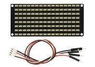

工作电压: DC 3.3-5V

功率损耗：400mW

震荡频率：450KHz

驱动电流：200mA

工作温度：-40~80℃

**项目组件：**

| UNO PLUS  开发板\*1                                        | L298P 电机驱动扩展板 V1\*1                                 | 8x16 LED灯板\*1                                             |
| ---------------------------------------------------------- | ---------------------------------------------------------- | ----------------------------------------------------------- |
| 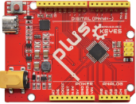 | 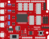 | 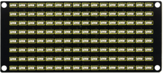  |
| USB线\*1                                                   | 18650双节电池盒 (18650电池*2 （电池自配）)* 1              | 4P 转杜邦线母单\*1                                          |
|  |  | 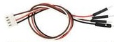 |

\**8*16点阵模块详细介绍：\*\*

1.  8\*16点阵的电路图：

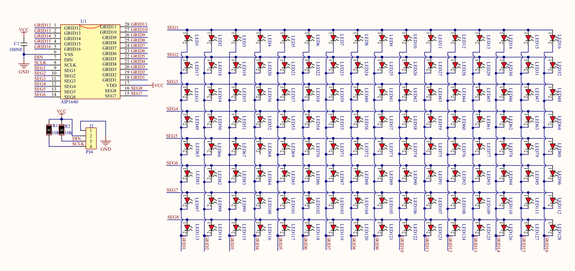

2.  控制8\*16点阵的原理：

是怎么控制8*16点阵的每个led灯的呢？要知道一个字节有8位，每一位是0或1，0时关闭led，1时打开led灯，那么一个字节就可以控制点阵一列的led灯开关了，自然16个字节就可以控制16列led灯，即控制了8*16点阵。

3.  接口说明及通讯协议：

微处理器（arduino）的数据通过两线总线接口与AiP1640通讯。

通讯协议图如下(SCLK)就是SCL，(DIN)就是SDA ：

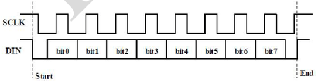

① 数据输入的开始条件是，SCL为高电平，SDA由高变低。

② 数据命令设置，有下图所示方法可选

我们的示例程序中选择 地址自动加1的方式，其二进制是0100
0000对应的十六进制为0x40

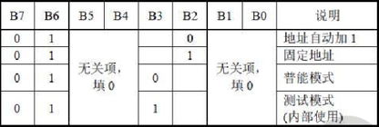

③ 地址命令设置，有如下图地址可以选

我们示例程序中选了第一个00H，其二进制1100 0000对应的十六进制是0xc0

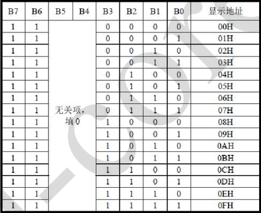

④
数据输入的要求是，在输入数据时当SCL是高电平时，SDA上的信号必须保持不变，只有SCL上的时钟信号为低电平时，SDA上的信号才可以改变。数据的输入是
低位在前，高位在后 传输。

⑤
数据传输结束的条件是，SCL为低时，SDA为低，SCL为高时，SDA电平也变为高电平。

⑥ 显示控制，设置不同脉宽，脉宽有如下图可选

我们示例中选了脉宽为4/16，1000 1010对应的十六进制是0x8A

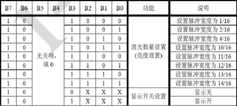

对应我们的示例程序来学习会理解的更好。

4.  取模工具的使用说明

<figure>
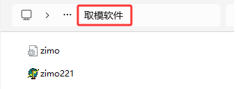
<figcaption>Img</figcaption>
</figure>

设置时，我们需要把一个图案转换成1组16个的16位数据，这里就需要用到一个取模软件,这个软件已放入资料文件夹中。使用时打开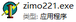图标，显示如下图。

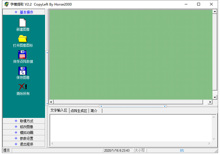

点击这个图标新建图案，根据显示屏规格，设置宽度为16，高度为8，如下图。

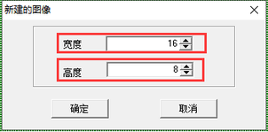

初始时发现格点不大，不方便设置，我们可以通过设置模拟动画，设置格点大小，点击如下图。

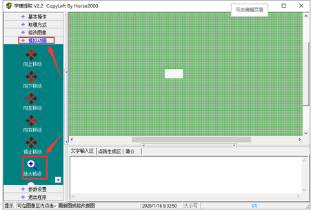

一直鼠标左键点击，就可以一直放大格点了。

放大后，我们就可以通过用鼠标点击白色区域，设置显示图案了。

设置时，鼠标点击（左右键都可以）白色格点，变为黑色；再点击黑色格点，变为白色。黑色代表该格点显示亮起，白色代表格点不显示。显示屏最多能设置16\*8个点显示。设置笑脸显示如下图。

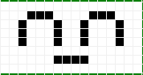

设置参数设置，选择其他选项，设置如下图。设置完成点击。

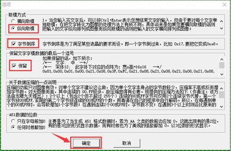

设置取模方式，选择C51格式选择如下图。

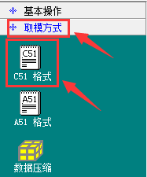

设置成功后，在以下区域就可以看到对应的16个数据了，只需要将数据复制粘贴在数组中，就可以用直接调用了。（0x00,0x00,0x1C,0x02,0x02,0x02,0x5C,0x40,0x40,0x5C,0x02,0x02,0x02,0x1C,0x00,0x00）

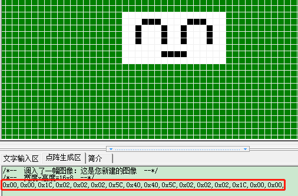

**特别提醒：由于图形化编程的代码块中已经有定义好的图案，可以不用取模工具设置图案而获取代码。**

**接线图：**

**⚠️特别注意：坦克智能车已经组装好了，这里不需要把传感器模块和其他的都拆下来又重新组装和接线，这里再次提供接线图，是为了方便您编写代码！**

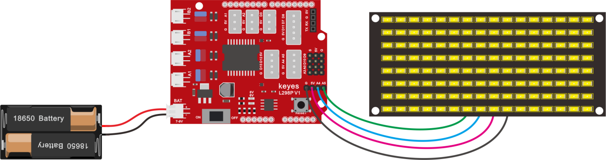

**接线注意：** 8x16
LED灯板的GND、VCC、SDA、SCL分别对应的接到keyes传感器扩展板-（GND）、+（VCC）、A4、A5进行两线串行通信。（注意：这里是接了arduino
IIC的引脚，但是这个模块并不是IIC通讯的，是可以接任意两个引脚的。）

**项目代码**

点阵显示上面画的微笑表情的代码

（**特别提醒：在上传程序代码前，需要把蓝牙模块取下，否则代码会上传失败。需要上传代码成功后，再连接蓝牙模块。**）

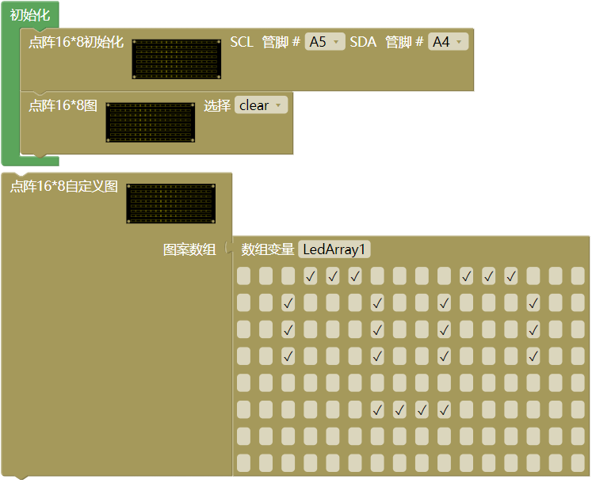

**项目结果：**

在 UNO PLUS 
开发板上传代码成功，按照接线图接线，拨码开关拨打到右端上电后，看一下，我们的显示屏上是不是显示了一个笑脸。

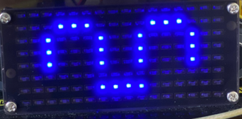

**项目拓展：**

我们利用刚刚学到的取模工具,让点阵循环显示：前进图案、后退图案、左转图案、右转图案、停止图案，然后清除图案，时间间隔为2000毫秒。

前进的代码块：

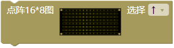

后退的代码块：

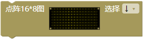

左转的代码块：

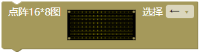

右转的代码块：

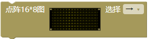

停止的代码块：

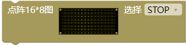

清屏的代码块：

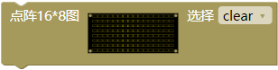

接线图不变：

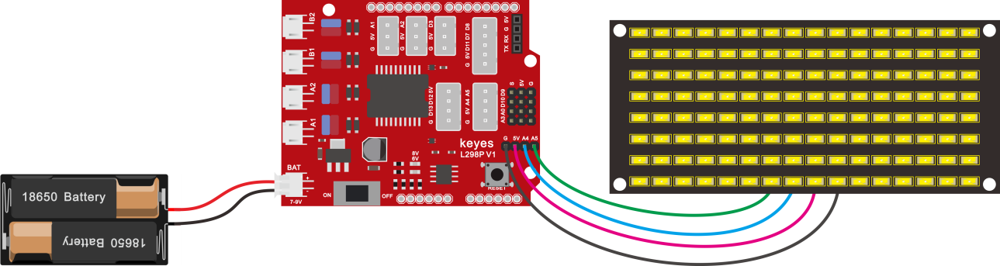

实验代码：

（**特别提醒：在上传程序代码前，需要把蓝牙模块取下，否则代码会上传失败。需要上传代码成功后，再连接蓝牙模块。**）

下面就是多个图案切换显示的代码

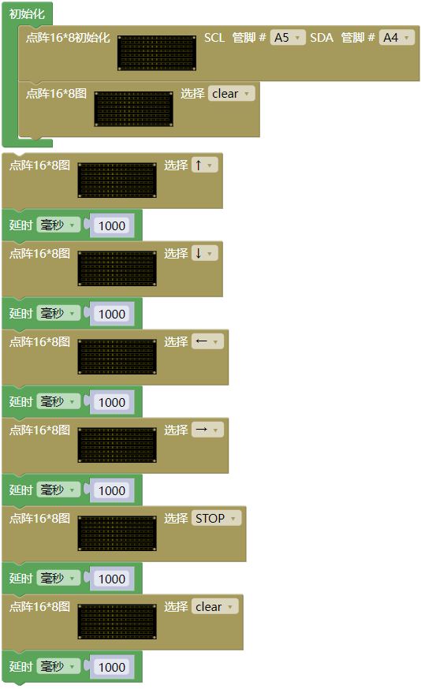

上传代码到开发板，我们看到表情面板（8\*16点阵）显示：前进图案、后退图案、左转图案、右转图案、停止图案、然后清除图案，时间间隔为2000毫秒。循环反复。