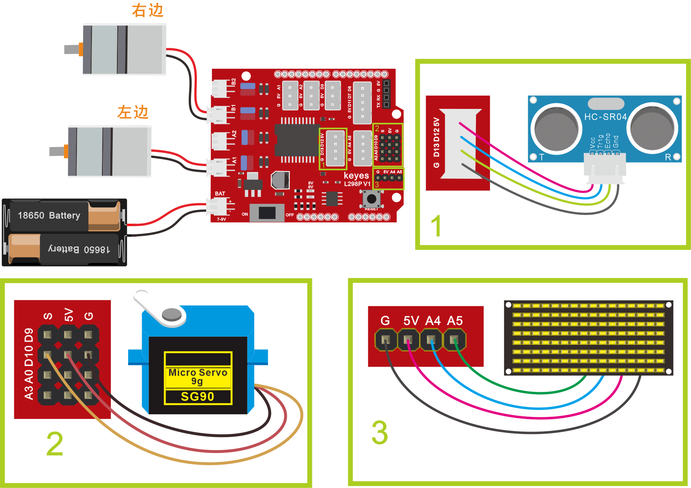
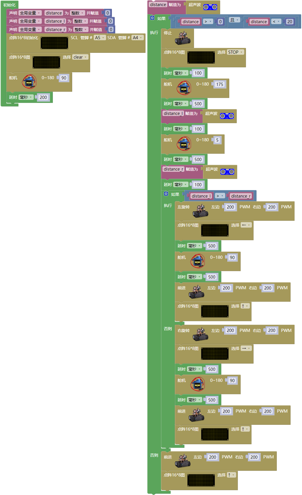

### 项目十二 自动避障智能车

**项目介绍：**

在上课程中，我们制作了一个跟随智能车。实际上，利用同样的电子元件，同样的接线方法，我们只需要更改一个测试代码就可以将跟随智能车变为避障智能车。

**避障智能车具体逻辑如下表格：**

| 检测            | 左边障碍物距离（distance_l（单位：cm））                                      |        |
|-----------------|-------------------------------------------------------------------------------|--------|
| 检测 检测       | 右边障碍物距（distance_r（单位：cm）） 中间障碍物距离（distance（单位：cm）） |        |
| 条件1           | 条件2                                                                         | 状态   |
| 0\<distance\<20 | distance_l \> distance_r 如果左边大于右边                                     | 向左转 |
| 0\<distance\<20 | distance_l\<=distance_r 如果左边不大于右边                                    | 向右转 |
| distance\>=20   | ——                                                                            | 前进   |

使用的电子元件，接线方法和课程四一样，更换测试代码，运行，确保智能车能够实现理想中的功能。

**接线图：**

**⚠️特别注意：坦克智能车已经组装好了，这里不需要把传感器模块和其他的都拆下来又重新组装和接线，这里再次提供接线图，是为了方便您编写代码！**

超声波模块+电机+舵机

接线注意：左、右电机分别对应的连接电机驱动扩展板上的接口A和接口B；超声波传感器模块的V引脚至5V，T（Trig）引脚至数字12(S)，E（Echo）引脚至数字13(S)，G引脚至G；舵机的黄线接数字口D10（S），红线接5V，棕线接G；电源接到BAT接口。

**测试代码**

（**特别提醒：在上传程序代码前，需要把蓝牙模块取下，否则代码会上传失败。需要上传代码成功后，再连接蓝牙模块。**）

好了，
迷你智能车避障功能效果的代码全部编写好了，上传程序，看看精彩的效果！

**测试结果**

将驱动扩展板堆叠在UNO
PLUS 板上，上传好代码，将拨码开关拨至ON端后，智能车能够自动避开障碍物行走。