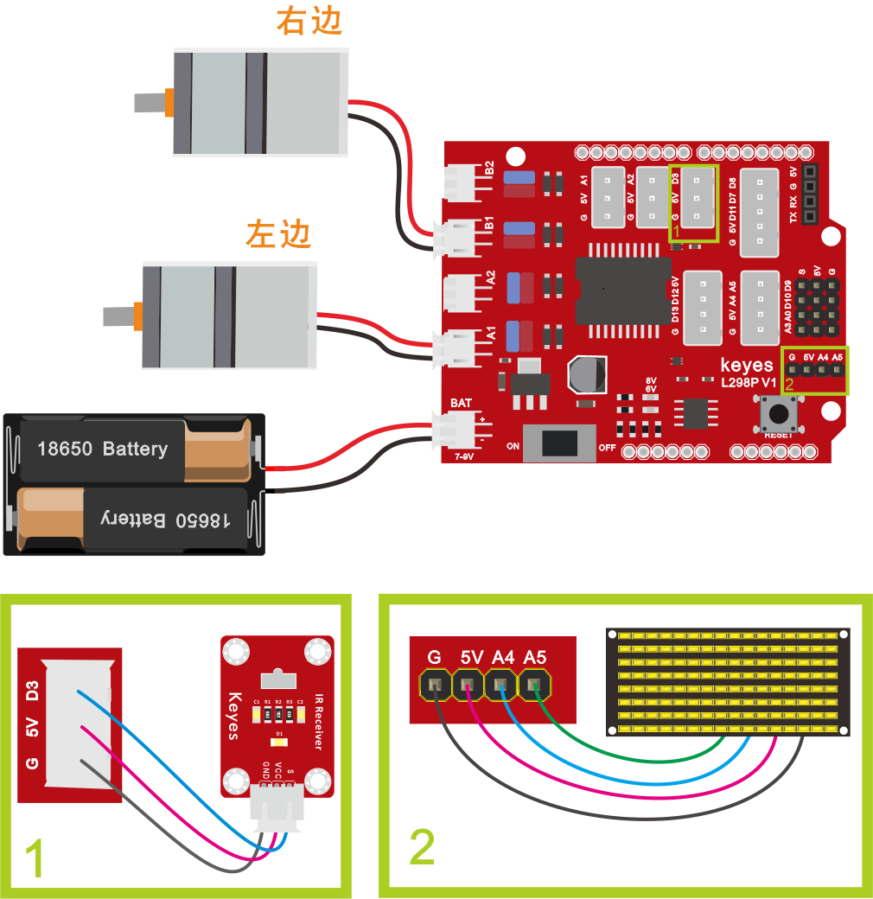
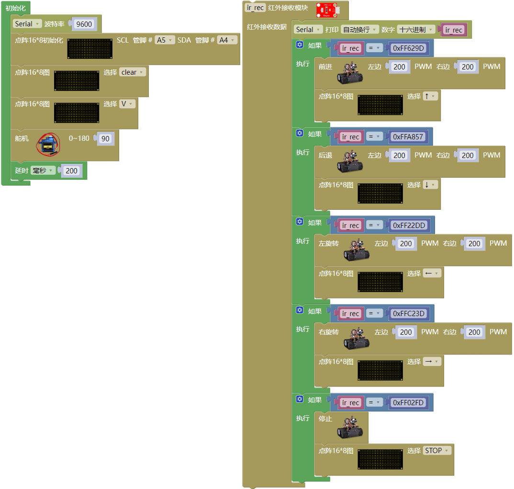

### 项目十三 红外遥控智能车

**项目介绍：**

前面的学习中我们详细的介绍了智能车上各个传感器、模块、扩展板的使用方法。在这里我们可以再结合前面课程中知识制作一个红外控制智能车。在传感器项目第四课中，我们已经测试出红外遥控器各个按键对应的键值。实验中，我们可以通过代码设置（键值），让对应的按键控制智能车对应的运动状态，且相应的状态模式显示在8X16 LED矩阵上。

**红外遥控智能车具体逻辑如下表格：**

| 按键图示 | 键值 (十六进制) | 小车状态 | 点阵屏显示内容 |
| :--: | :--: | :--: | :--: |
| | FF629D | 前进 | 向上箭头 ↑ |
| | FFA857 | 后退 | 向下箭头 ↓ |
| | FF22DD | 左转 | 向左箭头 ← |
| | FFC23D | 右转 | 向右箭头 → |
| | FF02FD | 停止 | "STOP" 字样 |

**项目组件：**

| 组装好的智能车(未插上蓝牙模块) *1 | USB线 *1 | 18650电池 *2（电池自备） |
| --- | --- | --- |
|  | |  |

**接线图：**

**⚠️特别注意：坦克智能车已经组装好了，这里不需要把传感器模块和其他的都拆下来又重新组装和接线，这里再次提供接线图，是为了方便您编写代码！**

**测试代码：**

（**特别提醒：在上传程序代码前，需要把蓝牙模块取下，否则代码会上传失败。**）

**测试结果**：

外接电源，将电机驱动扩展板上的拨码开关拨至ON端。选择好正确的开发板板型和适当的串口端口（COMxx），上传代码。上电后，我们就能用红外遥控控制智能车运动了。