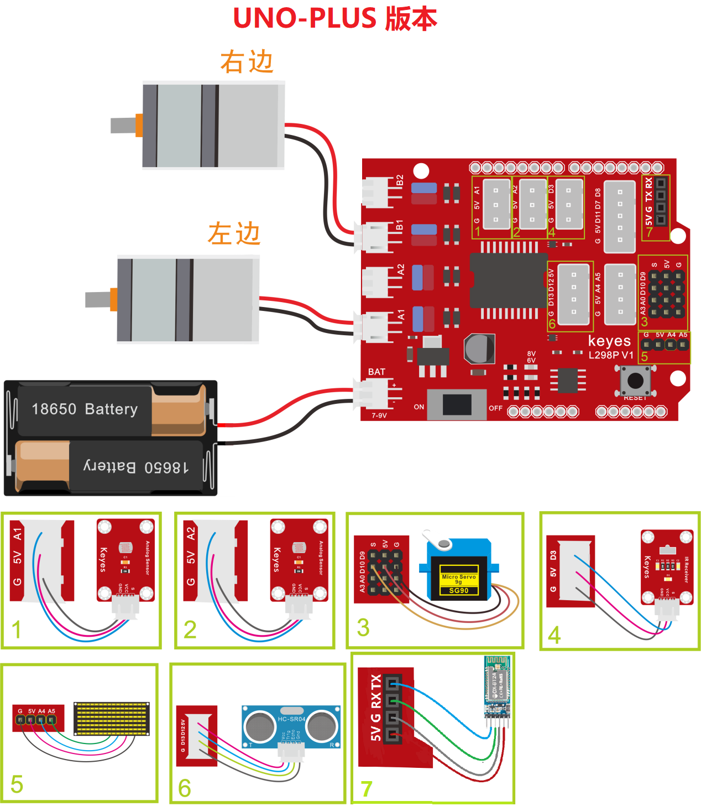
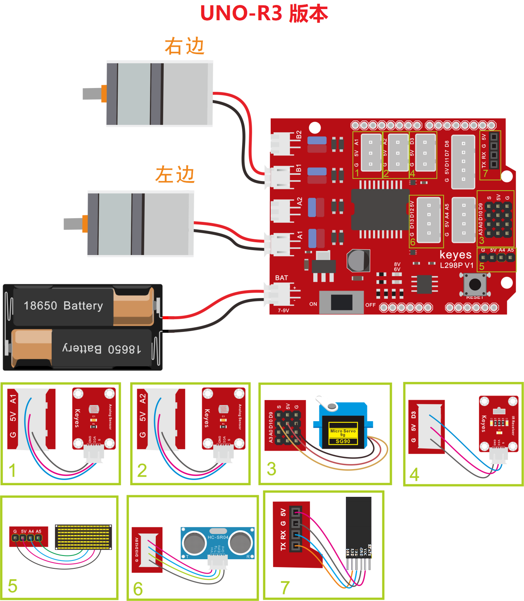
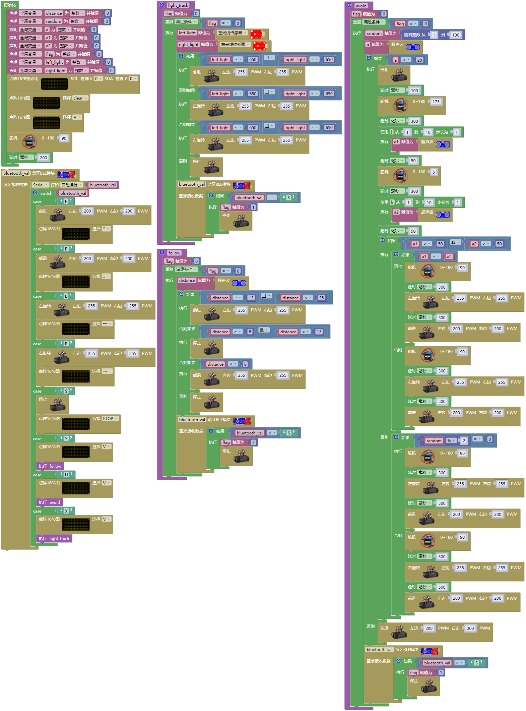
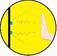

### 项目十五 多功能桌面小车

**项目介绍：**

在前面课程中，我们只是让智能车实现单个功能，那我们能不能把所有功能合在一起呢？能，在这一课程中，我们利用一个代码测试智能车，智能车包含前面课程中讲到的所有功能，我们利用手机蓝牙APP上按钮自动切换各种功能,简单方便。

**项目组件：**

| 组装好的智能车(未插上蓝牙模块) *1 |USB线 *1 |18650电池 *2（电池自备） |
| --- | --- | --- | 
|  | | | 
| 蓝牙模块  *1 | 手机/平板 *1|  |
| || |

**接线图：**

**⚠️特别注意：坦克智能车已经组装好了，这里不需要把传感器模块和其他的都拆下来又重新组装和接线，这里再次提供接线图，是为了方便您编写代码！**

⚠️ **特别注意：**

- **上传示例代码前，蓝牙模块可以先不直插到电机驱动扩展板上！因为蓝牙模块也占用Arduino的串口通信（TX/RX），如果连接到电机驱动扩展板上，示例代码上传会失败。示例代码上传成功后，再插回蓝牙模块。**

**测试代码：**

（**特别提醒：在上传程序代码前，需要把蓝牙模块取下，否则代码会上传失败。需要上传代码成功后，再连接蓝牙模块。**）

**测试结果：**

外接电源，将电机驱动扩展板上的拨码开关拨至ON端。选择好正确的开发板板型和适当的串口端口（COMxx），上传代码。手机APP连接蓝牙，蓝牙连接成功后，我们可以通过按下对应按钮实现对应功能，通过停止钮来停止功能。

| 按钮: |                            | 功能：配对连接HM-10蓝牙模块                                                               |
|--------------------------------------------------------------|----------------------------|-------------------------------------------------------------------------------------------|
| 按钮: |                            | 功能：进入蓝牙控制界面                                                                    |
| 按钮: |                            | 功能：断开蓝牙连接                                                                        |
| 按钮: | 控制字符：按下：F；松开：S | 功能：按下，小车前进；松开就停止                                                          |
| 按钮: | 控制字符：按下：B；松开：S | 功能：按下，小车后退；松开就停止                                                          |
| 按钮: | 控制字符：按下：L；松开：S | 功能：按下，小车左旋转；松开就停止                                                        |
| 按钮: | 控制字符：按下：R；松开：S | 功能：按下，小车右旋转；松开就停止                                                        |
| 按钮: | 控制字符： 点击发送：S     | 功能：小车停止，停止所有功能                                                              |
| 按钮: | 控制字符：                 | 功能：点击一下开启手机方向感应控制，再点击一下退出方向感应控制                            |
| 按钮: | 控制字符： 点击发送：U     | 功能：开启避障功能，点击退出       |
| 按钮: | 控制字符： 点击发送：X     | 功能：开启寻光功能，点击退出       |
| 按钮: | 控制字符： 点击发送：Y     | 功能：开启超声波跟随功能，点击退出 |