# 1. 迷你坦克机器人介绍

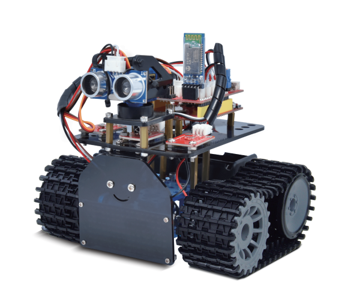

## 1.1 简介

在我们经常可以在网上看到别人利用一些控制板和一些电子元件，自己搭配结构，做出各种外观各种功能的小车。下面我们也要做一款迷你坦克机器人。这款坦克机器人本质上就是一个两驱动的履带车，它的安装有些复杂，我们提供详细的安装文件。这款小车接线非常简单，即使刚接触电子的人都可以搞定。

我们要让机器人听我们的话，就得给机器人下达指令，下指令时说人类的语言没有用，只能编写机器人能听懂的程序语言。

编程不仅对那些未来要当程序员的孩子有用，而且对其他孩子也有很大的作用。编程就是把大问题分割成小问题，然后解决问题的过程，对孩子的逻辑分析能力，创造能力，动手能力，解决问题的能力有极大的提升。

今天给大家推荐一款迷你坦克机器人，这款智能车可以让孩子们轻松学习编程，并且获得有关电子，机械，控制逻辑和计算机科学的实践知识。

他是基于ARDUINO的开源机器人，他的安装和接线十分简单，组件都通过螺钉和铜柱连接，只需要几个简单的步骤就可以组装完成。他提供了十多个编程的课程项目，由简单到复杂，一步一步，学习怎么去编写机器人能”听”懂的语言。

## 1.2 清单

当收到这个机器人套件的时候，首先看到是一个包装精美的外盒，每个配件被安全且有序的装在外盒里面的小盒子里，先来清点一下：

| No   | Product Name                                                 | Quantity | Picture                                                      |
| ---- | ------------------------------------------------------------ | -------- | ------------------------------------------------------------ |
| 1    | UNO plus 开发板                                              | 1        | 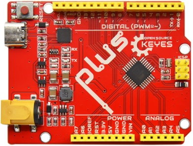        |
| 2    | L298P 电机驱动扩展板 V1                                      | 1        | 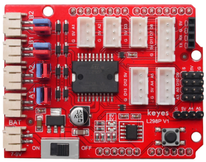        |
| 3    | 蓝牙模块                                                     | 1        | 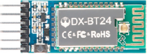 |
| 4    | keyes 超声波传感器                                           | 1        | 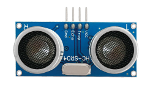 |
| 5    | keyes 红外接收传感器                                         | 1        | 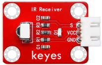        |
| 6    | keyes 8x16 LED灯板模块                                       | 1        |         |
| 7    | keyes brick光敏电阻传感器                                    | 2        |         |
| 8    | JMP-1 17键 遥控器                                            | 1        |         |
| 9    | 铝合金拼接板 蓝色                                            | 4        |        |
| 10   | keyes 草帽LED白发红模块                                      | 1        | 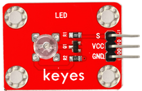       |
| 11   | 2.54三连pin 母对母杜邦线                                     | 1        | 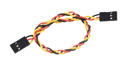 |
| 12   | 云台支架                                                     | 1        |        |
| 13   | 固定架（颜色随机）                                             | 2        | 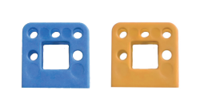 |
| 14   | L型支架                                                      | 1        |  |
| 15   | 舵机                                                         | 1        |        |
| 16   | 迷你履带坦克机器人套件 V2.0 亚克力板                         | 1        |  |
| 17   | 履带式坦克底盘驱动轮                                         | 2        | 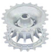       |
| 18   | 履带式坦克底盘承重轮                                         | 2        | 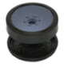       |
| 19   | 履带                                                         | 0.78     | 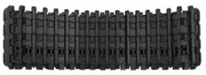       |
| 20   | GA25Y310 6V 145 DC6V 150rpm 大钮距金属直流电机+250MM PH2.0mm-2P线材环保 | 2        | 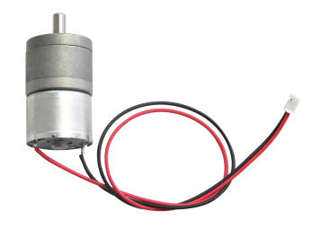       |
| 21   | 铝件 联轴器                                                  | 2        | 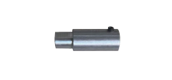 |
| 22   | 18650双节 电池盒                                             | 1        | 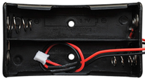       |
| 23   | USB 线 AM/BM                                                 | 1        | 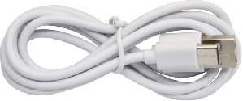 |
| 24   | 铝套                                                         | 2        | 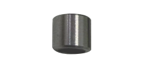 |
| 25   | 法兰轴承 原装电机级                                          | 4        | 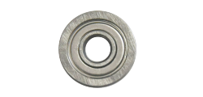 |
| 26   | 双通M3\*10MM六角铜柱                                         | 4        |  |
| 27   | 双通M3\*15MM 镀镍 六角铜柱                                   | 4        | 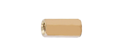 |
| 28   | 双通M3\*45MM六角铜柱                                         | 4        | 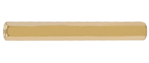 |
| 29   | M3\*10MM 平头螺钉                                            | 3        | 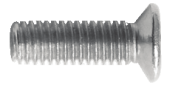       |
| 30   | M3\*6 内六角螺钉                                             | 22       | 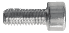       |
| 31   | M3\*8 内六角螺钉                                             | 8        | 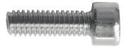       |
| 32   | M3\*25MM 内六角螺钉                                          | 4        |        |
| 33   | M4\*40 内六角螺钉                                            | 4        | 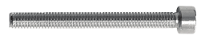       |
| 34   | M4\*50MM 内六角螺钉                                          | 2        | 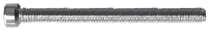       |
| 35   | M4\*12MM 内六角螺钉                                          | 6        |        |
| 36   | M3 镀镍 螺母                                                 | 24       | 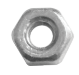 |
| 37   | M4 镀镍 自锁螺母                                             | 2        | 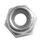 |
| 38   | M2\*10MM 圆头 螺钉                                           | 6        | 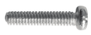       |
| 39   | M3\*12MM 圆头 螺钉                                           | 12       | 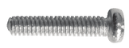       |
| 40   | M4 镀镍 螺母                                                 | 12       |        |
| 41   | M2 镀镍 螺母                                                 | 10       | 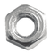       |
| 42   | HX-2.54 3P 双头连接线                                        | 3        | 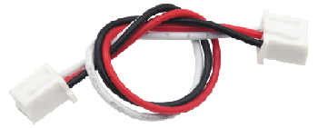       |
| 43   | HX-2.54 4P 双头连接线                                        | 1        | 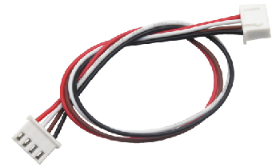       |
| 44   | HX-2.54 4P 转杜邦线母单连接线                                | 1        | 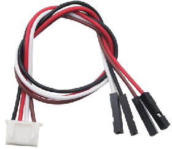       |
| 45   | 缠绕管                                                       | 0.12     | 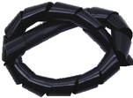       |
| 46   | 紫黑色 红黑色 十字螺丝刀                                     | 1        | 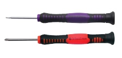 |
| 47   | 扎带                                                         | 6        |        |
| 48   | L型 M1.5 M2.5 M3 镀镍 内六角扳手                             | 1        | 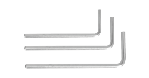 |
| 52   | M3\*4MM 机米螺丝                                             | 2        | 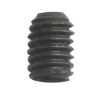 |
| 53   | M3+M4 小扳手                                                 | 1        |        |

## 1.3 特点

1.功能多多：避障功能，跟随功能，红外遥控，蓝牙控制，追光功能，显示图案等。

2.组装简单：无需焊接电路，只需几个简单的步骤即可组装该机器人。

3.结构坚固：构成车体的部分是PCB材质，电机用是优质的金属电机。

4.扩展性强：配置了电机驱动扩展板，可以扩展其他的传感器和模块。

5.多种控制：红外遥控器控制，手机遥控控制（苹果和安卓手机都可）。

6.学习基础编程：使用Arduino IDE的C语言编程，可以接触底层代码。

## 1.4 参数

电机转速：6v 转速150转/分。 

控制电机选用L298P驱动扩展板，自带电源控制开关。

超声波感应角度：\<15度

超声波探测距离：2cm-400cm

红外遥控距离：10米（实测）

蓝牙遥控距离：50米（实测）

光敏电阻模块，检测坦克机器人两边光照强度，控制坦克机器人。

蓝牙APP控制：支持Android和IOS系统

可接入外部7~9V的电压。并能搭载多款传感器模块，根据您的想象力实现各种功能.

## 1.5 UNO PLUS 开发板

在开始所有的项目之前，我们首先要了解下面这片uno plus开发板，因为这个智能车的核心就是这个开发板。

UNO plus开发板是我们最新推出的一款易用型开源控制器，硬件上与Arduino UNO相比并没有大的变动。外观上我们将蓝色换成了红色，给你们一种新的体验。硬件上，我们用ATmega16U2代替了8U2，这个更新为是USB接口芯片服务的，理论上它让UNO能模拟USB HID，比如 MIDI/Joystick/Keyboard。

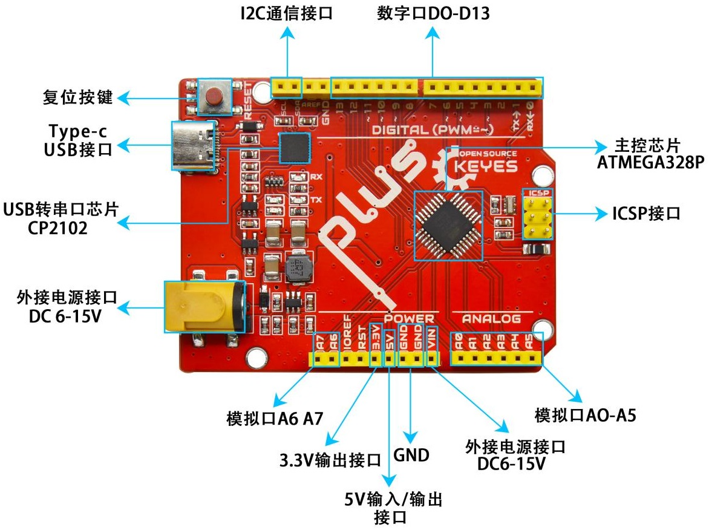

它具有14个数字输入/输出引脚（其中6个可用作PWM输出），6个模拟输入，一个16 MHz石英晶体，一个USB连接，一个电源插孔，2个ICSP接头和一个复位按钮。

它包含支持微控制器所需的一切；只需使用USB电缆将其连接到计算机，或使用AC-DC适配器或电池为其供电即可开始使用。

| 控制器                  | ATmega328P-PU                                            |
| ----------------------- | -------------------------------------------------------- |
| 工作电压                | 5V                                                       |
| 输入电压                | DC7-9V                                                   |
| 数字引脚                | 14 (D0-D13) (其中包含6个PWM输出口)                       |
| PWM引脚                 | 6 个(D3, D5, D6, D9, D10, D11)                           |
| 模拟输入引脚            | 6 个(A0-A5)                                              |
| 每个I / O引脚的直流电流 | 20 mA                                                    |
| 3.3V引脚的直流电流      | 50 mA                                                    |
| Flash Memory            | 32 KB (ATmega328P-PU) of which 0.5 KB used by bootloader |
| SRAM                    | 2 KB (ATmega328P-PU)                                     |
| EEPROM                  | 1 KB (ATmega328P-PU)                                     |
| 时钟频率                | 16 MHz                                                   |
| LED按键                 | D13                                                      |

## 1.6 L298P电机驱动扩展板

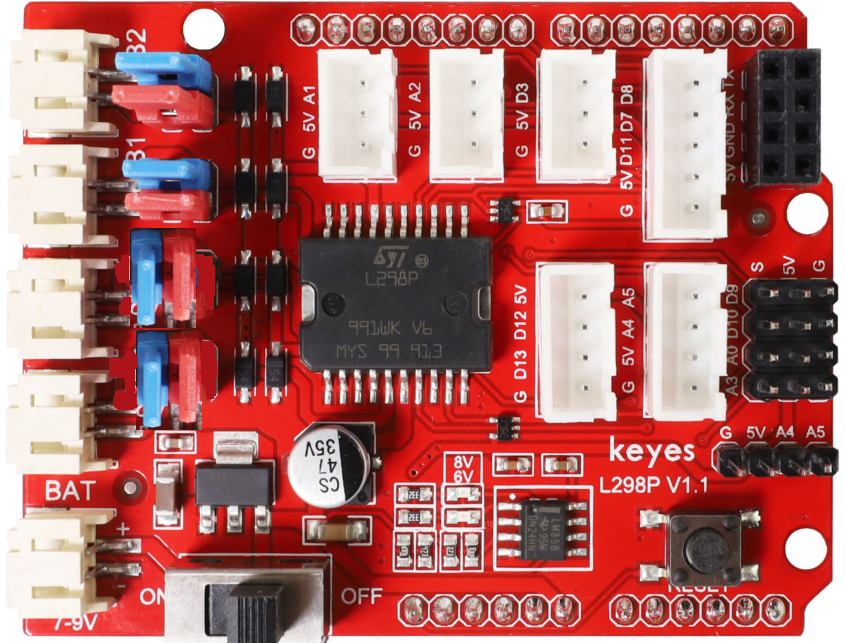

**1、概述**

驱动电机的方法有很多，利用的L298P芯片驱动电机是非常常用的一种方案。

L298P是ST意法半导体公司出品的优秀大功率电机专用驱动芯片，可直接驱动直流电机、二相、四相步进电机，驱动电流达2A，电机输出端采用8只高速肖特基二极管作为保护。我们根据L298P的电路设计了一款扩展板，叠层的设计可直接插接到UNO plus板上使用，降低了用户使用和驱动电机的技术难度。

当我们将驱动扩展板堆叠在UNO plus板后，BAT上电后，将拨码开关拨至ON端，外接电源同时给驱动扩展板和UNO plus板供电。驱动扩展板上电机和电源接口为PH2.0-2P防反接口，防止你电源接反导致电路损坏和电机方向乱接，增加测试难度。

同时，驱动扩展板上自带一个间距为2.54mm的排母接口，也是串口通讯接口，兼容市面上常用的蓝牙模块线序，如: BT-24模块、HM-10模块。为方便外接其他传感器/模块，驱动板上还自带3个XH-2.54mm 3P防反接口，2个XH-2.54mm 4P防反接口，1个XH-2.54mm 5P防反接口。扩展板还利用间距为2.54mm的排针扩展了2个数字口接口，2个模拟口接口和1个I2C通讯接口。扩展板上还自带一个复位按键，方便你随时进行复位处理。

扩展板可以连接4个直流电机，默认跳线帽连接方式时，A1和A2，B1和B2接口电机并联，运动规律相同。8个跳线帽可用于控制4个电机接口的转动方向，例如当A1电机接口前方2个跳线帽由横向连接改为纵向连接时，A1电机的转动方向就和原来的转动方向相反。

**2、规格参数**

- DC输入电压：DC 7V~9V

- 逻辑工作电流：最大36mA

- 电机驱动电流：最大2A

- 最大功耗：25W(温度＝75℃)

- 工作温度：0 ~ 50℃

- 尺寸大小：69x53x26mm

- 重量：25.5克

**3、L298P电机驱动扩展板示意图**

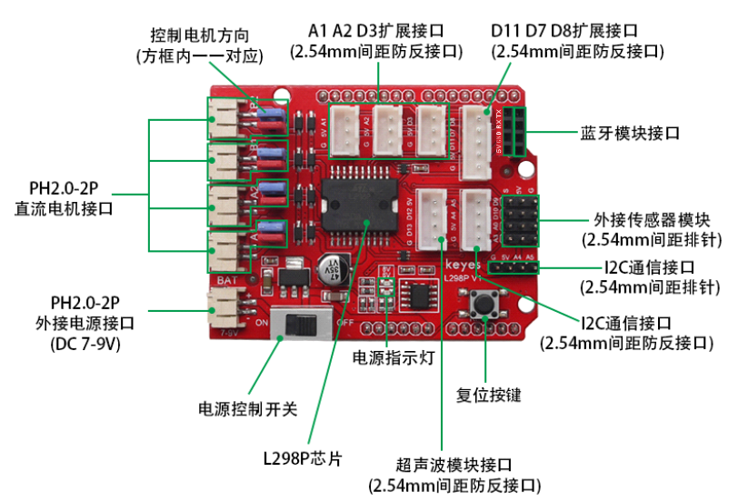

- 6V LED指示灯：当外接电源电压低于6.2V时，LED熄灭；高于6.2V时，LED亮起。

- 8V LED指示灯：当外接电源低于8V时，LED熄灭；高于8V时，LED亮起。

**4、L298P电机驱动扩展板连接电机图**

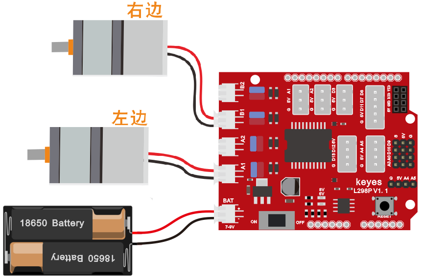
