# 2. 驱动安装

## 2.1 驱动下载

驱动下载：[USB驱动下载](./USB驱动文件.7z)

## 2.2 Windows系统驱动安装

1、将主板连接到电脑

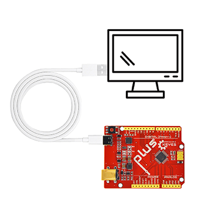

2、打开 “**设备管理器**”.

3、检查驱动是否已经安装

情况一：驱动安装完成，请跳过驱动教程，进行下一步学习

情况二：驱动没有安装，请进行以下教程手动安装驱动

（1）、鼠标右击 “**USB串行设备**”，在弹出框中选择 “**更新驱动程序（P）**”

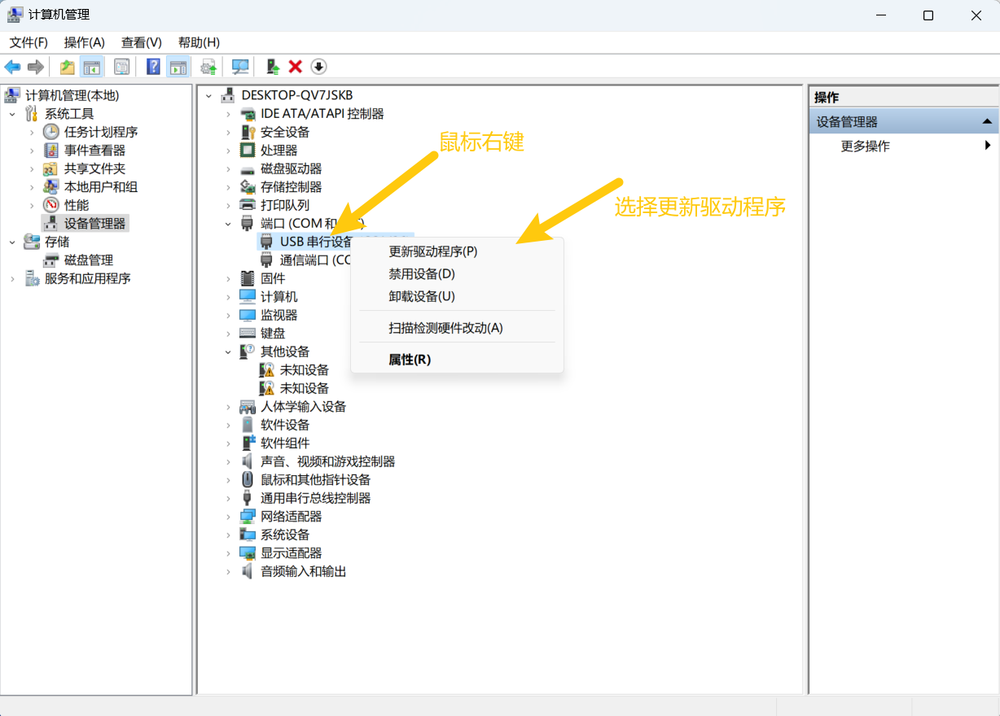

（2）、点击选择 “**浏览我的电脑以查找驱动程序（R）**”.

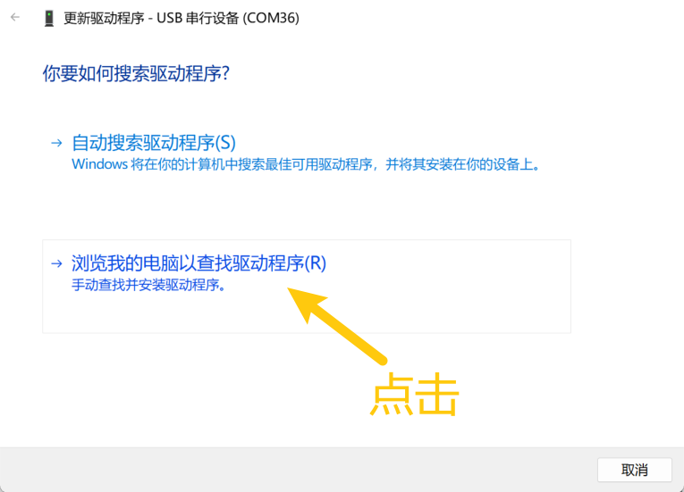

（3）、点击 “**浏览（R）**” 选项，在弹出的方框中找到Arduino安装路径下的，或者直接选择提供的,点击 “**确定**”，完成后点击 “**下一步**” 进行驱动安装.

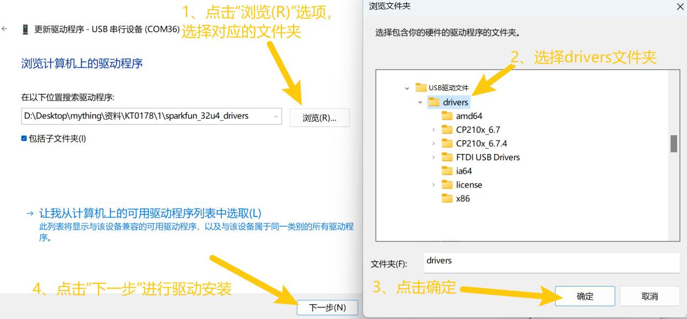

（4）、界面显示如下图类似的话语，证明驱动安装成功，点击 “**关闭**”.

（5）、驱动安装完成后，选择 “**端口**” 选项，如图对应端口的名字改变成Arduino Uno，证明驱动安装完成.

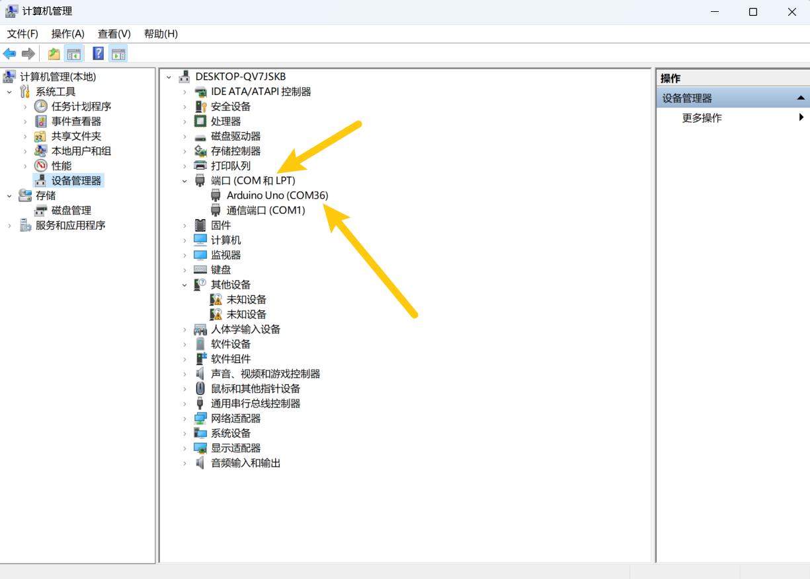

## 2.3 Mac系统驱动安装

### 2.2.1 检查驱动程序

1\. 将开发板连接到电脑（如图）。

2\. 打开 “**关于本机->系统报告->硬件->USB**” 。右侧为 “**USB设备树**” 。如果USB设备工作正常，您将发现其 “**厂商ID**” 等设备。

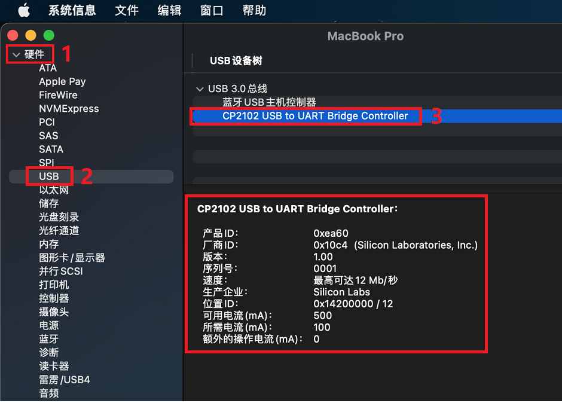

3\. 打开 “**应用程序-实用程序**” 文件夹下的 “**终端**” 程序，键入命令 “**ls /dev/tty.***” 。

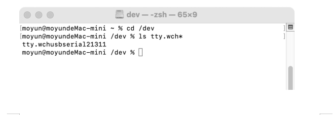

你应该看到 “**tty.wchusbserialx**”，其中“**x**”是分配的设备号，类似于Windows COM端口分配。

### 2.2.2 手动安装驱动程序

**提醒：这里是将CP2102_MAC驱动压缩包下载保存与电脑桌面上为例，你也可以保存于任何自己方便的位置。**

1\. 将驱动压缩包解压，放于电脑桌面上。

2\. 打开文件夹，双击 SiLabsUSBDriverDisk.dmg 文件。

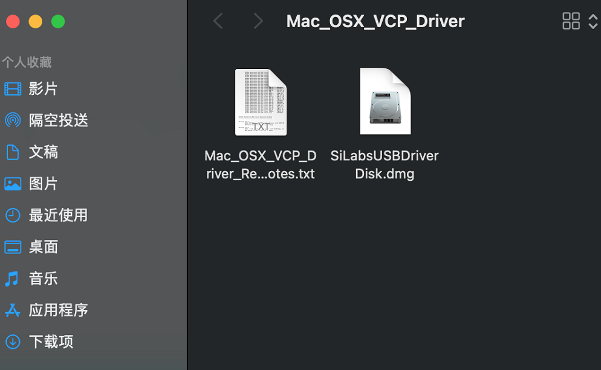

3\. 可以看到以下文件。

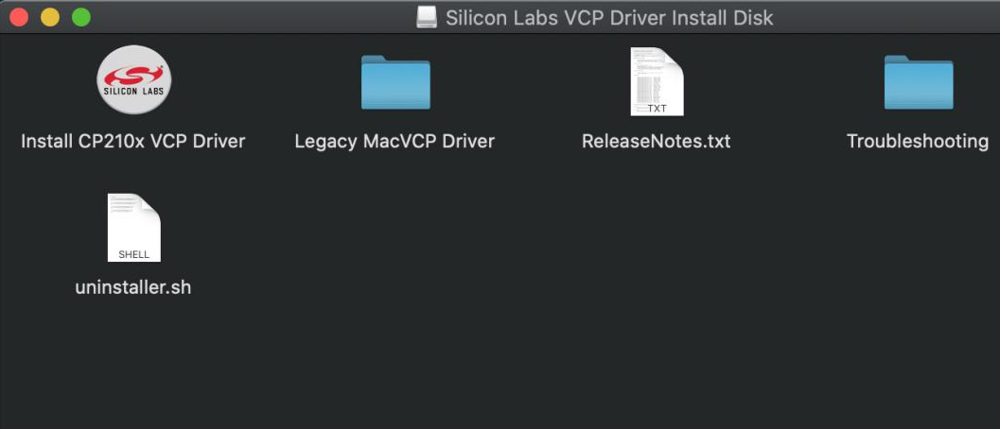

4\. 双击 “**Install CP210x VCP Driver**” 等待界面。然后点击 “**Continue**”。

5\. 先点击 “**Agree**” ，然后点击 “**Continue**”。

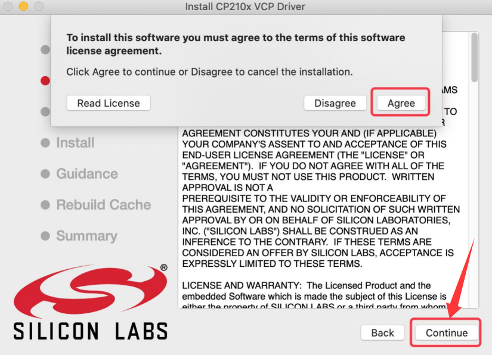

6\. 继续点击 “**Continue**” ，然后输入你的用户与密码，输入后继续。

⚠️ **特别提醒：** 安装到最后会弹出：System Extension Updated（但还没放行）。macOS 会拦截，必须去 “**安全性与隐私**” 允许。

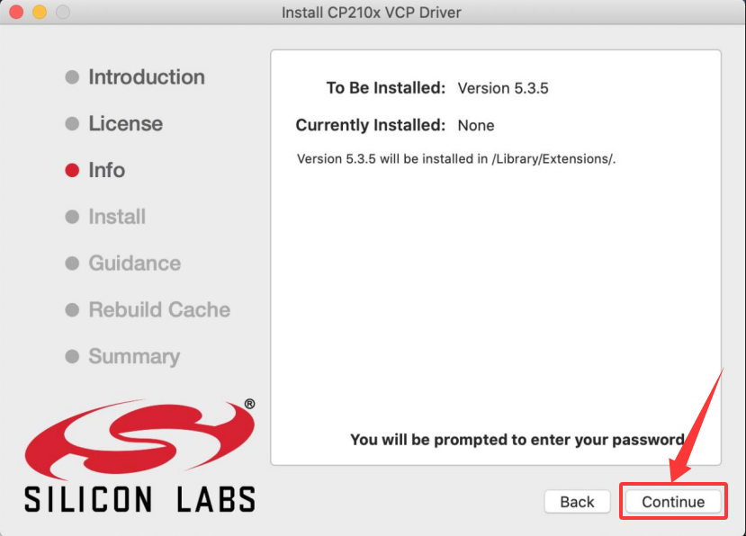

7\. 回到安装界面，根据提示等待安装。

8\. 安装成功。

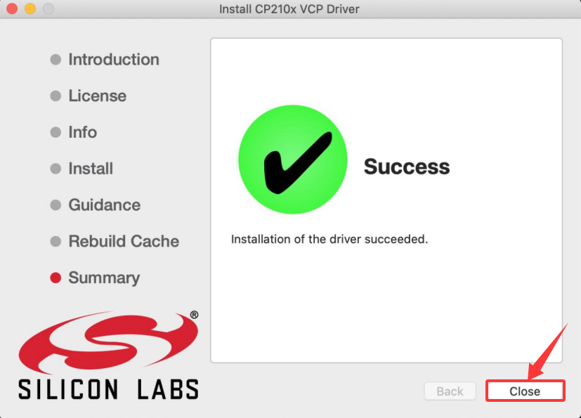

9\. 安装后在「**隐私与安全性**」允许，并且重启电脑。

10\. 将主控板连接USB线插入电脑的USB接口时，请打开 “**关于本机->系统报告->硬件->USB**” 。右侧为 “**USB设备树**” 。如果USB设备工作正常，您将发现其 “**厂商ID**” 等设备。

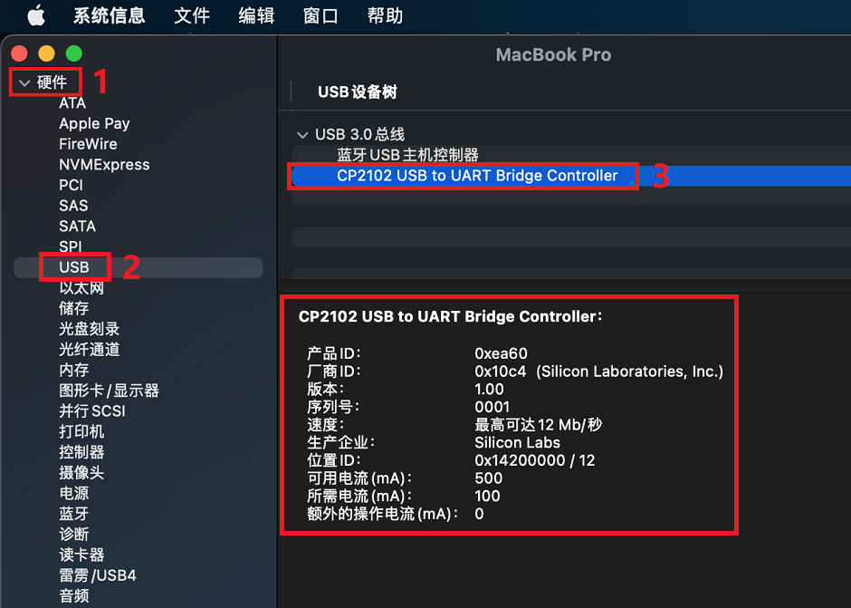

打开 “**应用程序-实用程序**” 文件夹下的 “**终端**” 程序，键入命令 “**ls /dev/tty.***” 。

你应该看到 “**tty.wchusbserialx**”，其中“**x**”是分配的设备号，类似于Windows COM端口分配。
